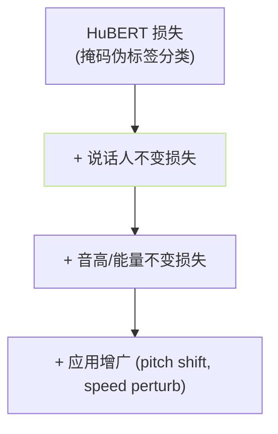
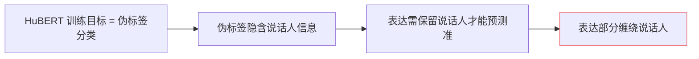

## 前置知识

> [!important]
> 
> 本页属于 [[1.3.4 ContentVec - 语义-说话人解耦]]。

---

## 0. 定义

> **ContentVec 与 HuBERT 的说话人解耦差异** = 「ContentVec 在 HuBERT 基础上加了三个“解耦损失」，使表达「只保留语义、丢掉说话人」」。HuBERT 本身不保证解耦。

---

## 1. ContentVec 的三项损失

### 1.1 说话人不变损失

$$\mathcal L_{spk} = \| \text{ContentVec}(x) - \text{ContentVec}(x') \|^2$$

其中 $x, x'$ 是同一句话的两个说话人版本（通过 VC 生成）。强迫表达不依赖于说话人。

### 1.2 音高/能量不变损失

以 augmented 样本（pitch shift / energy normalize）作为 $x'$，同样不变。

### 1.3 disentanglement loss

赋予召唤 latent 与 说话人 embedding 的互信息 限在低位。

---

## 2. HuBERT 为什么不够解耦

HuBERT 的伪标签是 k-means 于中层表达上的聚类，**同一个音素「不同说话人」可能被划为不同类**，表达中随之会隐含说话人信息。

---

## 3. 在 SVC 中的作用

SVC（Singing Voice Conversion）需要：

1. 保留歌词、旋律、 丢掉原始歌手。

1. 歌手切换 → ContentVec 表达 不变。

**使用 HuBERT** → 换歌手后表达会变「不够净」，需额外的说话人剖分。

**使用 ContentVec** → 表达几乎不变，仓库生成质量高。

---

## 4. GPT-SoVITS 不采用 ContentVec

- **原因 1**：TTS 场景不需「丢掉说话人」，反而需保留「说话人零样本 克隆」。

- **原因 2**：TTS 由 prompt audio + reference 提供说话人信息，不需要「从 SSL 里抽」。

- **原因 3**：hubert 代表语义 + VITS posterior 代表声学 已能事实上解耦。

---

## 参考文献

1. Qian, K. et al. (2022). _ContentVec_. ICML.

1. SoftVC, SVC-Develop-Team (2023). GitHub.