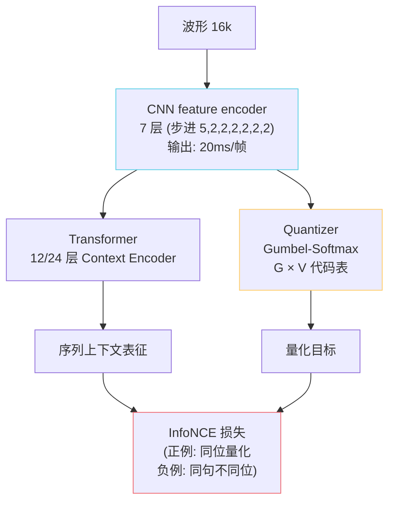

## 前置知识

> [!important]
> 
> 建议先读 [[1.3 自监督语音表征（SSL Features）|1.3 自监督语音表征（SSL Features）]]。本页是 SSL 路线的「对比学习”代表，与下一页 HuBERT（「屏蔽预测」）是两条并行路。

---

## 0. 定位

> **一句话**：wav2vec 2.0 （Meta, 2020）= **「掉掉 quantizer + contrastive loss + Transformer」** 的语音 SSL 预训范式。它是 HuBERT 的「哥哥」，**GPT-SoVITS 未采用**，但要读懂 HuBERT 必须先识该对比预训体系。

---

## 1. 三部件架构

---

## 2. 核心损失：InfoNCE

$$\mathcal L = -\log \frac{\exp(\mathrm{sim}(c_t, q_t)/\kappa)}{\sum_{\tilde q \in Q_t} \exp(\mathrm{sim}(c_t, \tilde q)/\kappa)}$$

- $c_t$：Transformer 在被掩码位置的输出。

- $q_t$：同位置的 CNN 输出 → Quantizer 后的**正例**。

- $Q_t$：$q_t$ + K 个负例（同句其他位量化后的结果）。

- $\kappa$：温度系数（0.1）。

> [!important]
> 
> **直觉**：让 Transformer 在看不见该位置原始 CNN 输出的情况下，仅靠上下文猜出「被掩挪那一下量化后是哪个代码」。这就同于 BERT 的 MLM，但目标是「区分正例 vs 负例」而非「预测位」。

---

## 3. Quantizer：Gumbel-Softmax

Group VQ——把 CNN 输出拆为 $G$ 组（默认 2 组），每组在 $V$ 代码中选一。总代码数 $V^G$（默认 320²=10万）。

Gumbel-Softmax：可微采样，训练时由软最大达代表示 $\arg\max$，推理时拿 $\arg\max$。

---

## 4. 与 HuBERT 的区别

||**wav2vec 2.0**|**HuBERT**|
|---|---|---|
|损失|InfoNCE（对比）|交叉熵（掩码预测）|
|目标来源|在线 Quantizer|离线 k-means|
|训练稳定性|较难（Gumbel-Softmax难调）|稳|
|代码本崩溃风险|高（需 diversity loss）|低|
|表征语义性|较低|较高|
|GPT-SoVITS 选择|❌|✅ (cnhubert)|

> [!important]
> 
> wav2vec 2.0 需要 diversity loss 防止代码崩溃，训练难调。HuBERT 用离线 k-means 避开了这个难题，同时用交叉熵损失让训练信号更密。**这也是为什么 GPT-SoVITS 选 HuBERT 而不是 wav2vec 2.0 的深层原因**。

---

## 5. 子页面导航

[[1.3.1.1 对比学习与 Quantizer（wav2vec 2.0）|1.3.1.1 对比学习与 Quantizer（wav2vec 2.0）]]

---

## 参考文献

1. Baevski, A. et al. (2020). _wav2vec 2.0_. NeurIPS.

1. Schneider, S. et al. (2019). _wav2vec_. Interspeech.【前作】