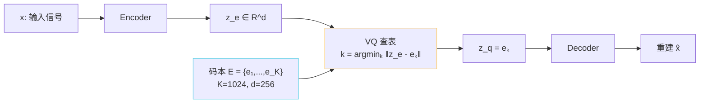

## 前置知识

> [!important]
> 
> 先读 [[1.4 向量量化（VQ）与离散语义 Token]]。VQ-VAE 是「连续表征 → 离散 token」的祖宗架构。

---

## 0. 定位

> **一句话**：VQ-VAE（van den Oord et al. 2017）= **「VAE 中间加一个可查表量化器」**，把连续 hidden $z_e \in \mathbb R^d$ 映射到码本 $e_k in mathbb R^d, kin{1..K}$。GPT-SoVITS 的 SoVITS 解码器里嵌了一个这样的 VQ 块，$K=1024$。

---

## 1. 三部件



---

## 2. 损失分三项

$$\mathcal L_{\text{VQ-VAE}} = \underbrace{\| x - \hat x \|^2}_{\text{recon}} + \underbrace{\| \mathrm{sg}[z_e] - e_k \|^2}_{\text{codebook}} + \beta \underbrace{\| z_e - \mathrm{sg}[e_k] \|^2}_{\text{commitment}}$$

- **recon**：重建误差，推动 encoder/decoder。

- **codebook 损失**：拉 $e_k$ 贴近 $z_e$（sg 是 stop-gradient）。

- **commitment 损失**：拉 $z_e$ 贴近 $e_k$，防止 encoder 在空间里乱跳。一般 $beta = 0.25$。

> [!important]
> 
> **为什么要三项？**重建损失驱动重建质量；codebook 损失让码本「追」表征；commitment 损失让编码器「不跑」。三项同动 → 稳定量化。

---

## 3. STE：跨越不可微问题

查表操作 $z_q = e_{\arg\min_k}$ 是「不可微」的。**Straight-Through Estimator（STE）** 的做法：

- 前向：如实查表。

- 反向：梯度「直接跳过」 $z_q$、当作 $z_e$ 传递。

```python
z_q = z_e + (e_k - z_e).detach()  # PyTorch 表达
# forward: z_q == e_k
# backward: ∂z_q/∂z_e == 1
```

详见 [[1.4.1.1 Straight-Through Estimator]]。

---

## 4. 推理与生成


**重点**：VQ-VAE 本身不是生成模型。要生成，需要「另训一个 AR 模型走 codebook 索引」。这就是 GPT-SoVITS 的 AR 头的「哥哥」架构。

---

## 5. 与 GPT-SoVITS 的关系

||VQ-VAE 原论文|GPT-SoVITS|
|---|---|---|
|输入|图像|cnhubert 第 9 层 hidden|
|K|512~8192|**1024**|
|d|32~256|**256**|
|commitment $\beta$|0.25|**0.25**|
|码本更新|梯度|**EMA**（见 [[1.4.2 EMA 码本更新]]）|
|生成侧 AR|PixelCNN|s1.yaml 下的 GPT 头|

---

## 6. 子页面导航

[[1.4.1.1 Straight-Through Estimator]]

---

## 参考文献

1. van den Oord, A. et al. (2017). _Neural Discrete Representation Learning (VQ-VAE)_. NeurIPS.

1. Razavi, A. et al. (2019). _VQ-VAE-2_. NeurIPS.