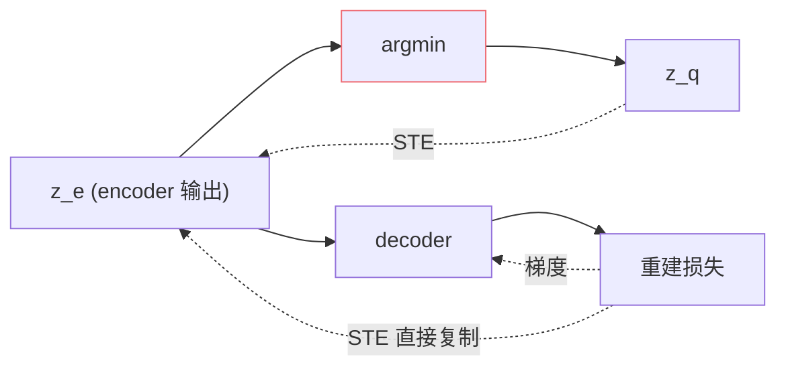

## 前置知识

> [!important]
> 
> 本页属于 [[1.4.1 VQ-VAE 基础]]。

---

## 0. 定义

> **Straight-Through Estimator（STE）** = 「前向走『argmin』产生离散输出，反向『假设是恒等函数』直接把梯度拷贝过去」的 trick。是 VQ-VAE 能训练的核心原因。

---

## 1. 问题

VQ 操作：

$$z_q = e_k, \quad k = \arg\min_j \| z_e - e_j \|$$

argmin 本身**不可微** —— 梯度不能从 $z_q$ 传回 $z_e$，编码器无法训练。

---

## 2. STE 的做法

```python
# 伪代码
def vq_forward(z_e, codebook):
    # 前向：量化
    distances = compute_distance(z_e, codebook)
    indices = distances.argmin(dim=-1)
    z_q = codebook[indices]
    
    # STE: 梯度从 z_q 「复制」到 z_e
    z_q = z_e + (z_q - z_e).detach()
    return z_q
```

- 前向值：$z_q$。

- 反向梯度： $frac{partial z_q}{partial z_e} = I$（装作恒等）。

---

## 3. 为什么能动



- **假设**：$z_q$ 接近 $z_e$，梯度于 $z_q$ 与梯度于 $z_e$ 近似。

- **合理性**：仅在 codebook 被充分训练、 $z_q \approx z_e$ 时成立。

---

## 4. Commitment Loss 与 STE 的配合

STE 只传递梯度、不保证 codebook 被拉向 $z_e$。还需：

$$\mathcal L_{VQ} = \underbrace{\| sg[z_e] - e_k \|^2}_{\text{codebook loss}} + \underbrace{\beta \| z_e - sg[e_k] \|^2}_{\text{commitment loss}}$$

- codebook loss 拉 $e_k$ 近 $z_e$（或 EMA 替代）。

- commitment loss 拉 $z_e$ 近 $e_k$。

- $\beta = 0.25$ 是经验值。

---

## 5. STE 变体

|变体|描述|
|---|---|
|Vanilla STE|梯度 = I|
|Gumbel-Softmax|softmax + temperature，可微近似|
|Concrete|hard 采样 vs soft|
|Rotation Trick|DAC 采用、提升检索|

GPT-SoVITS 采用 vanilla STE。

---

## 参考文献

1. Bengio, Y. et al. (2013). _Estimating or Propagating Gradients Through Stochastic Neurons_. arXiv:1308.3432.

1. van den Oord, A. et al. (2017). _VQ-VAE_. NeurIPS.