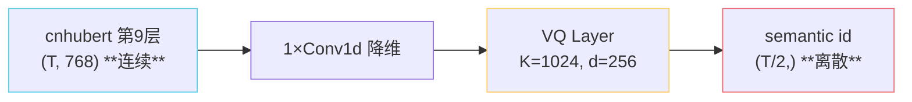

## 前置知识

> [!important]
> 
> 建议先读 [[1.3 自监督语音表征（SSL Features）]]，VQ 的输入正是 SSL 特征。

---

## 0. 定位

> **一句话**：VQ（**Vector Quantization**，向量量化）= **「给连续向量分一个 codebook 上的离散簇编号」**。GPT-SoVITS 用它把 cnhubert 的 768d 连续向量映射到 **K≈1024 个簇**的 ID 上，得到 AR 头能预测的 token 序列。

---

## 1.4.1 VQ 在 GPT-SoVITS 中的角色

GPT-SoVITS 的 VQ 模块**内置在 SoVITS 中**（非单独训练），与 SoVITS 解码器一起以 ELBO + GAN 损失训练。AR 头**不参与 VQ 训练**，只使用冻结后的 VQ 输出。详见 [[4.3 SoVITS 内置 VQ Encoder]]。

---

## 1.4.2 VQ 的核心公式

### 前向量化

$$z_q(x) = e_k, \quad k = \arg\min_{j \in \{1, \dots, K\}} \| z_e(x) - e_j \|_2$$

- $z_e(x)$：encoder 输出连续向量；$e_j$：codebook 第 $j$ 个码字；$z_q$：量化后的向量。

- **最近邻查表**，无可学习参数（除了 codebook 本身）。

### VQ-VAE 训练损失

$$\mathcal{L}_{\text{VQ}} = \underbrace{\| \mathrm{sg}[z_e(x)] - e_k \|_2^2}_{\text{codebook 学习}} + \beta \underbrace{\| z_e(x) - \mathrm{sg}[e_k] \|_2^2}_{\text{commitment}}$$

- $\mathrm{sg}[\cdot]$：stop-gradient（梯度截断）。

- 第一项让码本向 encoder 输出靠拢；第二项让 encoder 输出不要漂移离码本太远。

### Straight-Through Estimator

VQ 的 $\arg\min$ 不可导，反向时用：

$$\frac{\partial \mathcal{L}}{\partial z_e} \approx \frac{\partial \mathcal{L}}{\partial z_q}$$

即直接把 $z_q$ 的梯度复制给 $z_e$。

---

## 1.4.3 单码本 vs 多码本（RVQ）

|维度|单 VQ（GPT-SoVITS）|RVQ（EnCodec / SoundStream）|
|---|---|---|
|信息容量|$\log_2 K$ bit/帧|$N \cdot \log_2 K$ bit/帧|
|AR 复杂度|单序列 softmax|多序列耦合（AR+NAR）|
|重建质量|中（语义足够，音色由解码器补）|高（直接还原波形）|
|码本崩溃风险|低|中|
|训练稳定性|高|较高|
|GPT-SoVITS 选择|✅|❌|

> [!important]
> 
> **设计哲学**：GPT-SoVITS 信奉「**少即是多**」——VQ 只承担「语义离散化」，**不试图重建波形**。重建任务全部交给 SoVITS 解码器（它的输入除了 semantic 还有 ref mel），所以丢失的细节能从 ref 中找回。

---

## 1.4.4 三大工程陷阱

### 陷阱 1：码本死码（codebook collapse）

部分码字从未被选中，浪费容量。

> [!important]
> 
> **缓解**：EMA 更新 + 死码重启（把死码重置到 batch 中最远的 $z_e$ 上）。详见下方原子页 1.4.3。

### 陷阱 2：commitment 系数 β 失衡

- $\beta$ 太小：encoder 不约束，输出漂移到码本之外。

- $\beta$ 太大：encoder 被压死，多样性下降。

- GPT-SoVITS 经验值 $\beta = 0.25$（与原版 VQ-VAE 一致）。

### 陷阱 3：码本规模 K

- K 太小：信息瓶颈，语义混淆。

- K 太大：训练慢、易死码、AR 头 softmax 过宽。

- GPT-SoVITS 取 **K=1024**，每帧 10 bit；对应 25Hz 帧率即 250 bit/s，跟 8kbps 电话语音的语义带宽接近。

---

## 1.4.5 EMA 更新（GPT-SoVITS 实际使用）

$$\begin{aligned}  
N_k^{(t+1)} &= \gamma N_k^{(t)} + (1-\gamma) \cdot n_k^{(t)} \\  
m_k^{(t+1)} &= \gamma m_k^{(t)} + (1-\gamma) \cdot \sum_{i: k_i = k} z_e^{(i)} \\  
e_k^{(t+1)} &= m_k^{(t+1)} / N_k^{(t+1)}  
\end{aligned}$$

- $\gamma = 0.99$；$n_k$：batch 中分到码 $k$ 的样本数。

- **优势**：码本更新不走梯度，更稳定。

---

## 1.4.6 子页面导航

[[1.4.1 VQ-VAE 基础]]

---

## 1.4.7 延伸阅读

- [[4.3 SoVITS 内置 VQ Encoder]]

- [[4.4 prompt_semantic（参考音频→AR prompt）]]

---

## 参考文献

1. van den Oord, A. et al. (2017). _VQ-VAE_. NeurIPS.

1. Razavi, A. et al. (2019). _VQ-VAE-2_. NeurIPS.

1. Zeghidour, N. et al. (2021). _SoundStream_. IEEE/ACM TASLP.

1. Défossez, A. et al. (2022). _EnCodec_. arXiv:2210.13438.

[[1.4.2 EMA 码本更新]]

1. Yu, J. et al. (2022). _VQ-GAN improved_. ICLR.

[[1.4.3 Codebook 死码与重启]]

[[1.4.4 GPT-SoVITS 的 VQ 维度与码本规模]]