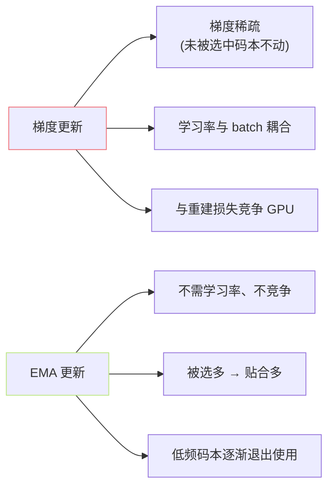

## 前置知识

> [!important]
> 
> 先读 [[1.4.1 VQ-VAE 基础]]。本页评说「为什么 codebook 不用梯度更新」。

---

## 0. 定位

> **一句话**：**EMA（Exponential Moving Average）** 是「用指数滑动平均替代梯度更新 codebook」的策略。问题同源：原论文 VQ-VAE 的 codebook 损失梯度不稳定、易崩。**GPT-SoVITS 默认采用 EMA，衰减率** $\gamma = 0.99$。

---

## 1. 梯度更新与 EMA 更新的对比

### 梯度更新（原论文）

$$e_k \leftarrow e_k - \eta \cdot \nabla_{e_k} \|\mathrm{sg}[z_e] - e_k\|^2 = e_k + 2\eta(\mathrm{sg}[z_e] - e_k)$$

问题：学习率 $\eta$ 难调；某些码本被越取越频繁，金错丢。

### EMA 更新（Razavi 2019）

对每个码本 $k$ 维护两个累计量：

- $N_k$：当前步中被选中的 hidden 个数。

- $m_k$：被选中的 hidden 之和。

$$\begin{aligned}  
N_k^{(t)} &\leftarrow \gamma N_k^{(t-1)} + (1-\gamma) \cdot |\{i: z_e^{(i)} \to e_k\}| \\  
m_k^{(t)} &\leftarrow \gamma m_k^{(t-1)} + (1-\gamma) \sum_{i: z_e^{(i)} \to e_k} z_e^{(i)} \\  
e_k^{(t)} &\leftarrow \frac{m_k^{(t)}}{N_k^{(t)}}  
\end{aligned}$$

意义：每个 $e_k$ 是「被它取中的 hidden 的加权平均」，权重随时间指数衰减。

---

## 2. 为什么 EMA 更稳定



**三个关键优点**：

1. 无需单独调学习率。

1. 不与重建 loss 竞争梯度。

1. 不被选中的码本随时间衰减 $N_k to 0$，自动进入「冷闲重启」状态（见 [[1.4.3 Codebook 死码与重启]]）。

---

## 3. 衰减率 $\gamma$ 的选择

|$\gamma$|含义|适用|
|---|---|---|
|0.9|快送适应|small batch|
|**0.99**|中逹|**GPT-SoVITS 默认**|
|0.999|慢逹、稳定|large batch, 训练后期|

**经验**：$gamma$ 太低 → 码本奋动、量化误差高；太高 → 低频码本难以退场，死码越多。

---

## 4. 实现细节（PyTorch 伪代码）

```python
class VQEmbeddingEMA(nn.Module):
    def __init__(self, K=1024, d=256, gamma=0.99, eps=1e-5):
        self.embed = nn.Parameter(torch.randn(K, d))
        self.N = nn.Parameter(torch.zeros(K), requires_grad=False)
        self.m = nn.Parameter(self.embed.clone(), requires_grad=False)

    def forward(self, z_e):
        # z_e: (B, T, d)
        flat = z_e.reshape(-1, d)
        # 1) 查表
        dist = torch.cdist(flat, self.embed)
        k = dist.argmin(dim=-1)        # (B*T,)
        z_q = self.embed[k].reshape(z_e.shape)

        if self.training:
            # 2) 累计 N_k, m_k
            onehot = F.one_hot(k, K).float()  # (B*T, K)
            self.N.data = gamma * self.N + (1 - gamma) * onehot.sum(0)
            self.m.data = gamma * self.m + (1 - gamma) * onehot.t() @ flat
            # 3) 更新 e_k
            N_safe = (self.N + eps) / (self.N.sum() + K * eps) * self.N.sum()
            self.embed.data = self.m / N_safe.unsqueeze(1)
        return z_q, k
```

**注意**：`embed` 虽是 Parameter 但不参与梯度传递（STE 跳过），只被 EMA 覆写。

---

## 5. GPT-SoVITS 代码位置

- `GPT_SoVITS/module/quantize.py` 里的 `VectorQuantize` 类，启用 `decay=0.99`。

- 训练时随 s2_[train.py](http://train.py) 主流程同步更新。

---

## 参考文献

1. Razavi, A. et al. (2019). _VQ-VAE-2_. NeurIPS. §2.2.

1. Lancucki, A. et al. (2020). _Robust Training of VQ-VAE for Speech Applications_. ICASSP.