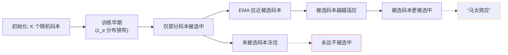

## 前置知识

> [!important]
> 
> 先读 [[1.4.2 EMA 码本更新|1.4.2 EMA 码本更新]]。「死码」是 VQ 训练中最常见的问题。

---

## 0. 定位

> **一句话**：**死码（Dead Code）** = 训练中在很长时间里「从未被选中」的码本；他们冻在初始位，使用率为 0，码本利用率远低于 $K$。**重启策略** = 「让死码重生」的一类启发式补丁。

---

## 1. 死码怎么产生的



**原因**：VQ 是「距离最近码赢者通吃」，被选中的码本被 EMA 拉近「热区」 → 他们更有可能被选 → 冷区码本永远冻住。这是**马太效应**的经典体现。

---

## 2. 衡量指标

### 使用率（Codebook Usage）

$$U = \frac{|\{k : \sum_i \mathbf 1[k_i = k] > \tau\}|}{K}$$

一般 $\tau$ 取一个小阈值（例如 batch 中 1 次）。健康值：$U > 0.7$；<0.3 是危险信号。

### 困惑度（Codebook Perplexity）

$$\text{PPL} = \exp\!\Big(-\sum_k p_k \log p_k\Big), \quad p_k = \Pr(\text{token}=k)$$

理想值 $\text{PPL} \to K$（均匀分布）。GPT-SoVITS 实际量化 PPL 在 **300∼500**（K=1024），表示有 30%-50% 死码。

---

## 3. 重启策略

### 3.1 随机重启（需智能使用）

每隔 N 步检查 $N_k$，若 $N_k < \epsilon$，**用当前 batch 中随机一个** $z_e$ **重初始化** $e_k$。

```python
if self.N[k] < self.dead_thres:
    rand_idx = torch.randint(0, flat.shape[0], (1,))
    self.embed.data[k] = flat[rand_idx]
    self.N.data[k] = 1.0  # 重启后给一个初始计数
```

### 3.2 K-means 重启（DAC 采用）

在 inactive 码本上重跑 k-means，用聚类中心代替死码。

### 3.3 警警重初始化（SoundStream）

对出现频率低于门限的码本，用 batch 随机重初始化。

---

## 4. GPT-SoVITS 里的项实践

```python
# GPT_SoVITS/module/quantize.py 伪代码
class VectorQuantize:
    def __init__(self, codebook_size=1024, decay=0.99, threshold_ema_dead_code=2):
        self.threshold = threshold_ema_dead_code  # N_k < 2 视为死码
        ...
    
    def expire_codes_(self, batch_samples):
        """每个训练步检查并重启死码"""
        expired = (self.cluster_size < self.threshold)
        if expired.any():
            samples = self._sample_vectors(batch_samples, expired.sum())
            self.embed.data[expired] = samples
            self.cluster_size.data[expired] = 1.0
```

---

## 5. 为什么有的设计选择 NOT重启

> [!important]
> 
> 不重启不一定是坏事：
> 
> - 若有效码本足够表达语义 (e.g. K=1024 但只需 400 个能表达中文 phoneme 变体)，死码也可隔离变量。
> 
> - **过多重启**会让码本体系不稳定，AR 预测错误率上升。
> 
> 实践中仅在**使用率过低（<30%）且训练早期**才重启。

---

## 6. FSQ 走了另一条路

CosyVoice 采用 **Finite Scalar Quantization（FSQ）**，**根本不需要 codebook**——每个 hidden 维独立量化到固定几个样本，逻辑上避免了「查表 + 死码」问题。是该领域下一代的热门方向。

---

## 参考文献

1. Lancucki, A. et al. (2020). _Robust Training of VQ-VAE_. ICASSP.

1. Kumar, R. et al. (2023). _DAC_. NeurIPS.【K-means 重启】

1. Mentzer, F. et al. (2023). _Finite Scalar Quantization (FSQ)_. arXiv:2309.15505.