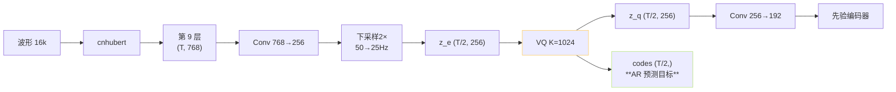
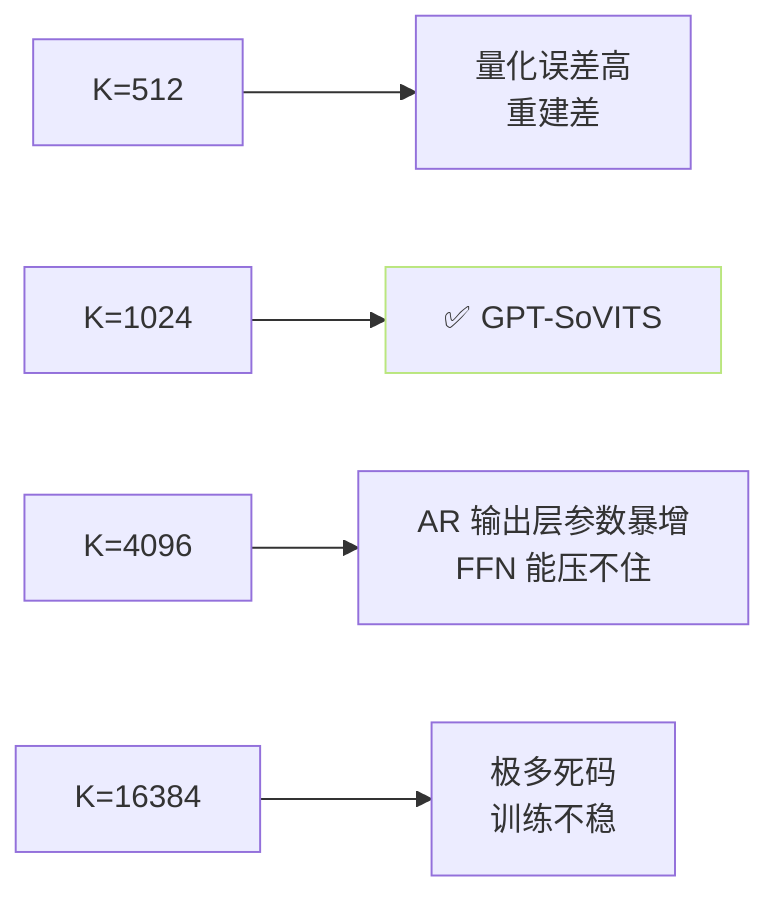

## 前置知识

> [!important]
> 
> 先读 [[1.4.1 VQ-VAE 基础]] 与 [[1.4.2 EMA 码本更新]]。本页隶出 GPT-SoVITS 的实际配置。

---

## 0. 定位

> **一句话**：GPT-SoVITS 的 VQ 在 SoVITS 解码器里，$K=1024, d=256$，位于 cnhubert 输出后、后验编码器前，并作为 AR 头的预测目标。该页是「参数表」型，详细原理见父页。

---

## 1. 参数一览表

|项|取值|含义|
|---|---|---|
|codebook size $K$|**1024**|码本中心数|
|embed dim $d$|**256**|每个中心的维度|
|input dim|768|cnhubert 第 9 层 hidden|
|pre-VQ proj|768 → 256|1×1 Conv 降维|
|post-VQ proj|256 → 192|给 prior encoder 用|
|commitment $\beta$|**0.25**|损失权重|
|EMA decay $\gamma$|**0.99**|中逹|
|dead code threshold|$N_k < 2$|低于则重启|
|token rate|**25 Hz**|cnhubert 50Hz × 2 下采样|
|bit-rate|$\log_2(1024) \cdot 25 = 250$ bps|每秒代价|

---

## 2. 架构位置

---

## 3. 各版本的 VQ 参数差异

|版本|K|d|rate|变动|
|---|---|---|---|---|
|v1|1024|256|25 Hz|基线|
|v2|1024|256|25 Hz|同 v1|
|v3|1024|256|25 Hz|加装 BERT 特征作 condition|
|v4|1024|256|25 Hz|同 v3|
|v2Pro|1024|256|25 Hz|• ERes2NetV2 说话人 embedding|

点评：**VQ 参数各版本以来一直保持 不变**。变的是输入条件（BERT/ERes2NetV2）与解码器。这侧面表明：VQ 质量已经充分，不是系统短板。

---

## 4. 为什么选 1024 而不是更大

**决策依据**：

1. **AR 输出层 = K 个 token 表**，K 太大 AR softmax 可能脱锁。

1. 中文音位 × 声调 × 连接变体 约 ~600，K=1024 充余。

1. 训练数据不足以填满更大码本。

---

## 5. 定位代码路径

- 架构定义：`GPT_SoVITS/module/models.py: PriorEncoder, PosteriorEncoder`。

- VQ 块：`GPT_SoVITS/module/quantize.py: VectorQuantize`。

- AR 输出层：`GPT_SoVITS/AR/models/t2s_model.py: Linear(d_model, K)`。

- 训练入口：`s2_train.py` 中部分损失被决表为 `loss_kl + loss_vq + loss_mel + loss_adv + loss_fm`。

---

## 6. 与同类体系的对比

||GPT-SoVITS|CosyVoice|VALL-E|
|---|---|---|---|
|量化器|VQ-VAE (EMA)|FSQ|RVQ-8|
|K 或有效簇数|1024|~4000 (FSQ)|1024×8|
|token rate|25Hz|50Hz|75Hz × 8|
|bit-rate|~250 bps|~1000 bps|~6000 bps|
|重建质量|粗略（需 ref mel）|粗略|高（端到端）|
|训练难度|低|低|高|

> [!important]
> 
> **总结**：GPT-SoVITS 选择「低比特率 + 靠解码器补」是一个极其巧妙的架构。VQ 参数 K=1024 / d=256 / 25Hz 是這一思路的量化体现。

---

## 参考文献

1. GPT-SoVITS 代码仓库. [https://github.com/RVC-Boss/GPT-SoVITS](https://github.com/RVC-Boss/GPT-SoVITS)

1. 配置文件 `configs/s2.json` 中 `quantizer_kwargs`.