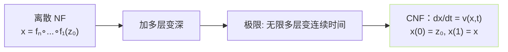
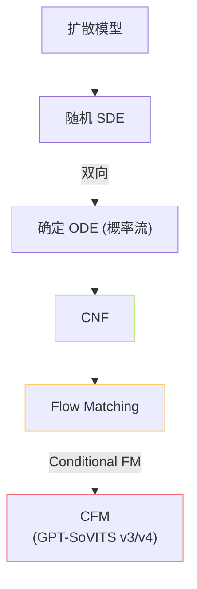

---

## 参考文献

1. Chen, R. T. Q. et al. (2018). _Neural Ordinary Differential Equations_. NeurIPS.

1. Grathwohl, W. et al. (2019). _FFJORD_. ICLR.

[[1.5.1.1 ODE 视角与连续变换]]

1. Lipman, Y. et al. (2023). _Flow Matching for Generative Modeling_. ICLR.

## 前置知识

> [!important]
> 
> 建议先读 [[1.5 Flow Matching - CFM（v3-v4 的核心范式）]]。CNF 是 Flow Matching 的「连续时间体」前身。

---

## 0. 定位

> **一句话**：**连续标准化流（Continuous Normalizing Flow，CNF）** = 「**把离散叏叠变换床变为连续时间 ODE**」。代表作 FFJORD (2019) 、Neural ODE (2018)。Flow Matching 以 CNF 为架构，但**避免了训练时的 ODE 求解**。

---

## 1. 从离散 Flow 到 CNF

**从** $z_0 \sim p_0$ **出发，护随一个速度场** $v(x,t)$ **走到 $t=1$，得到** $x \sim p_1$。训练的是这个速度场。

---

## 2. ODE 视角下的密度变化

连续版变量变换（隶使 $\nabla \cdot v$ 的迹公式）：

$$\frac{d \log p_t(x(t))}{dt} = -\nabla_x \cdot v(x(t), t) = -\text{tr}\!\left(\frac{\partial v}{\partial x}\right)$$

意义：密度随时间的变化 = 负的「速度场散度」。这是物理上「连续方程」的变体。

---

## 3. CNF 的训练难题

传统 CNF 训练需要：

1. **反向 ODE 求解** 从 $x$ 走回 $z_0$ 计算似然。

1. **Hutchinson 迹估计**。

1. **伊纏接传梯度**。

同时需要存中间状态，内存压力大、训练慢。详见 [[1.5.1.1 ODE 视角与连续变换]]。

> [!important]
> 
> **Flow Matching 的创新点**：训练时不走 ODE，**直接拟合** $v(x,t)$ **的对应目标速度**。ODE 只在推理时走。这让 CFM 的训练复杂度与扩散模型相当、者更低。

---

## 4. 推理阶段 ODE 求解器

推理时要从 $z_0$ 走到 $x$，需一个 ODE solver：

|Solver|阶数|函数评估次数（NFE）|误差阶|
|---|---|---|---|
|Euler|1 阶|8–16|$O(h^2)$|
|Midpoint / RK2|2 阶|16–32|$O(h^3)$|
|RK4|4 阶|32–64|$O(h^5)$|
|Adaptive (Dopri5)|变|64→ 200+|tol 可控|

**GPT-SoVITS v3 / v4** 选择：Euler，**NFE = 8 (v3) / 10 (v4)**。详见 [[1.5.3 ODE Solver 与 NFE]]。

---

## 5. 与扩散模型的关系

DDPM 可转为确定 ODE（「概率流 ODE」），于是可看作一种特殊的 CNF。Flow Matching 提供了「直接训速度场」的简化途径。

---

## 6. 子页面导航