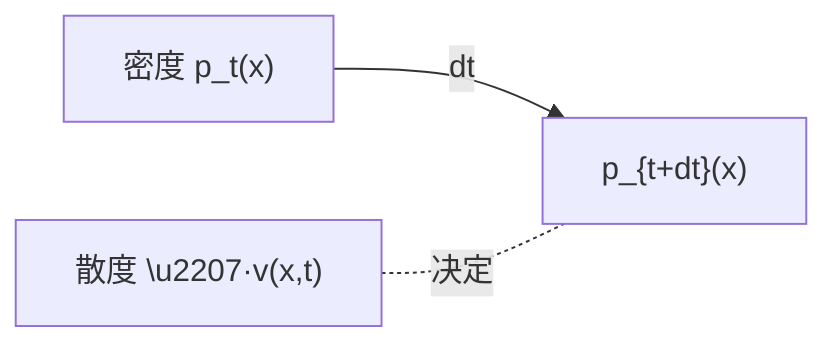
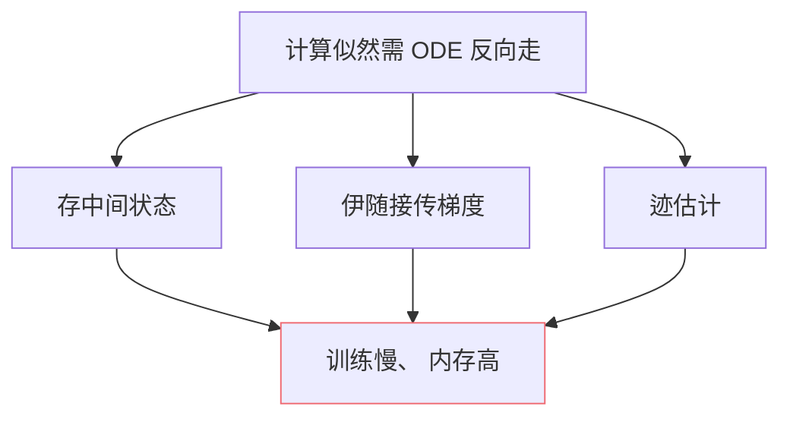

## 前置知识

> [!important]
> 
> 本页属于 [[1.5.1 Continuous Normalizing Flow (CNF)]]。

---

## 0. 定义

> **从 ODE 视角看 CNF** = 「把『生成过程』看作『粒子在速度场 $v(x,t)$ 作用下从 $t=0$ 走到 $t=1$ 的轨迹』」。密度随轨迹变化满足连续性方程。

---

## 1. ODE 系统

$$\frac{dx(t)}{dt} = v_\theta(x(t), t), \quad x(0) = z_0 \sim \mathcal N(0, I)$$

粒子从 $t=0$ 的初始点 $z_0$ 出发，随速度场 $v_\theta$ 走到 $t=1$ 的位置 $x(1) = x$。

---

## 2. 连续性方程（密度传输）

连续性方程是流体动力学里「质量守恒」的数学表达：

$$\frac{\partial p_t(x)}{\partial t} + \nabla_x \cdot (p_t(x) v(x,t)) = 0$$

沉粒送随轨迹的密度变化：

$$\frac{d \log p_t(x(t))}{dt} = -\nabla_x \cdot v(x(t), t) = -\text{tr}\!\left(\frac{\partial v}{\partial x}\right)$$

---

## 3. 迹估计（FFJORD trick）

雅克比迹计算复杂度 $O(d^2)$，高维下不可受。Hutchinson 估计器：

$$\text{tr}(A) = \mathbb E_{\epsilon \sim p(\epsilon)} [\epsilon^T A \epsilon], \quad p(\epsilon) = \mathcal N(0, I) \text{ 或 Rademacher}$$

使用随机向量 $\epsilon$ 与 VJP （vector-Jacobian product）计算、复杂度 $O(d)$。

---

## 4. 似然计算

似然 = 先验似然 + 雅克比修正：

$$\log p_1(x) = \log p_0(z_0) - \int_0^1 \text{tr}\!\left(\frac{\partial v}{\partial x}\right) dt$$

这是 CNF 能拟合似然的数学基础，但**在 Flow Matching 里不必走**（直接拟速度、不算似然）。

---

## 5. CNF 训练的费镂点

Flow Matching 的创新主要从「取消训练时 ODE 求解」这一点上。

---

## 参考文献

1. Chen, R. T. Q. et al. (2018). _Neural ODE_. NeurIPS.

1. Grathwohl, W. et al. (2019). _FFJORD_. ICLR.