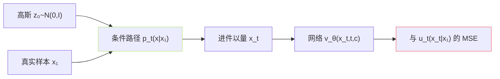

---

## 参考文献

1. Lipman, Y. et al. (2023). _Flow Matching for Generative Modeling_. ICLR.

1. Tong, A. et al. (2023). _Improving and Generalizing Flow-Based Generative Models with Minibatch OT_. arXiv:2302.00482.

[[1.5.2.1 Conditional FM 目标推导]]

1. Liu, X. et al. (2023). _Rectified Flow_. ICLR.

## 前置知识

> [!important]
> 
> 先读 [[1.5.1 Continuous Normalizing Flow (CNF)]]。本页启序上是 Flow Matching 理论的「主舌看点」。

---

## 0. 定位

> **一句话**：Flow Matching 的训练目标 = 「**拟合一个『目标速度场』**」。『目标速度』是「**从** $z_0$ **到** $x$ **的路径上，每个点应该走多快**」。**Conditional Flow Matching（CFM）** 是其可计算版本——通过选一个「条件路径」避免了诡异积分。

---

## 1. Flow Matching（论文原始形式）

$$\mathcal L_{\text{FM}} = \mathbb E_{t, x \sim p_t(x)} \big\| v_\theta(x, t) - u_t(x) \big\|^2$$

- $u_t(x)$：目标速度场。

- $v_theta(x,t)$：网络预测的速度场。

- $t sim U(0,1)$, $x sim p_t$：样本采自路径中间状态。

**诡异问题**：未知 $p_t(x)$ 、未知 $u_t(x)$。不可直接计算。

---

## 2. Conditional Flow Matching（理论主看点）

**选一个条件路径** $p_t(x|x_1)$，指定「从 $z_0$ 到 $x_1$」的一条路径。**关键定理**：

$$\mathcal L_{\text{CFM}} = \mathbb E_{t, x_1, x_t \sim p_t(\cdot|x_1)} \big\| v_\theta(x_t, t) - u_t(x_t | x_1) \big\|^2$$

上述梯度与原 Flow Matching 损失梯度**相等**（Lipman 2023 论文 Theorem 2）。于是：只需要 $u_t(x_t|x_1)$，不需面对 $u_t(x_t)$ 的不可算。

详见 [[1.5.2.1 Conditional FM 目标推导]]。

---

## 3. 最佳运输 (OT) 路径

选路径设计：$x_t = (1-t) z_0 + t x_1$——「**直线插值**」。这是 Optimal Transport 的最简单路径。

对应目标速度：

$$u_t(x_t | x_1) = x_1 - z_0$$

于是损失变成：

$$\mathcal L_{\text{CFM-OT}} = \mathbb E_{t, z_0, x_1} \big\| v_\theta(x_t, t) - (x_1 - z_0) \big\|^2$$

> [!important]
> 
> **极简化**：训练变为「预测两点连线的方向」。不需中间 ODE、不需伊随接传。这是 Flow Matching 被誉为「扩散 2.0」的原因。

---

## 4. CFG（Classifier-Free Guidance）

训练时随机掩掉条件 $c$（概率 10%），推理时：

$$\tilde v(x_t, t) = v_\theta(x_t, t, \emptyset) + w \cdot \big( v_\theta(x_t, t, c) - v_\theta(x_t, t, \emptyset) \big)$$

GPT-SoVITS v3/v4 默认 $w = 2.0$。作用：加强条件的影响力。

---

## 5. 与扩散模型的取舍

||DDPM|CFM|
|---|---|---|
|损失|预测噪声 $\epsilon$|预测速度 $u_t$|
|路径|调同限定（VP/VE）|可选（OT 最简）|
|推理步数|100–1000|**8–20**|
|质量（水平接近）|成熟|低步数多样|
|CFG|可|可|

> [!important]
> 
> **为什么 GPT-SoVITS v3 选 CFM 而不是扩散**：质量持平，训练/推理都更快，低 NFE 让 24kHz、48kHz 生成可接受。

---

## 6. 子页面导航