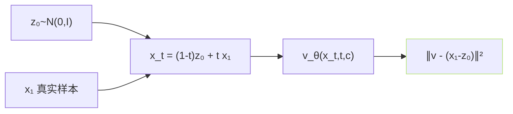

## 前置知识

> [!important]
> 
> 本页属于 [[1.5.2 Flow Matching 训练目标]]。

---

## 0. 定义

> **Conditional FM 推导** = 「证明 $nabla_theta mathcal L_{text{FM}} = nabla_theta mathcal L_{text{CFM}}$」。这个定理让 Flow Matching 从「不可计算」变「可训练」。

---

## 1. 三个量

- **边缘路径** $p_t(x) = int p_t(x|x_1) p_{text{data}}(x_1) dx_1$。

- **边缘速度场** $u_t(x)$：让 $p_t$ 沿 $u_t$ 演化。

- **条件速度场** $u_t(x|x_1)$：仅对 $p_t(\cdot|x_1)$ 上有意义。

不可计算点：$u_t(x)$ 需要边缘化 $p_t(x|x_1)$，不能闭式写出。

---

## 2. 定理（Lipman 2023 Theorem 2）

$$\nabla_\theta \mathbb E_{t, x \sim p_t}\|v_\theta - u_t(x)\|^2 = \nabla_\theta \mathbb E_{t, x_1, x_t \sim p_t(\cdot|x_1)}\|v_\theta - u_t(x_t|x_1)\|^2$$

证明思路：展开二范数，中间交叉项 $\mathbb E[v_\theta \cdot u_t(x)]$ 与 $\mathbb E[v_\theta \cdot u_t(x_t|x_1)]$ 在边缘下相等。

---

## 3. 为什么 OT 路径是 $x_t = (1-t)z_0 + t x_1$

选一个高斯条件路径：

$$p_t(x|x_1) = \mathcal N(x; \mu_t(x_1), \sigma_t^2 I)$$

与 $mu_t(x_1) = t x_1, sigma_t = 1 - (1-sigma_{min})t$。令 $sigma_{min} to 0$：$mu_t = t x_1, sigma_t = 1-t$。

采样：

$$x_t = \mu_t(x_1) + \sigma_t \cdot z_0 = t x_1 + (1-t) z_0$$

即「两点插值」。

---

## 4. 条件速度场求取

连续性方程下推导：

$$u_t(x|x_1) = \frac{\dot \mu_t(x_1) + \dot\sigma_t (x - \mu_t(x_1))/\sigma_t \cdot \sigma_t}{1} = \dot\mu_t(x_1) + \dot\sigma_t \frac{x - \mu_t(x_1)}{\sigma_t}$$

代入 $dotmu = x_1, dotsigma = -1$：

$$u_t(x_t|x_1) = x_1 - \frac{x_t - t x_1}{1-t} = x_1 - z_0$$

**结果极简**：$u_t = x_1 - z_0$。不依赖 $x_t$ 本身、不依赖 $t$、只依赖两个端点。

---

## 5. 训练目标简化



$$\mathcal L_{\text{CFM-OT}} = \mathbb E_{t, z_0, x_1} \| v_\theta((1-t)z_0 + t x_1, t, c) - (x_1 - z_0) \|^2$$

---

## 6. 迭代算法

```python
# 伪代码
for batch in dataloader:
    x1 = batch['target_mel']
    c = batch['condition']
    z0 = torch.randn_like(x1)
    t = torch.rand(x1.size(0), 1, 1, device=x1.device)
    xt = (1 - t) * z0 + t * x1
    target_v = x1 - z0  # OT 路径的目标速度
    pred_v = model(xt, t, c)
    loss = ((pred_v - target_v) ** 2).mean()
    loss.backward(); optimizer.step()
```

---

## 7. GPT-SoVITS v3/v4 调同

GPT-SoVITS 上调同接入 mel 预测、CFG 随机掩 c、训练迭代 ~7000h，遵以上公式。

---

## 参考文献

1. Lipman, Y. et al. (2023). _Flow Matching for Generative Modeling_. ICLR. Theorem 2.

1. Tong, A. et al. (2023). _Conditional Flow Matching_. arXiv:2302.00482.