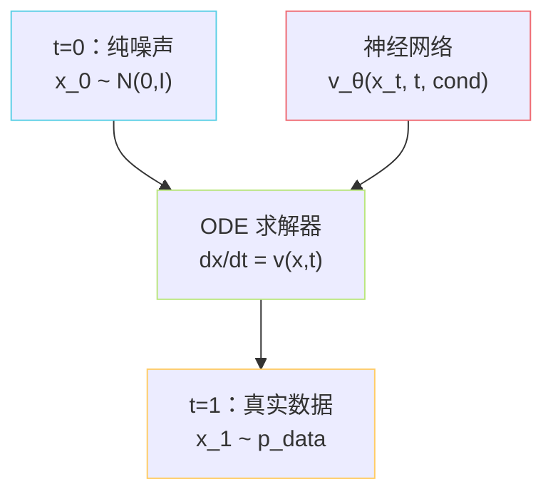
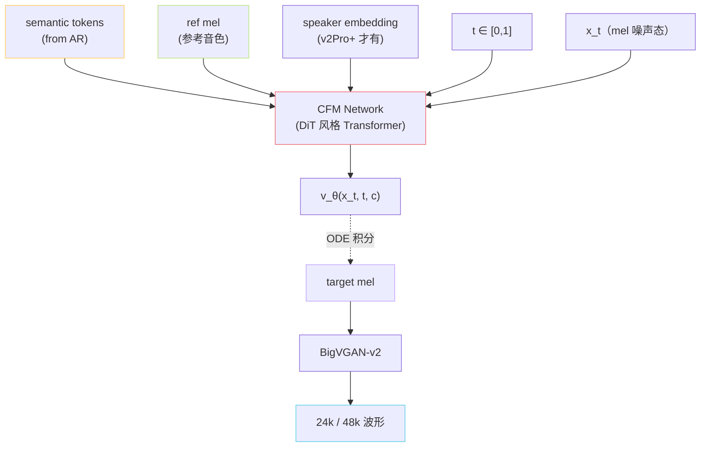

## 前置知识

> [!important]
> 
> 建议读过 [[1.1 VITS 原理（SoVITS 的“S”血统）]]，本页大量与 VITS Flow 对比。

---

## 0. 定位

> **一句话**：CFM（**Conditional Flow Matching**，条件流匹配）= **「直接回归从噪声到数据的最优传输向量场」**。GPT-SoVITS v3/v4 用它**替换** VITS 的 Flow + GAN 解码路径，把 semantic + ref mel **流匹配生成** target mel，再交 BigVGAN 出波形。

---

## 1.5.1 为什么不用 VITS Flow？

VITS 的 Normalizing Flow 是**可逆耦合层**堆叠，本质上是「把高斯先验扭成复杂分布」：

**问题**：

- 可逆性约束 → 表达能力受限（每层 Jacobian 必须有解析行列式）。

- 与 GAN 联训 → 不稳定，GAN 部分易 mode collapse。

- 在 24k / 48k 高采样率上音质天花板低（v1/v2 32k 已是极限）。

CFM 用**完全不同的范式**绕开这些问题：

---

## 1.5.2 Flow Matching 核心思想

**关键点**：

- 训练时**不需要**可逆、不需要求 Jacobian。

- 推理时通过 **ODE 数值积分**从噪声走到数据。

- 与 Diffusion 同源但更直接：Diffusion 用 score（梯度场），CFM 用 vector field（速度场）。

---

## 1.5.3 CFM 训练目标

### 概率路径

定义一条从噪声 $p_0 = \mathcal{N}(0,I)$ 到数据 $p_1 = p_{\text{data}}$ 的概率路径：

$$p_t(x | x_1) = \mathcal{N}\!\big(x \,\big|\, \mu_t(x_1),\, \sigma_t^2 I\big)$$

最常用的「**直线路径**」（OT-CFM）：

$$\mu_t(x_1) = t \cdot x_1, \quad \sigma_t = 1 - (1-\sigma_{\min}) t$$

对应**目标向量场**：

$$u_t(x | x_1) = \frac{x_1 - (1-\sigma_{\min}) x}{1 - (1-\sigma_{\min}) t}$$

### 损失函数（Conditional FM）

$$\mathcal{L}_{\text{CFM}} = \mathbb{E}_{t, x_1, x \sim p_t(x|x_1)} \Big[\, \| v_\theta(x, t, c) - u_t(x | x_1) \|^2 \,\Big]$$

- $c$：条件（GPT-SoVITS 中是 semantic + ref mel + speaker embedding）。

- 与 Diffusion 的 $\epsilon$-prediction 同构，**实现极简**（MSE，无 GAN 判别器）。

---

## 1.5.4 CFM vs Diffusion vs VITS Flow

|维度|VITS Flow|Diffusion (DDPM)|**CFM (v3/v4)**|
|---|---|---|---|
|训练范式|可逆变换 + GAN|score / noise 回归|**vector field 回归**|
|训练损失|ELBO + adv + fm|MSE(ε)|**MSE(v)**|
|是否需 GAN|是|否|**否**|
|推理步数|1|1000 → 50（DPM-Solver）|**8~32（ODE）**|
|采样轨迹|无（一步）|SDE / ODE|**ODE，可任意 solver**|
|表达能力|受 Jacobian 约束|充分|**充分**|

> [!important]
> 
> **CFM 相对 Diffusion 的核心优势**：
> 
> 1. **路径自由**：不必走「数据 → 加噪声」的固定路径，可走最优传输直线（OT），收敛更快。
> 
> 1. **采样更少步**：8~16 步即可达到 Diffusion 50 步的质量。
> 
> 1. **训练目标更直接**：直接回归速度场，物理意义清晰。

---

## 1.5.5 在 GPT-SoVITS v3/v4 中的具体形态

详见 [[6.2 V3 - V4 SoVITS（CFM + BigVGAN）]]。

---

## 1.5.6 工程判断

> [!important]
> 
> **什么时候选 CFM（v3/v4）vs VITS（v2Pro）？**
> 
> - 训练数据 ≥ 1000 小时、追求 48k 自然度 → **CFM（v4）**
> 
> - 训练数据 ≤ 100 小时、追求音色相似度 → **VITS（v2Pro）**
> 
> - 实时低延迟（≤ 200ms） → **VITS（v2 中型）**
> 
> - 慢工细活离线合成 → **CFM（v4）**

---

## 1.5.7 子页面导航

[[1.5.1 Continuous Normalizing Flow (CNF)]]

---

## 1.5.8 延伸阅读

- [[6.2 V3 - V4 SoVITS（CFM + BigVGAN）]]

- [[13.5 与端到端 Flow - Diffusion TTS 的未来融合]]

---

## 参考文献

1. Lipman, Y., Chen, R., Ben-Hamu, H., Nickel, M., & Le, M. (2023). _Flow Matching for Generative Modeling_. ICLR.

1. Tong, A. et al. (2024). _Improving and Generalizing FM with Minibatch OT_. TMLR.

1. Le, M. et al. (2023). _Voicebox: Text-Guided Multilingual Universal Speech Generation at Scale_. NeurIPS.

[[1.5.2 Flow Matching 训练目标]]

1. Du, C. et al. (2024). _CosyVoice_. arXiv:2407.05407.

[[1.5.3 ODE Solver 与 NFE]]

[[1.5.4 与 Diffusion - Score Matching 的关系]]