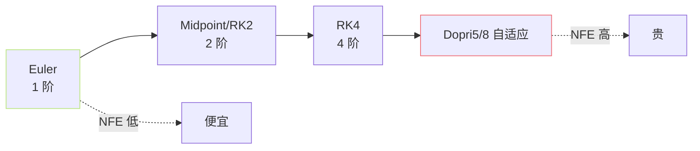
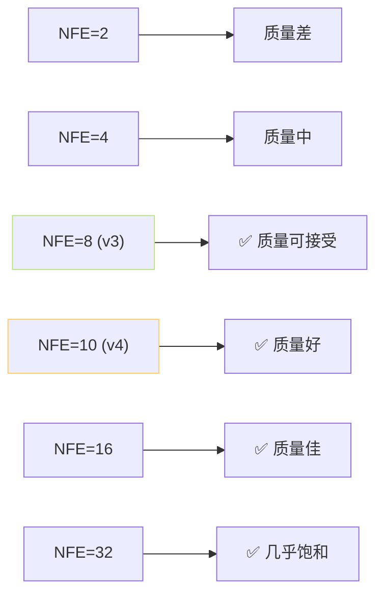

## 前置知识

> [!important]
> 
> 先读 [[1.5.2 Flow Matching 训练目标]]。本页偏「推理实现」侧。

---

## 0. 定位

> **一句话**：推理时需要从 $z_0$ 开始、顺着 $v_\theta$ 走 ODE 到 $x$。**ODE Solver** 选哪个、**NFE（Number of Function Evaluations）调多少**，直接决定推理速度与质量的平衡点。

---

## 1. 主流求解器



### Euler（1 阶）

$$x_{t+h} = x_t + h \cdot v_\theta(x_t, t)$$

- NFE 每步 1、误差 $O(h^2)$。

- 适合路径较「直」的 OT-CFM 场景。

### Midpoint（2 阶）

$$\begin{aligned}  
k_1 &= v_\theta(x_t, t) \\  
x_{mid} &= x_t + \tfrac{h}{2} k_1 \\  
k_2 &= v_\theta(x_{mid}, t + \tfrac{h}{2}) \\  
x_{t+h} &= x_t + h \cdot k_2  
\end{aligned}$$

- NFE 每步 2、误差 $O(h^3)$。

### RK4（4 阶）

- NFE 每步 4、误差 $O(h^5)$。质量上限高、NFE 贵。

### Adaptive Dopri5

- 动态调整步长，错误控制在 tol。

- NFE 不可控（可能 50+）。不适合实时 TTS。

---

## 2. NFE 与质量的权衡



**经验规则**：NFE 从 2 到8 提升明显；8←16 边际收益递减；32+ 几乎饱和。

---

## 3. GPT-SoVITS 的选择

|版本|Solver|NFE|为什么|
|---|---|---|---|
|v3 (24kHz)|Euler|**8**|24kHz mel 生成，快优先|
|v4 (48kHz)|Euler|**10**|48kHz 生成，额外 2 NFE 保障质量|
|v2Pro/ProPlus|不适用|-|仍用 VITS 解码器，无 CFM|

```python
# GPT_SoVITS/module/cfm.py 伪代码
def sample(self, mu, ref, x_lens, n_timesteps=10, temperature=1.0):
    """Euler ODE 求解器：x_0 → x_1"""
    t_span = torch.linspace(0, 1, n_timesteps + 1, device=mu.device)
    x = torch.randn_like(mu) * temperature  # x_0 = noise
    for t_curr, t_next in zip(t_span[:-1], t_span[1:]):
        dt = t_next - t_curr
        v = self.estimator(x, t_curr, mu, ref, x_lens)
        x = x + dt * v  # Euler 步
    return x  # x_1, mel 预测
```

---

## 4. CFG 下的 NFE 加倍问题

CFG 每步要跑两次 $v_theta$（有/无条件）：

$$\tilde v = v(\emptyset) + w(v(c) - v(\emptyset))$$

**实际 NFE** = $n_{text{timesteps}} times 2$。v3 名义上 8 步、实际调 forward 16 次。这是新手调性能时最容易忘记的点。

---

## 5. 高级选项：Distillation

Consistency Model 、Progressive Distillation、Rectified Flow。目标是「把 8 步学习压到 1 步」。

**GPT-SoVITS 未采用，但是未来加速热门方向**。详见：[[13.5 与端到端 Flow - Diffusion TTS 的未来融合]]。

---

## 6. 推理调优清单

> [!important]
> 
> - 实时场景：NFE = 6，CFG 关闭或 w=1.5。
> 
> - 质量优先：NFE = 16-20，CFG w = 2.0。2.5（稳平衡）。
> 
> - 调高粗炕感：NFE = 32，CFG w = 1.0。
> 
> - **不要仅靠加大 NFE 收拔 “金属河、闷咼」问题**，都是 BigVGAN-v2 微调问题、不是 ODE 精度问题。见 [[13.2 v3 - v4 人工感 - 金属音]]。

---

## 参考文献

1. Lu, C. et al. (2022). _DPM-Solver_. NeurIPS.【与 Flow Matching 拼接人有 NFE 底现】

1. Chen, R. T. Q. (2018). _torchdiffeq_ documentation.

1. GPT-SoVITS `module/cfm.py`.