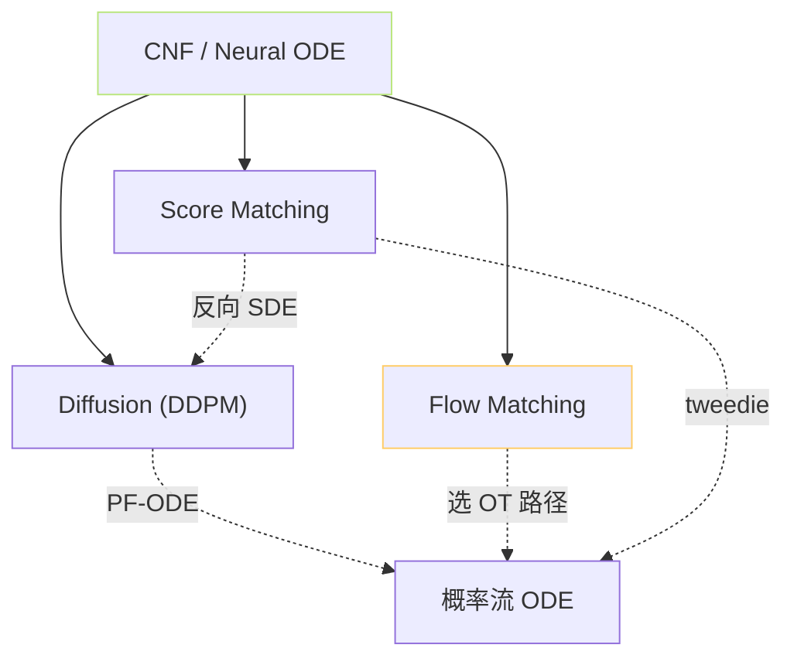
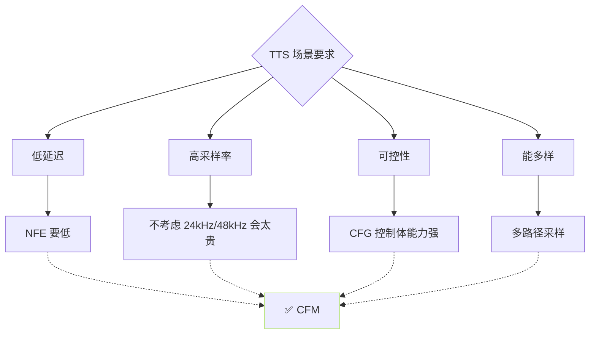

## 前置知识

> [!important]
> 
> 先读 [[1.5.2 Flow Matching 训练目标]]。本页是 与 Diffusion / Score Matching 的深度对比。

---

## 0. 定位

> **一句话**：**Diffusion / Score Matching** 与 **Flow Matching** 是「同一个生成框架的三种启发护口」——都是「训练一个变量场」，只是选取走路/纲领、拟合目标、推理求解各不同。

---

## 1. 三条路线的机械

### 1.1 Diffusion（DDPM）

- **前向过程**： $x_t = sqrt{baralpha_t} x_0 + sqrt{1-baralpha_t},epsilon$。

- **训练目标**： $\mathcal L = \mathbb E\|\epsilon_\theta(x_t,t) - \epsilon\|^2$ （预测噪声）。

- **推理**： DDPM 随机反向采样 / DDIM 确定采样。

### 1.2 Score Matching（SDE）

- **训练目标**： $\mathcal L = \mathbb E\|s_\theta(x_t,t) - \nabla_x \log p_t(x_t)\|^2$ （预测梯度）。

- **推理**： Probability Flow ODE （同 CNF）。

- 与 DDPM 的关系：$nabla_x log p_t = -epsilon / sigma_t$，二者仅是「预测量」不同。

### 1.3 Flow Matching（CFM）

- **训练目标**： $\mathcal L = \mathbb E\|v_\theta(x_t,t) - u_t(x_t|x_1)\|^2$ （预测速度）。

- **推理**： ODE 正向采样。

- 与 Score Matching 的关系：$v = x_1 - z_0 approx (x_t - z_0)/t$，与 score 可线性互换。

---

## 2. 三者同源图

**三者可互换**：预测变量 $(\epsilon, s, v)$ 与 $x_0$ 之间能闭式转换。区别仅在「训练目标」与「选哪条路径」。

---

## 3. 实践上的区别与需望

||Diffusion|Score Matching|Flow Matching|
|---|---|---|---|
|路径|VP/VE（选 $baralpha_t$）|任意 SDE|**可选 OT、直线**|
|训练损失|MSE on $\epsilon$|MSE on score|MSE on velocity|
|训练稳定性|稳|中|**高** (路径线性)|
|推理步数|100–1000|100–1000|**8–20**|
|误差阶数|$O(h)$|$O(h)$|$O(h^2)$±|
|加速方法|DDIM/DPM-Solver|PF-ODE|Rectified Flow / Distillation|
|能否多样|能|能|**能**（随 $z_0$）|

---

## 4. 为什么 TTS 选 CFM 而不是 Diffusion

> [!important]
> 
> **总结 4 点**：
> 
> 1. **推理快**：CFM 只需 8-20 步。
> 
> 1. **路径容易训**：OT 路径线性、v(x,t) 不难拟合。
> 
> 1. **质量饱和低 NFE**：MOS 接近 Diffusion，关键是能以低 NFE 水平抵达。
> 
> 1. **与 Diffusion 同源**：能安装现有 Diffusion 生态工具（CFG、条件注入、U-Net 架构都能复用）。

---

## 5. CosyVoice / E2 TTS / NaturalSpeech 3 的选择

||TTS 项目|生成范式|
|---|---|---|
|GPT-SoVITS v3/v4|CFM (mel) + BigVGAN|OT path, NFE 8/10|
|CosyVoice 1/2|CFM (mel) + HiFi-GAN|OT path, NFE 10|
|E2 TTS|CFM (mel) + Vocos|OT path, NFE 32|
|NaturalSpeech 3|多贫圈 Diffusion|Diffusion|
|VALL-E 2|Token AR|无 Diffusion/Flow|

**趋势**：主流 24kHz / 48kHz mel 生成**全面转向 CFM**，VALL-E 那类 Token AR 仍使用 NAR 不采 Flow。

---

## 6. 哲学总结

> [!important]
> 
> Diffusion / Score / Flow Matching 三者代差不是「架构」，而是「训练目标」。选哪个是工程决策——取决于**推理预算**、**路径设计是否能线性化**、**现有生态是否能复用**。
> 
> Flow Matching 不是「取代」扩散，而是「补全」扩散——为实时低延迟场景提供了一个多样性与质量并存的选项。

---

## 参考文献

1. Song, Y. et al. (2021). _Score-Based Generative Modeling through SDEs_. ICLR.

1. Ho, J. et al. (2020). _DDPM_. NeurIPS.

1. Lipman, Y. et al. (2023). _Flow Matching_. ICLR.

1. Tong, A. et al. (2023). _Conditional Flow Matching_. arXiv:2302.00482.