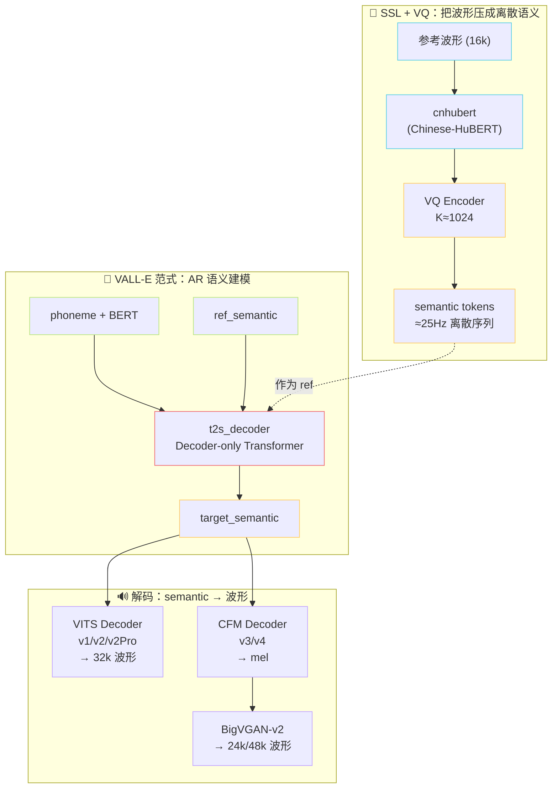

[[1.1 VITS 原理（SoVITS 的“S”血统）]]

## 前置知识

> [!important]
> 
> 本页是 GPT-SoVITS 系列理论根基的入口。读完本页应能理解：GPT-SoVITS **不是**任何一篇论文的复现，而是 **「VITS + VALL-E + SSL + VQ + Flow Matching」五条理论线的工程缝合**。
> 
> 延伸阅读：[[2. GPT-SoVITS 整体架构]]

---

## 0. 定位

> **一句话**：本章覆盖五条独立的理论根基。每一条都不是 GPT-SoVITS 原创，但它的创新在于**把这五条以正确的方式接起来**——具体怎么接，决定了 v1/v2/v2Pro/v3/v4 的所有差异。

---

## 1. 五条理论线 → 五个核心组件

|理论根基|代表论文|GPT-SoVITS 中的角色|涉及版本|
|---|---|---|---|
|**变分推断声码器（VITS）**|Kim et al., 2021|端到端声学解码器：semantic + ref → 直出 32k 波形|v1, v2, v2Pro, v2ProPlus|
|**离散语义 + 自回归（VALL-E 类）**|Wang et al., 2023|t2s_decoder：把 (text, ref_semantic) 自回归生成 target_semantic|全版本|
|**自监督语音表示（SSL）**|wav2vec 2.0 / HuBERT|cnhubert：从波形抽语义特征，**绕过显式音素对齐**|全版本|
|**向量量化（VQ）**|VQ-VAE, 2017|把 cnhubert 连续特征离散化为 semantic token，AR 头才能像 LLM 一样建模|全版本|
|**条件流匹配（CFM）**|Lipman et al., 2023|v3/v4 mel 生成器：semantic → mel，再交 BigVGAN 出 24k/48k 波形|v3, v4|

每一条都有独立子页面（见本页末尾导航）。

---

## 2. 拓扑视角：五条线如何咬合

> [!important]
> 
> **直觉**：把 GPT-SoVITS 看成「语音的 RAG + LLM」——VALL-E 是 LLM、SSL+VQ 是 tokenizer、VITS/CFM+BigVGAN 是 detokenizer，**参考音频则是 in-context 检索到的 voice prompt**。

---

## 3. 横向对比

### 3.1 表示形式的取舍

|维度|mel / linear（连续）|SSL 特征（连续）|VQ 离散 token|
|---|---|---|---|
|能否交 Transformer 自回归|❌ 无离散字典|❌ 同上|✅|
|是否保留说话人音色|✅（高度耦合）|✅（部分）|⚠️ 仅保留语义|
|是否便于压缩存储|❌|❌|✅|
|是否能复用 LLM 训练栈|❌|❌|✅|

> [!important]
> 
> **GPT-SoVITS 的选择**：**SSL + VQ 解耦语义与音色**，让 AR 头只学语义、解码器从参考音频中读音色。这就是它能做**少样本（zero-shot / few-shot）声音克隆**的核心。

### 3.2 解码器：VITS vs CFM

|维度|VITS（v1/v2/v2Pro）|CFM（v3/v4）|
|---|---|---|
|范式|条件 VAE + Flow + GAN|条件流匹配（ODE）|
|训练目标|ELBO + 判别器损失|$\mathcal{L}_{\text{FM}}$（向量场回归）|
|输出|直出波形（end-to-end）|输出 mel → BigVGAN 还原波形|
|采样步数|1 步前馈|$N \geq 8$ 步 ODE|
|训练稳定性|中（GAN 易崩）|高（无判别器）|
|推理速度|快|慢 $N$ 倍|
|音质上限|32k 中等|48k 高自然度|

### 3.3 自回归 vs 非自回归

|路线|代表|GPT-SoVITS 是否采用|
|---|---|---|
|纯 AR|VALL-E AR、Tortoise|✅ t2s_decoder|
|纯 NAR|FastSpeech 2、NaturalSpeech|❌|
|AR + NAR 混合|VALL-E 完整版、CosyVoice 1|❌（用 Flow/CFM 取代 NAR）|
|纯 Diffusion / FM|NaturalSpeech 3、E2 TTS|⚠️ v3/v4 解码器是 CFM|

> [!important]
> 
> **常见误区**：把 GPT-SoVITS 归类为「VALL-E 复现」。
> 
> 它只**借用了 AR 范式**，但用 **VITS/CFM 替换了 VALL-E 的 NAR 阶段**，且 tokenizer 不是 EnCodec 而是**自训练的 cnhubert + 单层 VQ**，参数量、复杂度都低一个数量级。

---

## 4. 工程判断：为什么是这五条线的组合？

> [!important]
> 
> **优先级链：先 SSL+VQ 解耦，再 AR 建语义，最后 Flow/CFM 还音色**
> 
> 1. **先 SSL+VQ**：解决「语音如何变 token」——没有这一步，AR 头无从下手。
> 
> 1. **再 AR**：解决「文本如何控制语音」——纯 NAR 路线对长文本稳定性差，AR 自然处理变长。
> 
> 1. **最后 Flow/CFM**：解决「token 如何还原成自然声音」——AR 输出是粗粒度语义，必须由非自回归解码器补全韵律与音色细节。

> [!important]
> 
> **为什么不像 VALL-E 那样用 EnCodec？**
> 
> - EnCodec 是 **8 个 RVQ 码本**，总容量 $8 \times 1024$。AR 必须预测多个码本流（VALL-E：AR 预测第 1 流 + NAR 预测剩余 7 流）。
> 
> - GPT-SoVITS 把 RVQ 砍到 **单码本（K≈1024）**，AR 只预测一个序列；丢失的细节由 VITS/CFM 解码器**从参考音频中**补回来。
> 
> - **代价**：AR token 只编码语义，必须始终提供 ref_audio；**好处**：AR 头小一个量级，能在消费级显卡上端到端训练，且少样本微调成本极低。

---

## 5. 子页面导航

1. Lipman, Y. et al. (2023). _Flow Matching for Generative Modeling_. ICLR.

1. GPT-SoVITS Repository. [https://github.com/RVC-Boss/GPT-SoVITS](https://github.com/RVC-Boss/GPT-SoVITS)

---

## 6. 延伸阅读

- 下一章入口：[[2. GPT-SoVITS 整体架构]]

- 数据流细节：[[2.1 高层架构图与数据流]]

- 解码器深入：[[6. SoVITS 解码器（声学生成阶段）]]

---

## 参考文献

1. Kim, J., Kong, J., & Son, J. (2021). _Conditional Variational Autoencoder with Adversarial Learning for End-to-End Text-to-Speech (VITS)_. ICML. arXiv:2106.06103.

1. Wang, C. et al. (2023). _Neural Codec Language Models are Zero-Shot Text to Speech Synthesizers (VALL-E)_. arXiv:2301.02111.

1. Baevski, A. et al. (2020). _wav2vec 2.0_. NeurIPS.

1. Hsu, W. et al. (2021). _HuBERT_. IEEE/ACM TASLP.

1. van den Oord, A. et al. (2017). _Neural Discrete Representation Learning (VQ-VAE)_. NeurIPS.

[[1.2 VALL-E 类范式（GPT-SoVITS 的“GPT”血统）]]

[[1.3 自监督语音表征（SSL Features）]]

[[1.4 向量量化（VQ）与离散语义 Token]]

[[1.5 Flow Matching - CFM（v3-v4 的核心范式）]]

[[1.6 BigVGAN]]