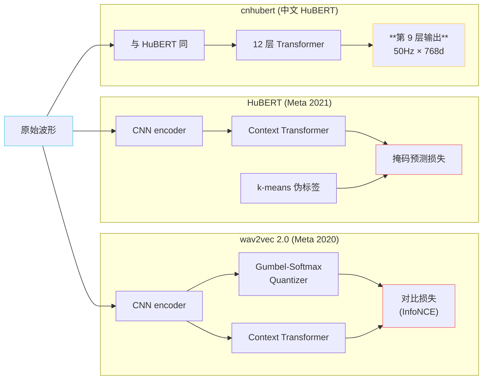
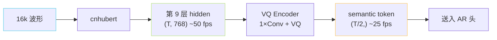

## 前置知识

> [!important]
> 
> 建议先读 [[1.2 VALL-E 类范式（GPT-SoVITS 的“GPT”血统）|1.2 VALL-E 类范式（GPT-SoVITS 的“GPT”血统）]] 了解「为什么需要把语音变成类语义的中间表示」。

---

## 0. 定位

> **一句话**：SSL（**Self-Supervised Learning**，自监督学习）语音特征是 GPT-SoVITS 的「**伪 phoneme**」——既不依赖人工对齐，又能把波形抽成稳定、与说话人**部分**解耦的语义表示。GPT-SoVITS 用 **cnhubert**（中文版 HuBERT），第 9 层输出，50 Hz 帧率。

---

## 1.3.1 为什么用 SSL 而不是 mel / phoneme？

|方案|训练数据需求|与说话人解耦|与文本对齐|GPT-SoVITS 采用|
|---|---|---|---|---|
|mel-spectrogram|任意|❌ 高度耦合|无|❌|
|人工 phoneme + 强制对齐|标注数据|✅|严格|❌（标注贵 + 跨语种难）|
|ASR encoder 中间层|监督 ASR 数据|部分|隐式|⚠️ 仅 0c 阶段|
|**SSL (wav2vec / HuBERT)**|**海量无标签波形**|**较好**|**隐式**|✅ **cnhubert**|
|ContentVec|HuBERT + 扰动训练|**强解耦**|隐式|❌（中文预训练数据少）|

[[1.3.4 ContentVec - 语义-说话人解耦|1.3.4 ContentVec - 语义-说话人解耦]]

[[1.3.2 HuBERT 训练目标|1.3.2 HuBERT 训练目标]]

[[1.3.3 cnhubert（Chinese-HuBERT-base）|1.3.3 cnhubert（Chinese-HuBERT-base）]]

> [!important]
> 
> **GPT-SoVITS 选 cnhubert 的三个理由**：
> 
> 1. **中文友好**：原版 HuBERT 在英文 LibriSpeech 上预训练，对中文音节失真；cnhubert 在 WenetSpeech 上预训练，对中文音节边界更敏感。
> 
> 1. **第 9 层最语义**：HuBERT 越深越偏 ASR，越浅越偏声学；**第 9 层是经验最优**的语义-声学平衡点。
> 
> 1. **50Hz 帧率**：对应 20ms 一帧，再下采样到 25Hz 给 AR——既不会太密（AR 序列爆炸）也不会太疏（丢韵律）。

---

## 1.3.2 三条 SSL 路线

各路线深入见下方导航。

---

## 1.3.3 关键公式：HuBERT 的掩码预测损失

$$\mathcal{L}_{\text{HuBERT}} = - \sum_{t \in M} \log \frac{\exp\!\big(\mathrm{sim}(o_t, e_{z_t}) / \tau\big)}{\sum_{c} \exp\!\big(\mathrm{sim}(o_t, e_c) / \tau\big)}$$

- $M$：被掩码的帧；$z_t$：k-means 前一轮聚类得到的伪标签；$e_c$：embedding 表里第 $c$ 个类中心。

- **直觉**：把语音的「下一个聚类簇」当成「下一个 token」预测，与 LM 完全同构。

**迭代训练**：

1. 用 mel + k-means 生成第 1 代标签

1. 训 HuBERT 第 1 代

1. 取 HuBERT 中间层做新 k-means，得第 2 代标签

1. 训 HuBERT 第 2 代

1. 论文实测 2 轮后效果饱和

---

## 1.3.4 SSL 特征如何进入 GPT-SoVITS

> [!important]
> 
> **关键工程点**：cnhubert 输入**必须**重采样到 16kHz（HuBERT 预训练采样率），与训练目标采样率（v1/v2 32k、v3 24k、v4 48k）**完全解耦**。详见 [[4.2.1 16kHz 强制重采样的来源|4.2.1 16kHz 强制重采样的来源]]。

---

## 1.3.5 常见误区

> [!important]
> 
> **误区**：「SSL 特征里没有说话人信息」。
> 
> 错——HuBERT 没经过说话人扰动训练，**说话人信息仍部分泄漏**到 hidden 中。这就是为什么必须再加一层 VQ 把它**离散化到小码本**，强制丢掉细节，只保留粗粒度语义。ContentVec 是另一条路（训练时扰动音色），但 GPT-SoVITS 没用，因为中文预训练数据少。

---

## 1.3.6 子页面导航

[[1.3.1 wav2vec 2.0 原理|1.3.1 wav2vec 2.0 原理]]

---

## 1.3.7 延伸阅读

- [[私人与共享/GPT-SoVITS 系列全栈总纲/4. 音频前端与 SSL 特征|4. 音频前端与 SSL 特征]]

- [[4.2 cnhubert 特征抽取|4.2 cnhubert 特征抽取]]

- [[1.4 向量量化（VQ）与离散语义 Token|1.4 向量量化（VQ）与离散语义 Token]]

---

## 参考文献

1. Baevski, A. et al. (2020). _wav2vec 2.0_. NeurIPS.

1. Hsu, W. et al. (2021). _HuBERT_. IEEE/ACM TASLP.

1. Qian, K. et al. (2022). _ContentVec_. ICML.

1. TencentGameMate/chinese-hubert-base. [https://huggingface.co/TencentGameMate/chinese-hubert-base](https://huggingface.co/TencentGameMate/chinese-hubert-base)