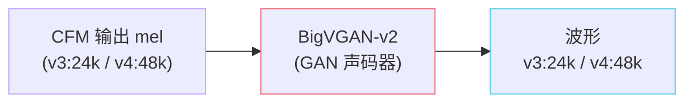

## 前置知识

> [!important]
> 
> 建议先了解 [[1.5 Flow Matching - CFM（v3-v4 的核心范式）|1.5 Flow Matching - CFM（v3-v4 的核心范式）]]，BigVGAN 是 CFM 输出 mel 之后的最后一步。

---

## 0. 定位

> **一句话**：BigVGAN 是 NVIDIA 提出的 **mel → 波形** 神经声码器。GPT-SoVITS **v3 用 BigVGAN-v2 24khz 100band 256x**、**v4 改为 48k 原生 BigVGAN**。本页**只做一句话定位**，不展开细节，详细工程参数已挂到对应版本演进页。

---

## 1.6.1 在 GPT-SoVITS 中的位置

---

## 1.6.2 核心要点（一笔带过）

- **架构**：HiFi-GAN 的升级版，引入 **Anti-Aliased Multi-Periodicity (AMP)** 模块和 **snake activation**。

- **数据**：在 LibriTTS-R + 多语种数据上预训练，泛化好。

- **GPT-SoVITS 接法**：从 NVIDIA 官方权重 `bigvgan_v2_24khz_100band_256x` 初始化；v4 改用 48k 训练 checkpoint。

- **为什么不用 HiFi-GAN？** v3 训练数据多样，HiFi-GAN 在跨说话人时易出金属噪；BigVGAN 的 AMP 模块对**高频混叠**有更好抑制。

- **v3 vs v4 的 vocoder 差异**：v3 的 24k → 48k 需要外部上采样导致金属感；v4 改为**原生 48k**，金属音消失。详见 [[10.4.2 V3 金属噪声问题溯源|10.4.2 V3 金属噪声问题溯源]]。

---

## 1.6.3 延伸阅读

- [[2.4.4 GPT_SoVITS-BigVGAN-|2.4.4 GPT_SoVITS-BigVGAN-]]（代码目录）

- BigVGAN 论文与官方仓库：见下方参考文献。

---

## 参考文献

1. Lee, S. et al. (2023). _BigVGAN: A Universal Neural Vocoder with Large-Scale Training_. ICLR.

1. NVIDIA BigVGAN repository. [https://github.com/NVIDIA/BigVGAN](https://github.com/NVIDIA/BigVGAN)