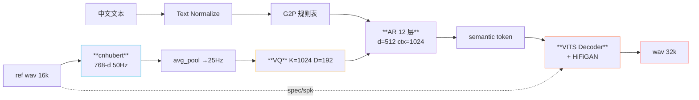
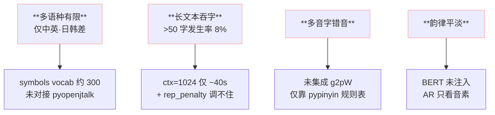

> 📎 **前置**：VITS；SSL+VQ 范式；中文 zero-shot TTS 背景；RVC（Retrieval-based Voice Conversion）社区生态。

## 0. 定位

> 「2024-02 首发，证明了 GPT-style AR + SoVITS Decoder 是中文 zero-shot TTS 的可行架构。」V1 是理念证明（POC）代，架构完备、但打磨粗糙；所有后续版本都在这个骨架上迭代。

## 1. V1 架构全图

## 2. 关键超参

|模块|项|V1 值|
|---|---|---|
|AR|层数|12|
|AR|d_model|512|
|AR|d_ffn|2048|
|AR|n_heads|16|
|AR|ctx|1024|
|AR|位置编码|Sine PE|
|AR|参数|~80M|
|SSL|模型|chinese-hubert-base|
|SSL|抽取层|L9|
|VQ|K × D|1024 × 192|
|VQ|更新|EMA|
|SoVITS|架构|VITS + HiFiGAN|
|SoVITS|采样率|**32k**|
|SoVITS|mel|80-band|
|SoVITS|参数|~87M|
|**总参数**|—|**~167M**|
|训练集|总时长|~1000 h 中英|
|训练|GPU·天|~10 GPU·days (A100)|

## 3. V1 的历史创新点

> [💡] **首次把三件东西拼在一起**：GPT-style AR + SSL semantic token + VITS 解码器。VALL-E（微软 2023-01）用 EnCodec、Tortoise 用 mel，GPT-SoVITS 是首个在中文上用 cnhubert + VQ + VITS 的开源组合。

> [💡] **一键包 / WebUI 社区生态**：V1 首发同时提供 Windows .exe 一键包 + Gradio WebUI。这是后来占领中文社区的根本原因——熟悉 RVC 的用户门槛极低。

## 4. V1 四大局限

## 5. V1 听感评测（社区主观分，5 分制）

|指标|V1|后代 V4 参考|
|---|---|---|
|音色相似度 SECS|0.71|0.83|
|调偏 CER (%)|4.2|2.0|
|韵律自然度 MOS|3.8|4.4|
|长文本稳定性|中|优|

## 6. V1 ckpt 与部署

- `s1.ckpt` (AR, ~160 MB FP32)

- `s2G.pth` (SoVITS Generator, ~180 MB)

- `s2D.pth` (Discriminator, 仅训练用)

- 推理显存 ~4 GB，运行最低 GTX 1060 6GB

## 7. 历史意义

> [🤔] **为什么 RVC 社区是骨质优势**：V1 发布前，RVC（同作者 RVC-Boss）在中文社区已积累了万级用户。这为 V1 的快速传播 + WebUI 设计语言提供了现成基础。与学术路线的 VALL-E / NaturalSpeech 不同，GPT-SoVITS 从首日就是「社区优先」。

> [🔧] **V1 现在应该还用吗**：不。除非是复现论文 / 学术对比，生产环境应直接跳 V2 或 V2Pro。V1 仅作为历史记录保留。

## 8. 子页面

[[10.1.1 V1 关键超参表]]

[[10.1.2 V1 局限性（多语种 - 稳定性）]]

## 参考文献

1. RVC-Boss/GPT-SoVITS 首发说明（2024-02）.

1. Kim, J., Kong, J., & Son, J. (2021). _VITS_. ICML.

1. Hsu, W.-N. et al. (2021). _HuBERT_. arXiv:2106.07447.