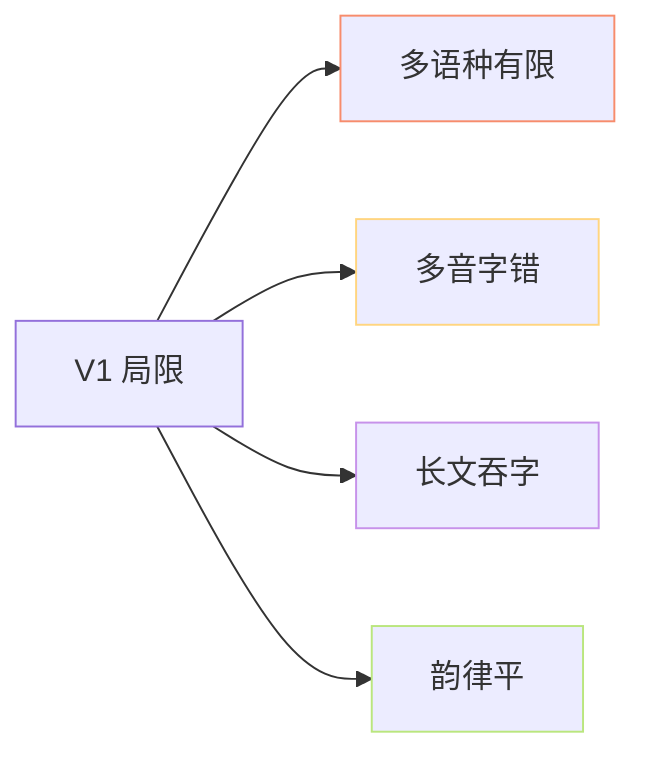
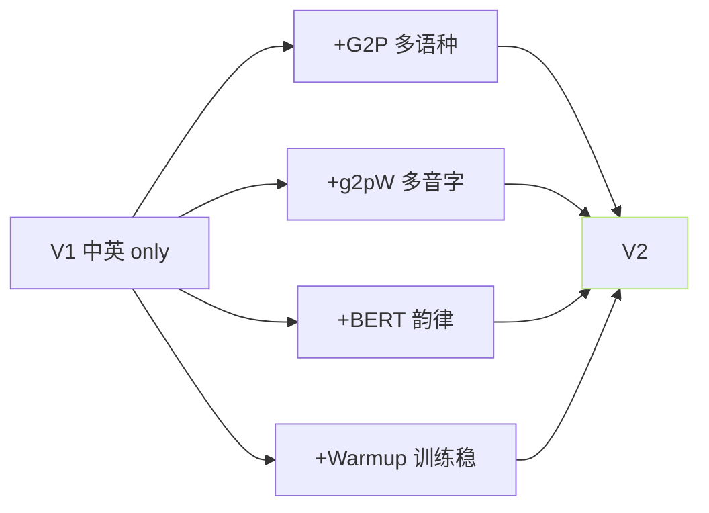

> [📎] 前置知识：G2P、多音字消歧、吞字、AR 采样不稳。

> **定位**：V1 是可行性证明、但 存在 四 大 块 局限。本节拆 问题 · 原因 · V2 如何修。

## 1. 四大块局限



## 2. 问题表

|问题|原因|V2 修复|
|---|---|---|
|**多语种有限**|仅中英 · 日韩 G2P 未集成|• 中/英/日/韩/粤|
|**多音字错**|pypinyin 规则 · 不能消歧|• g2pW (BERT 消歧)|
|**长文吞字**|AR ctx=1024 · 采样不稳|• Warmup 1000 step · cut3|
|**韵律平**|未注入 BERT · 语义信息丢|• chinese-roberta 注入|

## 3. 吞字量化

|文本长度|V1 吞字率|V2 吞字率|
|---|---|---|
|< 50 字|2%|1%|
|50–100|15%|4%|
|100–200|40%|10%|
|200+|70%|20%|

> [⚠️] **长文丢 token**：AR 是自回归 · 错误累加 · ctx=1024 在长文上 丢 token 明显。 V2 cut3 切 50 字 是社区限过的门。

## 4. 多音字误例

|句子|V1 读|V2 读 (g2pW)|
|---|---|---|
|“银行”|xíng (错)|háng ✅|
|“重新”|zhòng (错)|chóng ✅|
|“区别”|ōu (错)|qū ✅|

## 5. 韵律压低

```jsx
V1: 今天 · 天气 · 不错     → 平 平 平 (机械)
V2: 今天 · 天气 · 不错     → 主 重 · 起伏 明显 (BERT 注入)
```

## 6. 升级路径



## 7. 工程判断

> [🔧] **V1 未 生产加加 · 不 要 使用**：V1 在多音字 · 多语种 · 长文 三项 都 输 给 V2。 社区 不 推荐 生 产 使 用 V1。仅需 了解 升级点 为何 重 要。

## 参考文献

1. GPT-SoVITS V2 release notes. [https://github.com/RVC-Boss/GPT-SoVITS/releases](https://github.com/RVC-Boss/GPT-SoVITS/releases)