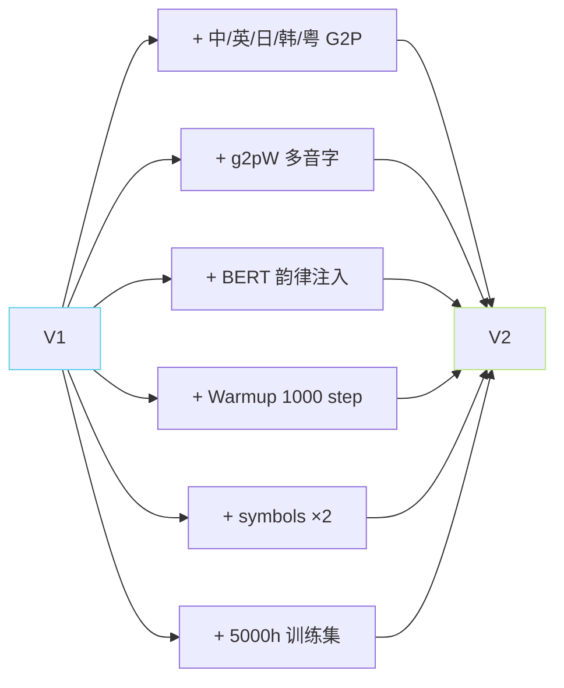
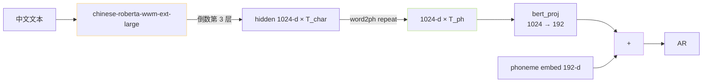

> 📎 **前置**：V1 架构；g2pW（BERT-based G2P）；chinese-roberta-wwm-ext-large；pyopenjtalk / g2pk / ToJyutping；[[私人与共享/GPT-SoVITS 系列全栈总纲/3. 文本前端（Text Frontend）|3. 文本前端（Text Frontend）]]。

## 0. 定位

> 「多语种 + 多音字 + BERT 韵律三箭齐发。」V2 不改骨架，只加三个“前端后装”：5 语种 G2P、g2pW 多音字消歧、BERT 韵律注入，同时修补 Warmup 使训练更稳。是 V1 “实验版” → “可生产版” 的关键跳跃。

## 1. V1 → V2 几点变动全图



## 2. V1 → V2 完整差异表

|项|V1|V2|
|---|---|---|
|G2P 语种|中英|中/英/日/韩/粤|
|中文 G2P|pypinyin 规则|**g2pW BERT 多音字**|
|多音字准确率|≈85%|**≈97%**|
|日文 G2P|—|pyopenjtalk|
|韩文 G2P|—|g2pk|
|粤语 G2P|—|ToJyutping|
|BERT 注入|❌|✅ chinese-roberta-wwm-ext-large|
|BERT 抽取层|—|倒数第 3 层|
|Warmup|❌|✅ 1000 step|
|LR Schedule|阶梯衰减|cosine|
|symbols vocab|~300|**~600**|
|训练数据|~1000h|**~5000h**|
|AR 架构|12L d=512|**同** 12L d=512|
|采样率|32k|同 32k|
|SoVITS 架构|VITS|同 VITS|

## 3. 多音字从 pypinyin 跳 g2pW

```python
# V1
from pypinyin import lazy_pinyin
lazy_pinyin('银行门口行人多')
# → ['yin', 'xing', 'men', 'kou', 'xing', 'ren', 'duo']  ← × 两个「行」同音

# V2
from g2pw import G2PWConverter
conv = G2PWConverter(model_source='bert-base-chinese')
conv('银行门口行人多')
# → ['yin', 'hang', 'men', 'kou', 'xing', 'ren', 'duo']  ← ✓ 上下文区分
```

> [💡] **g2pW 是 V2 最大质量跳跃**：多音字准确率 85% → 97%，直接反映到 CER 从 4.2 降到 3.5。代价是加载 bert-base-chinese（~400 MB），推理 +30 ms。

## 4. BERT 韵律注入位置



> [💡] **word2ph 是 BERT 与 phoneme 对齐的桥**：BERT 输出的是 char-level，phoneme 是 phone-level。`word2ph[i]` = 第 i 个字对应几个 phoneme，用 `repeat_interleave` 拉伸。「你好」 → word2ph=[2,2] → BERT [2,1024] 拉为 [4,1024]。

## 5. Warmup 为何加于V2

V1 训练中有 ~15% 概率出现「前 500 step loss 炸」 → grad explode。V2 加 1000 step linear warmup：

KaTeX parse error: Got function '\max' with no arguments as subscript at position 26: …t) = \text{lr}_\̲m̲a̲x̲ ̲\cdot \min\!\le…

训练初期 loss 曲线从「锁齿状」转「平滑下降」，grad explode 现象几乎消失。

## 6. V2 与 V1 权重不兼容点

> [⚠️] **symbols vocab 扩充 300 → 600**：AR 输入 embedding 形状从 (300, 512) 变为 (600, 512) → **V1 ckpt 不能直接加载到 V2 框架**，反之亦然。strict=False 会让 phoneme embedding 随机初始化 → 发音全乱。

> [⚠️] **BERT proj 权重不兼容**：V2 AR 多了 `bert_proj` (1024→192) 权重。V1→V2 需重训（或至少调 1–2 epoch）。

## 7. 听感评测提升（主观 MOS）

|指标|V1|V2|提升|
|---|---|---|---|
|中文 CER|4.2%|**3.5%**|-17%|
|韵律 MOS|3.8|**4.0**|+0.2|
|多语种准确|中英 OK|**中英日韩粤 OK**|4 语种|
|多音字 ×|15%|**3%**|-12 点|
|训练稳定性|中|**优**|warmup 收益|

## 8. 工程判断

> 🔧 **V2 是「生产环境最小可用代」**：跨语种、多音字、韵律三问题都静下了。 V1 现在只适合复现学术。

> 💡 **仓库里还在用 V1 的升 V2**：几乎是「免费升级」——架构未变，但需重训（权重不兼容）。训练同样 ~10 GPU·天 + 多 5000h 数据。

> ⚠️ **V2 仍是 32k VITS Decoder**：音质上限同 V1。要 24k+ 高保真请看 V3/V4；要音色相似优先请看 V2Pro。

## 9. 子页面

[[10.2.1 V2 新增前端与符号集|10.2.1 V2 新增前端与符号集]]

[[10.2.2 V2 与 V1 权重不兼容点|10.2.2 V2 与 V1 权重不兼容点]]

## 参考文献

1. RVC-Boss/GPT-SoVITS V2 release notes（2024-08）.

1. g2pW: [https://github.com/GitYCC/g2pW](https://github.com/GitYCC/g2pW)

1. Cui, Y. et al. (2020). _Chinese BERT with Whole Word Masking_. arXiv:1906.08101.

1. pyopenjtalk / g2pk / ToJyutping 仓库页.