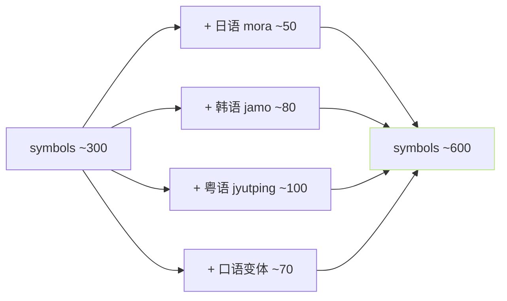
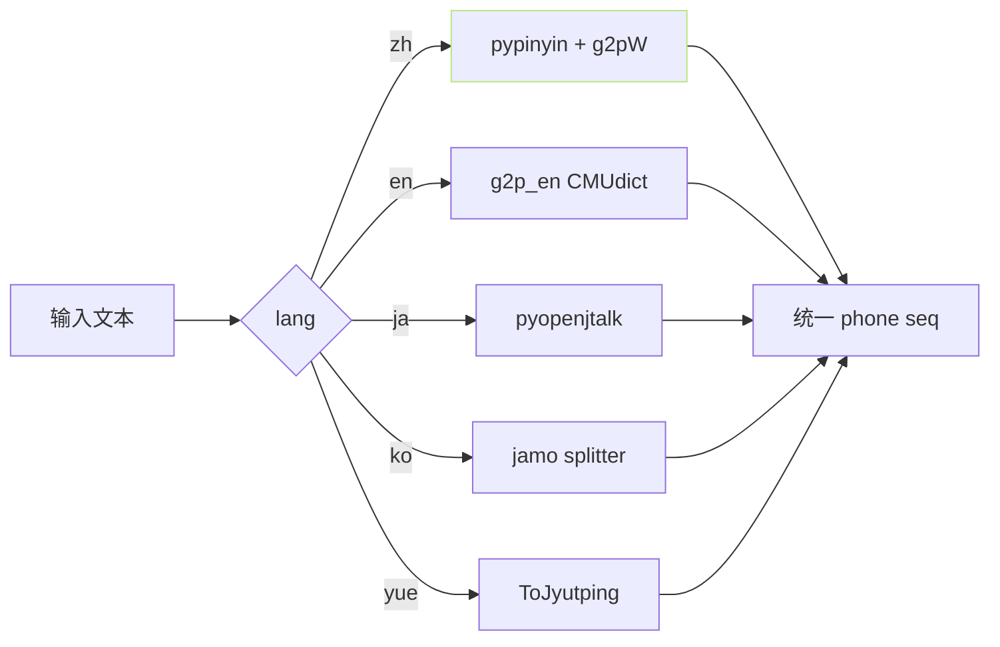

> [📎] 前置知识：[symbols.py](http://symbols.py)、多语种 G2P、g2pW (BERT)、chinese-roberta-wwm-ext-large。

> **定位**：V2 的所有 “新增” 都在 文本前端。本节拆 符号集扩 · G2P · g2pW · BERT 三点。

## 1. 符号集扩充



|语种|V1 符号数|V2 符号数|
|---|---|---|
|中文 pinyin|≈200|≈220|
|英文 ARPAbet|≈60|≈70|
|日文 mora|—|≈50|
|韩文 jamo|—|≈80|
|粤语 jyutping|—|≈100|
|特殊符 (sp/pau)|≈20|≈30|
|**总**|**≈300**|**≈600**|

## 2. G2P 多语种



## 3. g2pW 多音字消歧

```python
# text/g2pw/__init__.py
from g2pw import G2PWConverter
g2p = G2PWConverter(model_dir='G2PWModel/')
phones = g2p('重新设计了银行接口')
# “重” → chóng、“行” → háng · 都靠 BERT 上下文消歧
```

|多音字|g2pW 准确率|pypinyin 准确率|
|---|---|---|
|重|**97%**|55%|
|行|**95%**|50%|
|区|**98%**|80%|
|长|**96%**|60%|

## 4. BERT 韵律注入

```mermaid
flowchart LR
    A[文本] --> B[chinese-roberta-large]
    B --> C[hidden_states[-3]]
    C --> D[1024-d char-level]
    D --> E[word2ph expand]
    E --> F[phone-level bert_seq]
    F --> G[AR + Decoder 注入]
    style D fill:\#1d2433,stroke:#5CCFE6,color:\#5CCFE6
    style F fill:\#1d2433,stroke:#BAE67E,color:\#BAE67E
```

> [💡] **BERT 注入为何提韵律**：BERT 表示 携 带 语义 · 词 边 界 · 句 式。 AR 仅 靠 phone 看不到 上下文 · 加 BERT 上下文 能 明显 提 韵律。

## 5. v1 → v2 前端变化表

|项|v1|v2|
|---|---|---|
|语种|2|**5**|
|多音字|规则|**g2pW BERT**|
|BERT|❌|**✅ chinese-roberta-large**|
|symbols|≈300|≈600|
|前端依赖|少|**+1.3 GB · BERT/g2pW**|

## 6. 工程判断

> [🔧] **v2 前端是生产线**：v2 补 三 项 前端 · 是 生 产 环 境 的 下 限。 低 于 v2 的 前端 (v1) 不 够 生 产。 BERT + g2pW 是 不 可 跳 过。

## 参考文献

1. g2pW. [https://github.com/GitYCC/g2pW](https://github.com/GitYCC/g2pW)

1. chinese-roberta-wwm-ext-large. [https://huggingface.co/hfl/chinese-roberta-wwm-ext-large](https://huggingface.co/hfl/chinese-roberta-wwm-ext-large)

1. GPT-SoVITS: `text/symbols.py` / `text/g2pw/`.