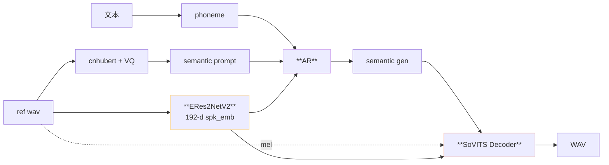
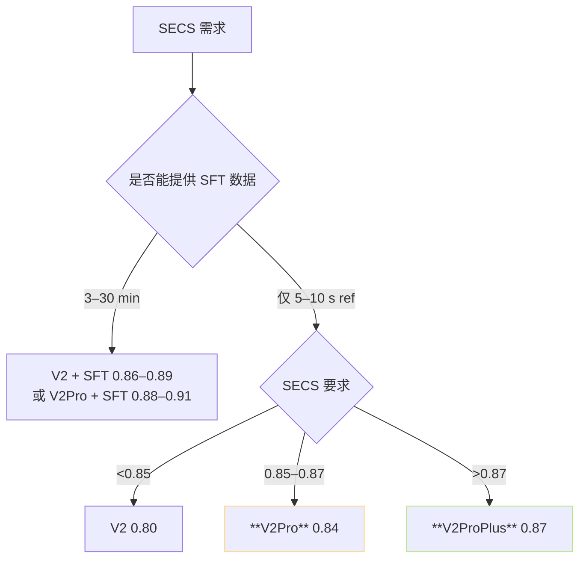

> 📎 **前置**：V2 架构；Speaker Verification (SV)；ERes2NetV2；SECS (Speaker Encoder Cosine Similarity)；FiLM 调制。

## 0. 定位

> 「V2 + 独立 SV 模型双注入。」V2Pro / V2ProPlus 是 V2 架构上加 ERes2NetV2 说话人验证模型提取 192-d 音色 embedding，同时注入 AR 与 Decoder，是 V3/V4 之前「音色优先」场景的首选。

## 1. V2Pro 双注入架构



## 2. 为什么 ERes2NetV2 胜出

|SV 架构|VoxCeleb1-O EER|参数|发布方|
|---|---|---|---|
|x-vector (Snyder 2018)|3.5%|4.2 M|JHU|
|ECAPA-TDNN (Desplanques 2020)|1.5%|6 M|Idiap|
|**ERes2NetV2** (Chen 2023)|**0.6%**|**17 M**|**阿里达摩院 3D-Speaker**|
|WeSpeaker ResNet|0.8%|13 M|WeNet|

> [💡] **ERes2NetV2 是中文 SV SOTA**：Res2Net 的细多尺度拆分 + Expanded residual + Attentive Statistical Pooling。VoxCeleb1-O EER 0.6%——2023 年公开架构中最低。GPT-SoVITS 选它是为了拿 SOTA SV 作为音色传感器。

## 3. Pro vs ProPlus 详细差异

|项|V2Pro|V2ProPlus|倍数|
|---|---|---|---|
|AR 层数|12|**16**|1.33×|
|AR d_model|512|**640**|1.25×|
|AR 参数|~80 M|**~140 M**|1.75×|
|SoVITS 参数|~120 M|**~140 M**|1.17×|
|总参数|~200 M|**~280 M**|1.4×|
|训练集|~5000 h|**~10000 h**|2×|
|说话人数|~10 k|**~30 k**|3×|
|训练词|中英主|中英日韩粤均衡|—|
|SECS（zero-shot）|0.84|**0.87**|+0.03|
|推理速度 RTF|~40×|~25×|0.63×|
|采样率|32k|32k|同|

## 4. spk_emb 注入点与机制

```python
# 伪代码·仓库 GPT_SoVITS/module/models.py SynthesizerTrn
spk_emb = eres2netv2(ref_wav)              # [B, 192]
spk_emb = F.normalize(spk_emb, dim=-1)     # L2 归一

# AR 侧注入：拼接到 prompt 之前
spk_token = spk_proj(spk_emb)              # 192 → d_model
ar_input = torch.cat([spk_token.unsqueeze(1), phone_emb, bert_emb, sem_prompt], dim=1)

# Decoder 侧注入：FiLM 调制
gamma, beta = decoder_spk_film(spk_emb).chunk(2, dim=-1)
hidden = gamma * hidden + beta             # 逐层调制
```

> [💡] **为什么双注入**：仅 AR 注入 → SoVITS 仍会以训练集均值重建音色；仅 Decoder 注入 → AR 生成的 semantic token 未携带音色信息。两处均注入才能让两阶段都「听到」同一个说话人。

## 5. ERes2NetV2 ckpt 与推理开销

- 权重文件：`eres2netv2w24s4ep4.ckpt`，~25 MB（与主模型独立）

- 推理费时：~50 ms / 7s ref（V100 FP16）

- 仅提取一次 / 请求，可缓存仅为调用

- ModelScope `iic/speech_eres2netv2_sv_zh-cn_16k-common`

## 6. zero-shot vs SFT 与 V2Pro 的交互



## 7. 与 V3/V4 的互补关系

|需求|V2Pro / Plus|V3 / V4|
|---|---|---|
|**音色相似优先**|✅ 首选|中|
|**高保真 48k**|❌ 32k|✅ V4 48k|
|**实时低延迟**|✅ RTF 25–40×|❌ RTF 5–10×|
|**低质 ref**|✅ 较宽容|❌ CFM 重建金属噪|
|跨语种|✅ ProPlus 佳|中|

## 8. 工程判断

> 🔧 **V2Pro 是「被低估的版本」**：社区玩万素玩代都追 V4，但 V2Pro/Plus 在 SECS、RTF、低质 ref 鲁棒性三个维度上都是顶友。生产人名仗復原考虑。

> 💡 **ProPlus +50% 参数但 RTF 仅降 1.5×**：该不该上 Plus 取决于 QPS 场景。云 GPU 多卡 batch 部署 → Plus；本地 8GB 显存→ Pro。

> ⚠️ **V2Pro 与 V3/V4 不是递进关系**：V2Pro 是 VITS 路线的极致优化，V3/V4 是 CFM 路线。两者并行，选型看场景。

> 🤔 **ProPlus 后是否还会有 ProMega**：仓库未明表态，但社区反馈表明 Pro 路线在 V2 + ERes2NetV2 架构上已接近能力顶点，后续资源预计全部转向 V5。

## 9. 子页面

[[10.3.1 Pro vs ProPlus 规模与速度对比]]

## 参考文献

1. RVC-Boss/GPT-SoVITS V2Pro / ProPlus release notes（2025 中）.

1. Chen, Y. et al. (2023). _ERes2NetV2_. ASRU.

1. 3D-Speaker. [https://github.com/alibaba-damo-academy/3D-Speaker](https://github.com/alibaba-damo-academy/3D-Speaker)

1. Desplanques, B. et al. (2020). _ECAPA-TDNN_. INTERSPEECH.