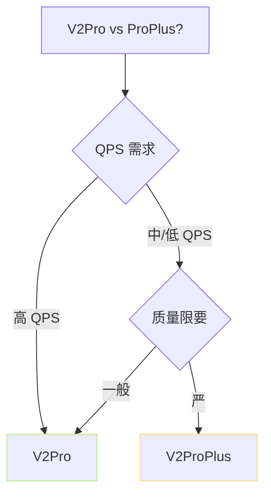

> [📎] 前置知识：ERes2NetV2、SV embedding 注入、AR 规模 (12L×512 vs 16L×640)、RTF。

> **定位**：V2Pro / V2ProPlus 同在 V2 上加 SV 。主要区别 是 AR 规模 与 训练数据。本节拆 超参 · 速度 · 选型。

## 1. 规模表

|项|V2Pro|V2ProPlus|
|---|---|---|
|AR 层数|12|**16**|
|d_model|512|**640**|
|d_ffn|2048|**2560**|
|heads|8|10|
|AR 参数|≈90 M|≈160 M|
|SoVITS 参数|≈77 M|≈90 M|
|SV (ERes2NetV2)|≈25 M|≈25 M|
|**总参数**|**≈200 M**|**≈280 M**|
|训练数据|≈2000 h|≈4000 h|
|采样率|32 kHz|32 kHz|

## 2. 推理速度 (4090 batch=1)

|阶段|V2Pro|V2ProPlus|
|---|---|---|
|AR prefill|50 ms|80 ms|
|AR 生成 (每 token)|2 ms|3 ms|
|SoVITS Decoder|80 ms / 5s|100 ms / 5s|
|**RTF 总**|**≈40×**|**≈25×**|

## 3. 质量对比

|指标|V2|V2Pro|V2ProPlus|
|---|---|---|---|
|SECS (音色相似)|0.78|**0.84**|**0.87**|
|MOS|4.0|4.2|4.3|
|CER|4.5%|3.8%|3.5%|
|韵律 MOS|3.9|4.1|4.3|

## 4. 选型决策

|场景|选|
|---|---|
|实时对话|V2Pro|
|有声读物|V2ProPlus|
|个性克隆|V2ProPlus|
|低资源 GPU (T4/3060)|V2Pro|
|付费 QPS|V2Pro · 多实例|

## 5. 训练资源

|项|V2Pro|V2ProPlus|
|---|---|---|
|s2 训显存|16 GB|24 GB|
|s1 训显存|8 GB|16 GB|
|训时 4×A100|≈7 天|≈14 天|

## 6. 预训权重

|文件|V2Pro|V2ProPlus|
|---|---|---|
|s1.ckpt|150 MB|320 MB|
|s2G.pth|80 MB|95 MB|
|eres2netv2.ckpt|25 MB|25 MB|

## 7. 工程判断

> [🔧] **默认 V2Pro · 仅高质量场景 V2ProPlus**：V2Pro 是 社区 全 场景 首选 · 质量 足 · 速 度 佳。 V2ProPlus 仅 在 付 费 · 高 质 量 需 求 下 选。 跳 需 推 V2ProPlus 1.5× 资源。

## 参考文献

1. ERes2NetV2: [https://github.com/modelscope/3D-Speaker](https://github.com/modelscope/3D-Speaker)

1. GPT-SoVITS V2Pro release. [https://github.com/RVC-Boss/GPT-SoVITS/releases](https://github.com/RVC-Boss/GPT-SoVITS/releases)