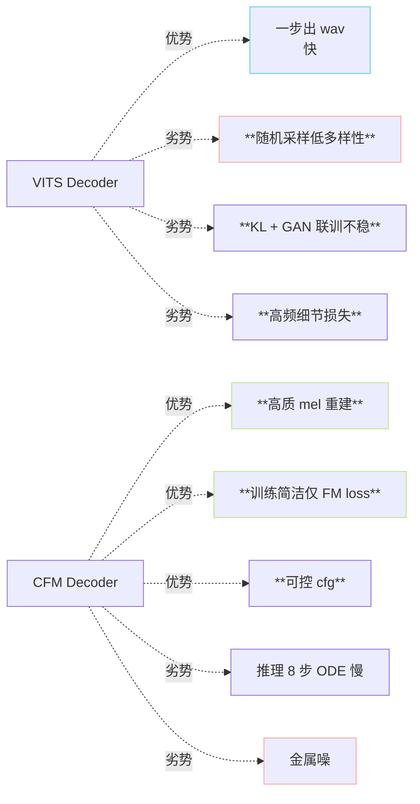
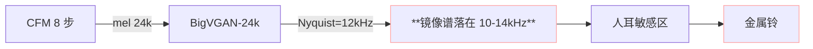

> 📎 **前置**：[[1.5 Flow Matching - CFM（v3-v4 的核心范式）]]；BigVGAN-v2；Classifier-Free Guidance (CFG)；ODE 求解器；[[5. AR - T2S 模型（GPT 语义建模阶段）]]。

## 0. 定位

> 「2025-02 「架构跳变」代。」GPT-SoVITS 首次重构·SoVITS Decoder 从 VITS 换为 CFM + BigVGAN-24k，AR 从 12 层·512·1024 扩到 24 层·768·2048。总参数 167M → 407M，训练集 1000h → 7000h。是 V1→V4 中唯一的“纯重构”代，代价是金属噪问题（V4 修复）。

## 1. V3 架构全图

```mermaid
flowchart LR
  TXT[文本] --> PH[phoneme + BERT]
  PH --> AR24[**AR 24×768**<br/>ctx=2048<br/>~330M]
  REF[ref] --> CN[cnhubert] --> POOL[avg_pool] --> VQ
  VQ --> AR24
  AR24 --> SEM[semantic token<br/>25Hz]
  SEM --> CFM[**CFM Decoder**<br/>ODE 8 步 Euler]
  REF -. mel/spk .-> CFM
  N[noise x₀~N\(0,I\)] --> CFM
  CFM --> MEL[mel 100-band @24k]
  MEL --> BV[**BigVGAN-v2 24khz<br/>100band 256×**]
  BV --> WAV[wav 24k]

  style AR24 fill:\#1d2433,stroke:#C792EA,color:\#C792EA
  style CFM fill:\#1d2433,stroke:#FFD580,color:\#FFD580
  style BV fill:\#1d2433,stroke:#F78C6C,color:\#F78C6C
  style WAV fill:\#1d2433,stroke:#FFA3A3,color:\#FFA3A3
```

## 2. 关键超参表

|模块|项|V3 值|vs V2|
|---|---|---|---|
|AR|层数|**24**|2×|
|AR|d_model|**768**|1.5×|
|AR|d_ffn|3072|1.5×|
|AR|ctx|**2048**|2×|
|AR|参数|**~330M**|4.1×|
|SoVITS|架构|**CFM + BigVGAN**|重构|
|SoVITS|参数|~77 M|同|
|**总参数**|—|**~407M**|2.4×|
|CFM|ODE 步数|8|—|
|CFM|求解器|Euler|—|
|CFM|cfg|2.0|—|
|Vocoder|BigVGAN-v2|24khz 100band 256×|—|
|采样率|—|**24k**|—|
|训练数据|—|**~7000h**|1.4×|
|训练资源|—|~120 GPU·days|12×|

## 3. 为什么要从 VITS 跳到 CFM



> [💡] **CFM 对 TTS 的本质优势**：$v_\theta$ 是“从噪声到 mel 的透项」·训练仅拟合线性插值·推理任意步数·可 CFG 插值。比 GAN 劣胜、比 Diffusion 简洁。

## 4. AR 扩规模 4× 的原因

|V1/V2 痛点|扩法|收益|
|---|---|---|
|长文本状中|ctx 1024 → 2048|可生成 ~80s 连续语音|
|容量不足|d 512 → 768|BERT 韵律信号被充分消化|
|复合关系学不全|层数 12 → 24|跨句一致性 + 韵律连贯|

> [⚠️] **V3 实际还是「过参数」**：按 Chinchilla·330M 参数需 6.6×10⁹ token（约 73 万小时音频）·实际仅 7000h·参数未训满。这是社区用更多数据 fine-tune 总是能提升 V3 质量的原因。

## 5. CFM 推理公式

$$\frac{dx_t}{dt} = v_\theta(x_t, t, c)$$

Euler 法迭代：

$$x_{t+\Delta t} = x_t + \Delta t \cdot v_\theta(x_t, t, c), \quad \Delta t = 1/8$$

Classifier-Free Guidance：

$$\tilde v(x_t, t, c) = v_\theta(x_t, t, \emptyset) + w \cdot (v_\theta(x_t, t, c) - v_\theta(x_t, t, \emptyset)), \quad w = 2.0$$

## 6. V3 金属噪问题



> [⚠️] **两个原因叠加**：① BigVGAN-24k 上采样镜像未压住；② CFM 8 步 Euler 误差在 sample edge 放大。V4 同时推 48k + ODE 10 步修复。详见 [[13.2 v3 - v4 人工感 - 金属音]]。

## 7. 听感跳跃评测

|指标|V2|V3|提升|
|---|---|---|---|
|SECS（zero-shot）|0.80|**0.82**|+0.02|
|CER|3.5%|**2.1%**|-1.4 pp|
|韵律 MOS|4.0|**4.3**|+0.3|
|采样率|32k|**24k**|降但高频更净|
|金属噪|无|**有**|—|
|RTF|50×|**10×**|慢 5×|

## 8. 训练代价

- 4×A100 (80GB) 不间断训 ~10 天

- BF16 混精度，grad checkpoint 必开

- AR + SoVITS 分开训：先训 SoVITS（VQ codebook 出），后训 AR

- 社区复现难点：BigVGAN-24k 需额外 ~2000h fine-tune

## 9. 工程判断

> 🔧 **生产环境不推荐直用 V3**：V3 是 V4 的型序点·金属噪问题在部分句型上明显·跳 V4 是免费升级。

> ⚠️ **重训资源门槛高**：4×A100 × 10 天 ≈ 4 万元云 GPU 费·社区选定 fine-tune 版本逍佳。

> 💡 **V3 是 CFM 走通的历史点**：中文开源 TTS 首次证明 CFM 在高保真 zero-shot 上可行。后续 CosyVoice 2 / F5-TTS 都在它之后。

> 🤔 **V3 是否还会出 fine-tune 版**：社区有 PR 提供 V3 fine-tune·用更多数据补足 Chinchilla scaling。但作者路线图直接跳 V4。

## 10. 子页面

[[10.4.1 V3 训练数据规模（~7000h）]]

[[10.4.2 V3 金属噪声问题溯源]]

## 参考文献

1. RVC-Boss/GPT-SoVITS V3 release notes（2025-02）.

1. Lipman, Y. et al. (2023). _Flow Matching_. ICLR.

1. Tong, A. et al. (2023). _Conditional Flow Matching_. arXiv:2302.00482.

1. Lee, S. et al. (2023). _BigVGAN_. ICLR.

1. Hoffmann, J. et al. (2022). _Chinchilla_. arXiv:2203.15556.