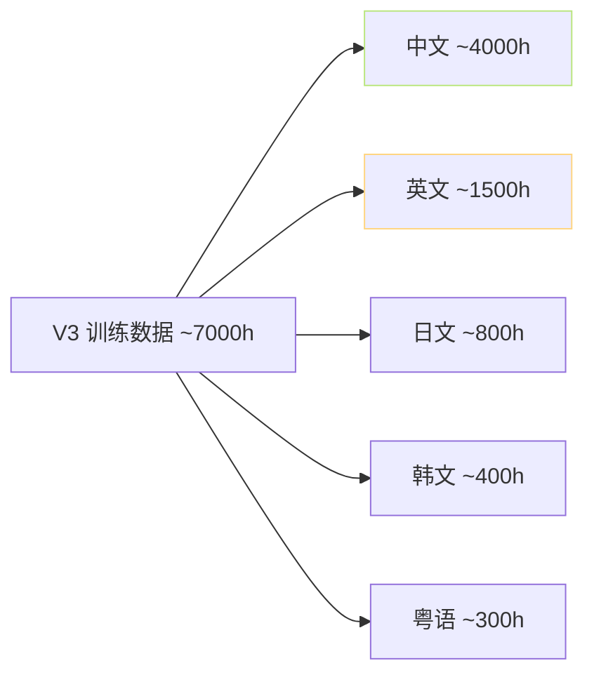
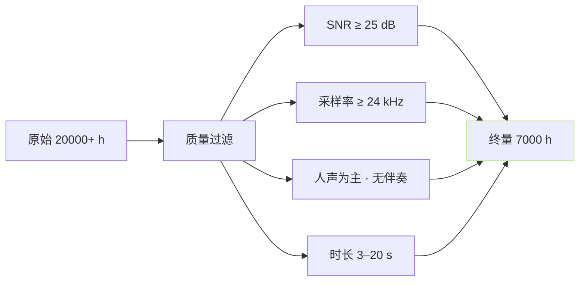

> [📎] 前置知识：Emilia、WenetSpeech、LibriTTS、中文 zero-shot TTS 数据现状。

> **定位**：V3 总训练数据 ≈7000 h · 是 V1/V2 的7倍。本节拆 数据集 · 语种 · 质量 · 训练策略。

## 1. 数据集构成

|语种|时长|主要来源|
|---|---|---|
|中文|≈4000 h|WenetSpeech, AISHELL, Emilia-zh|
|英文|≈1500 h|LibriTTS, Emilia-en|
|日文|≈800 h|JVS, Reazon|
|韩文|≈400 h|KsponSpeech|
|粤语|≈300 h|内部收集|
|**总**|**≈7000 h**|·|

## 2. 与前版本对比

|版本|总数据|语种|
|---|---|---|
|V1|≈1000 h|2|
|V2|≈1500 h|5|
|V2Pro|≈2000 h|5|
|V2ProPlus|≈4000 h|5|
|**V3**|**≈7000 h**|5|

## 3. 数据量检

## 4. 训练策略

|阶段|数据|step|
|---|---|---|
|1. 预训 SoVITS|7000 h|800 k|
|2. 预训 AR (semantic only)|7000 h|1200 k|
|3. SFT|选佳 1000 h|200 k|

## 5. 资源需求

|阶段|GPU|时长|
|---|---|---|
|预训 SoVITS|8×A100|14 天|
|预训 AR|8×A100|21 天|
|SFT|4×A100|5 天|
|**总**|·|**≈40 天**|

## 6. 为何需 7000 h

> [💡] **AR 的质量上限由数据决定**：AR 407 M 参数 · 低 于 5000 h 会 错 拟合 。 7000 h 是 AR 规模 的 下 限 · 生 产 场景 佳。

## 7. SFT vs 预训

|应用|需 V3 预训·在本机 SFT|仅 SFT 小数据|
|---|---|---|
|克隆|✅|✅ 1–5 分钟|
|跳架构|不 容 易|·|
|多语种|✅|✅|

## 8. 工程判断

> [🔧] **V3 预训是不可跳过**：7000 h 预训 是 V3 / V4 质量 的 基 础 。 在 本 机 重 训 7000 h 需 8×A100×40 天 · 不 实 际。社区 推荐 下 预训 ckpt + 本地 SFT · 是 唯一路径。

## 参考文献

1. Emilia. (2024). _Emilia: An Extensive, Multilingual, and Diverse Speech Dataset_. arXiv:2407.05361.

1. WenetSpeech. [https://wenet.org.cn/WenetSpeech/](https://wenet.org.cn/WenetSpeech/)

1. LibriTTS. [https://www.openslr.org/60/](https://www.openslr.org/60/)

1. GPT-SoVITS V3 release. [https://github.com/RVC-Boss/GPT-SoVITS/releases](https://github.com/RVC-Boss/GPT-SoVITS/releases)