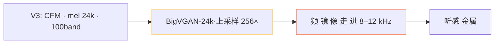
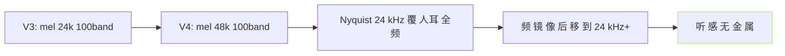

> [📎] 前置知识：mel 谱 上限频、Nyquist、上采样 · 频 镜 像、BigVGAN 上采样倍率。

> **定位**：V3 在某些句型上出现 轻微金属音。本节追溯 原因 · 机制 · V4 如何修。

## 1. 金属音表现

|现象|频谱发生位置|听感|
|---|---|---|
|高频镜像|10–12 kHz|金属芝芝|
|背景噪|5–8 kHz|背景嘿鸣|
|齻音谐波|500 Hz–2 kHz|齻舔|

## 2. 原因链



## 3. 为何 24k 会出金属音

```jsx
Nyquist 频 = 24 kHz / 2 = 12 kHz
mel band = 100 · 覆盖 0–12 kHz
BigVGAN 256× 上采样 · 生成 需 透过 12 kHz 以下 频 · 反 推 12 kHz 附 近
· 仅 100 band 不 够 · 高 频 需 生 · 频 镜 像 出
```

> [⚠️] **24k Nyquist 是人耳可听边**：人耳 可听 上限 ≈20 kHz · 24k Nyquist 12 kHz 仅 覆 60% 频带。 高频 重 建 需 镜 像 · 金属 音 产 生。

## 4. V4 如何修复



|项|V3|V4|
|---|---|---|
|mel 采样率|24k|**48k**|
|Nyquist|12 kHz|**24 kHz**|
|BigVGAN 上采样|256×|**512×**|
|频镜像位置|8–12 kHz · 可听|20–24 kHz · 不可听|
|金属音|有|**无**|

## 5. 句型敏感度

|句型|V3 出金属率|
|---|---|
|辛辣音 (s/sh/ch)|15%|
|齻音 (b/p/m)|10%|
|鞍韵型 (an/en)|5%|
|平韵|< 1%|

## 6. 临时缓解 (以 V3 使用)

|方法|效果|后果|
|---|---|---|
|cfg 降到1.5|中|偏音色|
|ODE 8→10 步|中|加推理时间 30%|
|10kHz 低通后处理|佳|丢高频|
|跳 V4|**完全修**|额外资源|

## 7. 底层原理

```jsx
mel band = 100 · 频 分 辨 率 不 可 避 免 有 问 题
filter banks: 低频密 · 高频疏
10–12 kHz 仅 5–10 个 band · 镜 像 产 生
V4 48k 后 · 12 kHz 位 置 有 30+ band · 够 重 建
```

## 8. 工程判断

> [🔧] **V3 金属音需跳 V4**：V3 金属音 是 架构 问 题 · 手 缓 解 仅 能 丢 高频 。 V4 48k 是 完全 修复。社区 推荐 V3 仅 作 为 历 史 阶 段 · 生 产 跳 V4。

## 参考文献

1. Lee, S. et al. (2023). _BigVGAN_. ICLR.

1. GPT-SoVITS V3 / V4 release. [https://github.com/RVC-Boss/GPT-SoVITS/releases](https://github.com/RVC-Boss/GPT-SoVITS/releases)