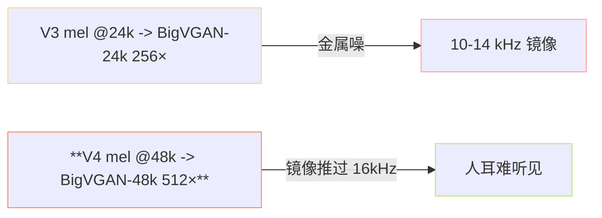
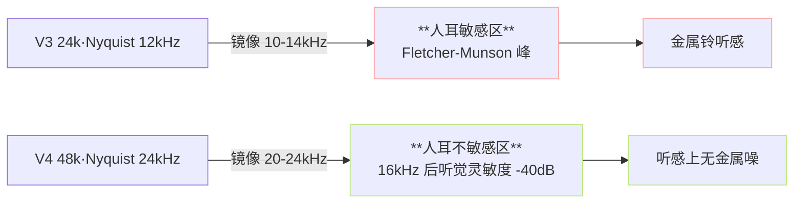
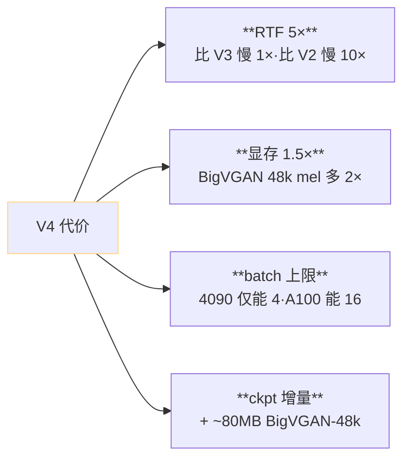
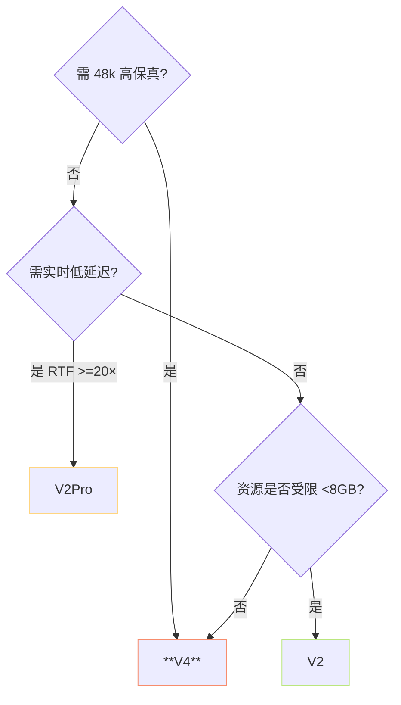

> 📎 **前置**：V3 架构；BigVGAN-v2 48khz 100band 512x；CFM ODE 步数；Nyquist 采样定理；Fletcher-Munson 听觉曲线。

## 0. 定位

> 「48k 原生 + 修复金属噪 + 多样保本。」V4 是 V3 的定点修复代：架构同 V3，但 Decoder 从 24k 换到 48k 原生，CFM ODE 从 8 步加到 10 步，BigVGAN 从 256× 扩到 512×。金属噪问题基本消失，成为 2025 中期「高保真 + zero-shot」首选。

## 1. V3 → V4 差异全表



|项|V3|V4|
|---|---|---|
|采样率|24k|**48k**|
|mel band|100|100（保持）|
|mel 帧率|~80 Hz|**~120 Hz**|
|BigVGAN|24khz 100band 256×|**48khz 100band 512×**|
|CFM ODE 步数|8|**10**|
|CFM 求解器|Euler|Euler（同）|
|AR 架构|24L d=768|同（同）|
|SoVITS 参数|~77 M|~85 M|
|金属噪|有|**无**|
|人工感|中|轻微|
|训练数据|~7000h|~7000h + 1500h 48k|
|推理速度 RTF|~10×|**~5×**|
|显存 (BF16)|~8 GB|**~12 GB**|

## 2. 为何 48k 修复了金属噪



> [💡] **V4 不是修镜像，是推上听不见的区**：从信号处理角度 BigVGAN 镜像现象仍在·仅是被推到 20-24 kHz。人耳在 16 kHz 以上灵敏度 -40 dB·听感上等同于消失。译为工程语言：「重建不变的能量·仅重安排频座」。

## 3. 资源折中



## 4. v4 仅需重训 SoVITS

> [💡] **AR 从 V3 复用**：V4 与 V3 的 semantic token 是同一个 codebook·AR 输出格式同·仅重训 SoVITS Decoder 适配 48k mel。这是 V3→V4 发布间隔仅三月的工程根因。

```python
# V3→V4 迁移 伪代码
ckpt_v3_ar = load('s1v3.ckpt')
ckpt_v4_ar = ckpt_v3_ar  # 复用。AR 不动

# SoVITS 重训
sovits_v4 = build_sovits(sr=48000, mel_band=100, hop=480)
sovits_v4.load_pretrained_from_v3_partial()  # 加载 CFM 主干
sovits_v4.bigvgan = build_bigvgan_48k_100band_512x()
sovits_v4.fine_tune(data_48k, steps=200000)
```

## 5. 听感评测提升

|指标|V3|V4|提升|
|---|---|---|---|
|SECS|0.82|**0.83**|+0.01|
|CER|2.1%|**2.0%**|-0.1 pp|
|韵律 MOS|4.3|**4.4**|+0.1|
|金属噪 MOS|3.0|**4.5**|+1.5|
|高保真丰富度|中|**优**|人耳可辨|

> [🤔] **SECS / CER 仅微提·为何还跳 V4**：主要提升不在跟踪指标·而在金属噪 MOS 从 3.0 跳到 4.5。SECS 衡量音色·CER 衡量发音·金属噪 是独立维度·位在高频伪信号。V4 的价值主要在「可听、不刺耳」。

## 6. v4 ckpt 体系

- `s1v3.ckpt`（AR，~660 MB BF16，与 V3 复用）

- `s2Gv4.pth`（SoVITS Generator + BigVGAN-48k，~280 MB）

- `s2Dv4.pth`（Discriminator，仅训练需）

- `vocoder.pth`（BigVGAN-v2 48khz 100band 512x 单独发布，~150 MB）

- 推理显存 ~12 GB（4090 24GB 可跨 batch=4）

## 7. 适用场景



## 8. 工程判断

> 🔧 **V4 是 2025 中期「高质量 zero-shot」首选**：采样率 48k·无金属噪·CER 低。唯一劣势是推理费 RTF 5× 与显存 ~12 GB。

> ⚠️ **显存跳跃**：V3 8GB → V4 12GB ·BigVGAN 48k 上采样 mel 多 2×。 4090 24GB 仅能 batch=4 · 需云 GPU batch 部署需 A100/H100。

> 💡 **低资源退 V2Pro**：V2Pro 32k 在 8GB 显存上可跨·SECS 0.84 接近 V4 0.83 · RTF 40× 远优 V4。 仅不能 48k。

> 🤔 **V4 后是否还会有 V4.5**：社区已有 Consistency Model 蒸馏到 1-2 步的 PR·这可能是 V5 的雏形。参 13.5。

## 9. 子页面

[[10.5.1 V4 vocoder.pth 与 s2v4.pth 配置]]

## 参考文献

1. RVC-Boss/GPT-SoVITS V4 release notes（2025 中）.

1. Lee, S. et al. (2023). _BigVGAN: A Universal Neural Vocoder_. ICLR.

1. Fletcher, H. & Munson, W. (1933). JASA.

1. NVIDIA BigVGAN-v2 48khz 100band 512x release.