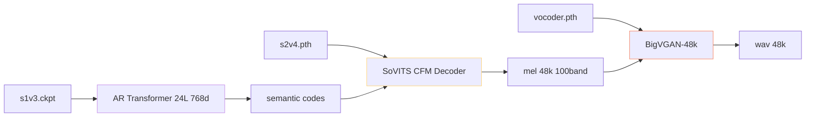

> [📎] 前置知识：BigVGAN 预训 · vocoder.pth、s2v4.pth · SoVITS Decoder · CFM、s1v3.ckpt · AR。

> **定位**：V4 预训 ckpt 是 三文件 · vocoder + s2v4 + s1v3。本节拆 文件 · 作用 · 走 路 · 调 参。

## 1. 三文件

|文件|大小|作用|
|---|---|---|
|**vocoder.pth**|480 MB|BigVGAN-48k 100band 512× · mel → wav|
|**s2v4.pth**|480 MB|SoVITS Decoder · CFM · 代 谢 mel|
|**s1v3.ckpt**|600 MB|AR Transformer 24L · phone→semantic|
|chinese-hubert-base|360 MB|SSL 特征 (同 V1–V3)|
|chinese-roberta-large|1.3 GB|BERT (同 V2/V3)|
|**总**|**≈3.2 GB**|·|

> [⚠️] **BigVGAN 许可警告**：vocoder.pth 基于 NVIDIA BigVGAN · 许可 为 Non-Commercial。 商业 使 用 需 重 训 或 换 其 他 vocoder。

## 2. 加载顺序



## 3. 代码

```python
import torch
from GPT_SoVITS.t2s_model import Text2SemanticDecoder
from GPT_SoVITS.cfm import CFMDecoder
from GPT_SoVITS.bigvgan import BigVGAN

ar = Text2SemanticDecoder.load('s1v3.ckpt').cuda().eval()
s2 = CFMDecoder.load('s2v4.pth').cuda().eval()
vocoder = BigVGAN.load('vocoder.pth').cuda().eval()

# 推理
sem  = ar.infer(phone, bert, ref_sem, top_k=15, top_p=0.8, temperature=0.7)
mel  = s2.infer(sem, ref_mel, cfg=2.0, n_steps=10)
wav  = vocoder(mel)  # [1, 1, T_wav @ 48k]
```

## 4. 与 V3 的 ckpt 差别

|项|V3|V4|
|---|---|---|
|AR ckpt|s1v3.ckpt 600 MB|**同**|
|SoVITS ckpt|s2v3.pth 320 MB|**s2v4.pth 480 MB**|
|Vocoder|BigVGAN-24k 320 MB|**BigVGAN-48k 480 MB**|
|ODE 步数|8|10|
|mel band|100|100|
|采样率|24k|**48k**|

## 5. 资源需求

|指标|V3|V4|
|---|---|---|
|推理显存 (batch=1)|6 GB|**8 GB**|
|RTF (4090)|10×|**5×**|
|首包 TTFB|500 ms|**700 ms**|
|4090 batch 上限|8|4|

## 6. SFT 配置

```yaml
# configs/s2v4.json
model:
  pretrained_s2G: pretrained/s2v4.pth
  sample_rate: 48000
  mel_n_bands: 100
  cfm_n_steps: 10
  cfg_scale: 2.0
train:
  batch_size: 4
  precision: bf16-mixed
```

## 7. 常见错误

|现象|原因|修复|
|---|---|---|
|vocoder OOM|BigVGAN 48k 显存高|batch=1|
|ckpt 加载错|路径错|检查 pretrained 路径|
|采样率不匹|训练集仅 32k|上采样 · 换 V2Pro|
|mel 形状错|v3 ckpt 走 v4 · 100 vs 100|检查采样率|

## 8. 工程判断

> [🔧] **V4 三文件 是 独立 加 载**：vocoder.pth · s2v4.pth · s1v3.ckpt 三 文件 独立 · 不 合 体。 训 练 SFT 仅 需 调 s2v4 与 s1v3 · vocoder 决 不 需 调 。商业 需 重 训 BigVGAN 或 换。

## 参考文献

1. BigVGAN: [https://github.com/NVIDIA/BigVGAN](https://github.com/NVIDIA/BigVGAN)

1. GPT-SoVITS V4 release. [https://github.com/RVC-Boss/GPT-SoVITS/releases](https://github.com/RVC-Boss/GPT-SoVITS/releases)

1. lj1995/GPT-SoVITS huggingface ckpt. [https://huggingface.co/lj1995/GPT-SoVITS](https://huggingface.co/lj1995/GPT-SoVITS)