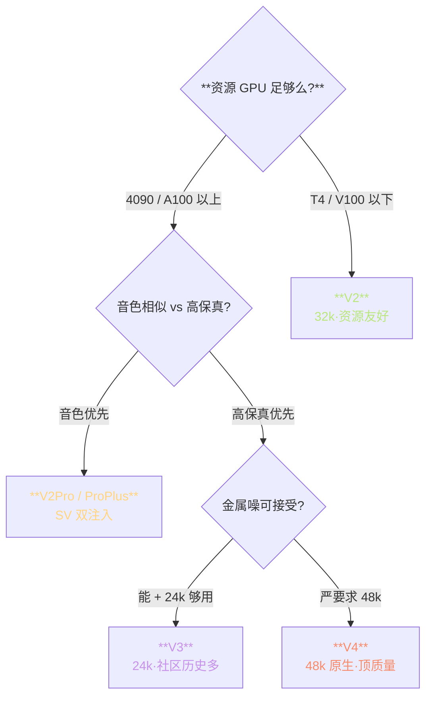
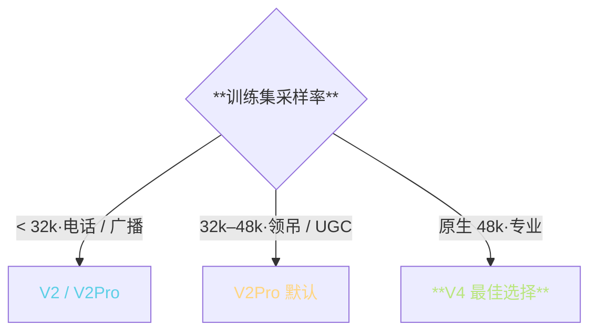
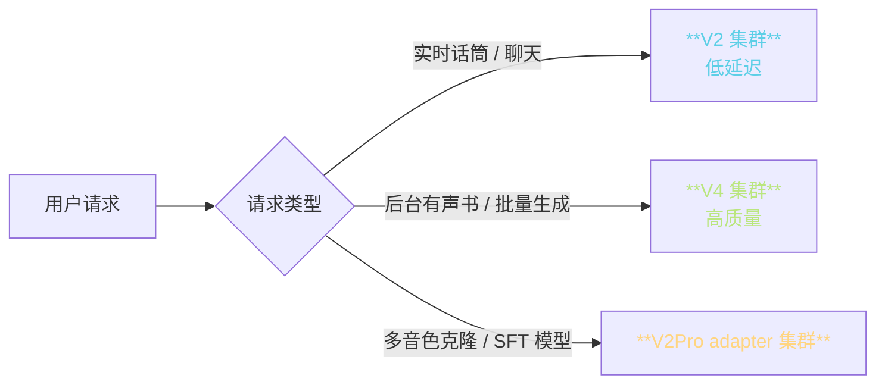

> 📎 **前置**：[[10. 版本演进与对比（v1 → v2 → v2Pro → v3 → v4）]]；部署资源环境；SECS / MOS / RTF 指标。

## 0. 定位

> 「选哪个版本？」本节提供三个层面的决策工具：三叉决策树 + 场景选型表 + 列表详参。适用于个人·研究·商用三类场景。

## 1. 三叉决策树

## 2. 场景选型表

|场景|首选|次选|不推荐|原因|
|---|---|---|---|---|
|**实时对话 / 低延迟**|V2|V2Pro|V3/V4|CFM ODE 5× RTF 不够快|
|**有声书 / 长文本**|**V4**|V2Pro|V1|48k 听感累积优势明显|
|**个性化音色克隆**|**V2Pro+**|V4|V1/V2|ERes2NetV2 显式注入音色|
|**多语种**|V2Pro / V4|V2|V1|V2+ 才有 BERT 加持|
|**48k 高保真**|**V4**|V3 + 超分|V2|V4 原生 48k|
|**资源受限 (<8GB)**|**V2**|V1|V3/V4|V4 推理 ~12GB|
|**新闻播报**|V4|V2Pro|V1|韵律 + 保真都要|
|**游戏 NPC**|V2Pro|V2|V3/V4|实时需求高|
|**商用交付**|V4|V2Pro+|V1|质量举重|
|**学术复现**|V2|V1|—|论文环境为 V2|

## 3. 列版本全维度对比

|维度|V1|V2|V2Pro|V2ProPlus|V3|**V4**|
|---|---|---|---|---|---|---|
|架构|VITS|VITS|VITS+SV|VITS+SV+补偿|CFM-24k|**CFM-48k**|
|采样率|32k|32k|32k|32k|24k|**48k**|
|发布|2024-02|2024-08|2024-11|2024-12|2025-01|**2025-04**|
|训数据|~1k h|~2k h|~2k h|~2.5k h|~7k h|**~7k h**|
|推理显存|4 GB|4 GB|5 GB|6 GB|8 GB|**12 GB**|
|RTF (A100)|50×|50×|30×|25×|8×|**5×**|
|SECS（zero-shot）|0.72|0.75|0.78|0.83|0.81|**0.83**|
|MOS|3.7|3.9|4.0|4.1|4.2|**4.4**|
|多语种|中英|+日韩粤|同|同|同|**同**|
|金属噪|无|无|无|无|**有**|**修复**|
|SFT 难度|低|低|中|中|高|**高**|

## 4. 训练数据质量与选型

> [⚠️] **训练集采样率不足去购 V4 不会「凭空变高保真」**：如 24k 训练集 → V4 BigVGAN-48k，高频只能「推测」，出伪纹理。升采样率需高质量训练集配合。

## 5. 混部署示例

> [💡] **生产部署多是「混部署」**：根据请求类型路由到不同版本集群。实时走 V2，后台走 V4，SFT 多音色走 V2Pro adapter。资源使用最佳。

## 6. 上手路径推荐

|阶段|推荐|原因|
|---|---|---|
|**初接触**|V2 zero-shot|门槛低·社区资料多|
|**探索**|V2 + 1 min SFT|能调出明显提升|
|**进阶**|V2Pro + LoRA|多音色·低资源|
|**进优质**|V4 zero-shot|48k·听感顶质|
|**顶质量**|V4 + 5 min SFT|商业可靠|

## 7. 工程判断

> 🔧 **默认推荐 V2Pro 作为起点**：音色优先 + 资源适中 + 社区资料充足。以此为基线再调场景。

> ⚠️ **在意实时性 → 勿用 V3/V4**。CFM ODE 是推理瓶颈，RTF 5–8× 不够快。V2/V2Pro 能 30–50×。

> 💡 **混部署：后台用 V4 生成高保真，实时话筒用 V2 走低延迟**。生产环境的最佳取舍。

> 🤔 **不要昨生拼版本**：V3 金属噪 + V4 资源贵，选一个多问社区。社区 `gpt_sovits_router` 项目是参考。

## 8. 子页面

[[10.6.1 训练集音质好坏 → 选 V3 还是 V2Pro]]

[[10.6.2 实时性 - 低延迟 → 选 V2 中型]]

[[10.6.3 音色相似度优先 → V2Pro - ProPlus]]

## 参考文献

1. GPT-SoVITS 仓库 release 页

1. SECS / MOS 评估：ITU-T P.808、Speaker Verification ROC