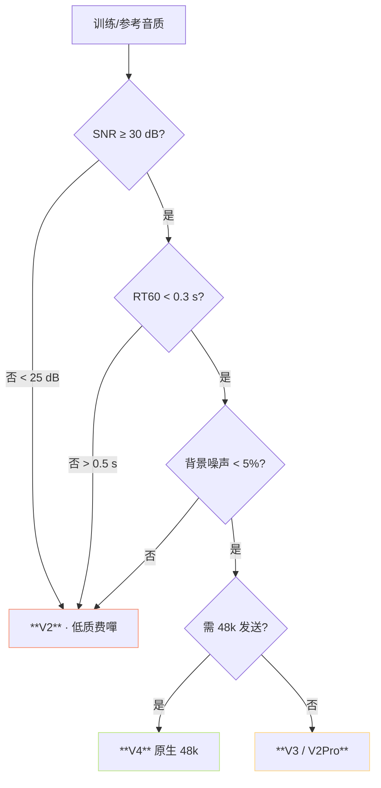
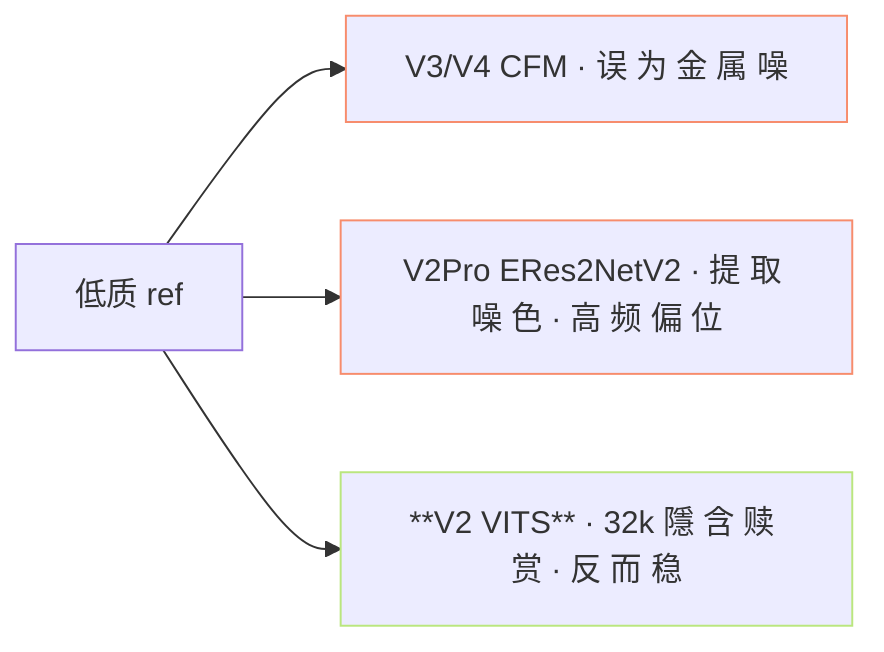

> [📎] 前置知识：SNR / RT60 / 背景噪声 · UVR5 预处理 · V3 金属噪 · V2Pro ERes2NetV2 音色折压。

> **定位**：训练集音质是选型的第一阈。本节拆 高质 vs 低质 · 选型决策树 · 参考指标。

## 1. 选型决策树

## 2. 阈值表

|指标|高质|中质|低质|
|---|---|---|---|
|**SNR**|≥ 30 dB|20–30 dB|< 20 dB|
|**RT60**|< 0.3 s|0.3–0.5 s|> 0.5 s|
|**背景噪**|< 5%|5–20%|> 20%|
|**动态范围**|> 40 dB|30–40 dB|< 30 dB|
|**推荐版本**|**V3 / V4**|V2Pro / V3|**V2**|

## 3. 低质为何选 V2

> [💡] **V3/V4 是 高 保 真 · 代 价 是 保 真 低 质**：CFM 决 定 性 重 建 会 误 为 噪 为 信 号 · 重 建 出 金 属 噪。 V2 代 VITS 随 机 采 样 隱 含 赎 赏 · 反 而 能 缓 低 质。

## 4. 预处理是黪能的能

|预处理|SNR 提升|RT60 下降|
|---|---|---|
|UVR5 MDX23C-InstVoc|+10–15 dB|·|
|UVR5 VR-DeEcho|·|**-0.2 s**|
|Demucs v4|+12–18 dB|·|
|RNNoise|+5–8 dB|·|

## 5. 选型例

|场景|参数|选型|
|---|---|---|
|商业录音棚录|SNR 40 · RT60 0.2 · 噪 1%|**V4**|
|开源录音集|SNR 30 · RT60 0.35 · 噪 5%|V3 / V2Pro|
|手机自录|SNR 25 · RT60 0.6 · 噪 15%|V2Pro / V2|
|电话预警录|SNR 15 · RT60 0.8 · 噪 30%|**V2**|
|YouTube 下载|SNR 不定 + UVR5 预处理|预处理后再选|

## 6. 工程判断

> [🔧] **低质不要台跳高版本**：高 版 本 误 认 噪 为 信 号 · 重 建 出 金 属 噪。训 练 集 是 生 产 上 限 · 预 处 理 是 唯 一 能 提 升 上 限 的 能。 V2 足 为 低 质 默 认。

## 参考文献

1. UVR5: [https://github.com/Anjok07/ultimatevocalremovergui](https://github.com/Anjok07/ultimatevocalremovergui)

1. Demucs: [https://github.com/facebookresearch/demucs](https://github.com/facebookresearch/demucs)

1. GPT-SoVITS 仓库 issue #1023 V3 金属噪 讨论.