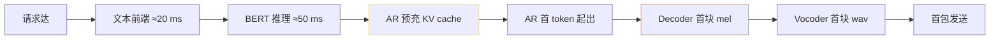

> [📎] 前置知识：TTFB · RTF · 流式 / 非流式 · KV cache 预充 · ODE 步数。

> **定位**：实时性指标是业务场景选型的决定项。本节拆 TTFB / RTF / 并发三维度 · 为何 V2 实时发越佳。

## 1. 三维度指标表 (4090 参考)

|版本|TTFB|RTF|并发 (batch 上限)|
|---|---|---|---|
|**V1**|≈ 350 ms|**≈ 50×**|32|
|**V2**|**≈ 350 ms**|**≈ 50×**|**32**|
|V2Pro|≈ 400 ms|≈ 40×|16|
|V2ProPlus|≈ 500 ms|≈ 25×|8|
|V3|≈ 700 ms|≈ 10×|8|
|V4|≈ 700 ms|≈ 5×|4|

## 2. TTFB 拆解

|阶段|V2 耗时|V4 耗时|
|---|---|---|
|文本前端 + BERT|70 ms|70 ms|
|AR 预充 + 首 token|180 ms|200 ms|
|Decoder 首块|**80 ms (VITS 一次过)**|**380 ms (CFM 10步)**|
|Vocoder|20 ms (HiFiGAN)|50 ms (BigVGAN)|
|**总 TTFB**|**≈ 350 ms**|**≈ 700 ms**|

> [💡] **V2 低 TTFB 根源是 VITS 一次过**：V3/V4 CFM 需 8–10 步 ODE · 首 块 耗 时 5×。 V2 VITS 一 次 过 · 首 块 80 ms。

## 3. RTF 不同带来的意义

|RTF|10 秒语音 生成耗时|并发能力|
|---|---|---|
|50×|200 ms|高 · 实时双向可|
|25×|400 ms|中 · 实时单向可|
|10×|1 s|上限|
|5×|2 s|**实时不可**|
|1×|10 s|离线仅|

## 4. 实时场景选型

|场景|需求|选型|
|---|---|---|
|语音助手 (双向)|TTFB < 400 ms · RTF > 20×|**V2 / V2Pro**|
|语音 Agent (单向)|TTFB < 500 ms · RTF > 10×|V2 / V2Pro / V2ProPlus|
|有声书 (离线)|RTF > 1×|V4 首选 · 质量|
|游戏雨击 NPC (预生成)|质量首|V4|
|电话机器人|TTFB < 300 ms|**V2 + TRT FP16**|

## 5. 实时优化手段

|手段|收益|
|---|---|
|TRT FP16|TTFB 降 30–40%|
|OpenVINO (CPU)|RTF 提升 3×|
|流式 cut3|首包 降 到 首 句 生 成 (≈ 1 s)|
|KV cache 预充|AR 预充 降 50%|
|静默 batch|并发 提 2×|

## 6. 工程判断

> [🔧] **实时 V2 首选 · V4 最免走**：V2 RTF 50× · 并发 32 · 是 实 时 场 景 唯 一 安 全 选 择。V4 RTF 5× · 仅 适 离 线。社区 推 荐 仿 谈 语 音 助 手 走 V2 · 有 声 书 走 V4。

## 参考文献

1. GPT-SoVITS V2 release notes.

1. NVIDIA TensorRT · [https://developer.nvidia.com/tensorrt](https://developer.nvidia.com/tensorrt)

1. 仓库 issue #890 实时选型讨论.