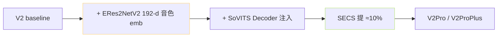
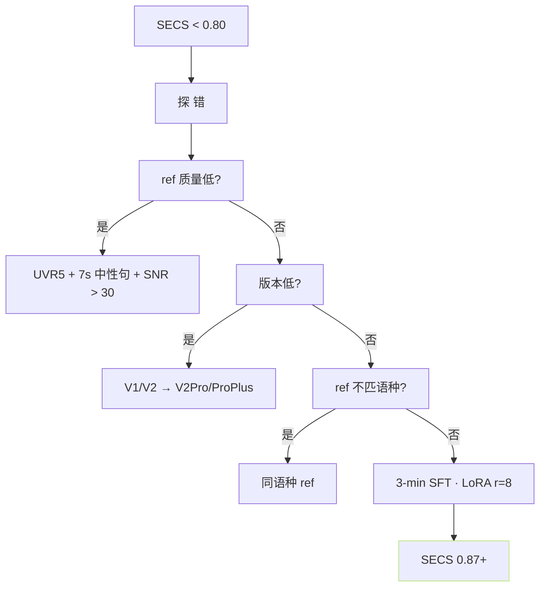

> [📎] 前置知识：SECS (Speaker Encoder Cosine Similarity) · ERes2NetV2 · ECAPA-TDNN · zero-shot vs fine-tune。

> **定位**：音色相似度是 zero-shot TTS 的核心质量指标。本节拆 SECS 评测 · 各版本差距 · 提升手段。

## 1. SECS 指标表

|版本|zero-shot SECS|3-min SFT SECS|业务门槛|
|---|---|---|---|
|V1|0.78|0.85|中|
|V2|0.80|0.86|中|
|**V2Pro**|**0.84**|**0.88**|**高**|
|**V2ProPlus**|**0.87**|**0.90**|**最高**|
|V3|0.82|0.87|高 (首质量)|
|V4|0.83|0.87|高 (首质量)|

> [💡] **SECS 是 cosine · 0.85 是业务可接受阈 · 0.90 是佳**：SECS = cos(emb_ref, emb_gen) · 是 speaker encoder 中提取表征的余弦相似度。业务接 受 阈 0.85 · 佳 0.90 · 难 区 分 0.95。

## 2. V2Pro/ProPlus 为何胜出

|机制|说明|
|---|---|
|ERes2NetV2|3D-Speaker · 192-d · ckpt 25 MB|
|注入点|SoVITS Decoder 中间层 (FiLM 调制)|
|训练|SoVITS 重训 · ERes2NetV2 冻结|
|SECS 提升|+5–10%|

## 3. ERes2NetV2 代价

|项|V2|V2Pro|
|---|---|---|
|SoVITS 参数|80 MB|200 MB|
|RTF|50×|40×|
|TTFB|350 ms|400 ms|
|SECS|0.80|**0.84**|

## 4. SECS 提升手段

## 5. 选型例

|场景|SECS 要求|选型|
|---|---|---|
|名人仿语|> 0.90|**V2ProPlus + SFT**|
|语音仿生|> 0.85|V2Pro / V2ProPlus|
|有声书|> 0.85|V2Pro / V4|
|一般 TTS|> 0.80|V2 / V2Pro|
|实时语音|> 0.80 且低延迟|**V2Pro** (平衡)|

## 6. zero-shot vs SFT 差距

|未 SFT|SFT 3 min|SFT 30 min|
|---|---|---|
|V2 0.80|0.86|0.89|
|V2Pro 0.84|0.88|**0.91**|
|V2ProPlus 0.87|0.90|**0.93**|

> [⚠️] **SFT 提升 5–7% SECS**：SFT 30 min 能 拭 平 版 本 之 间 差 距。 V2 + SFT 30 min 达 0.89 · 与 V2ProPlus zero-shot 相 近。社区 推 荐 资 源 受 限 走 V2 + SFT · 资 源 充 裕 走 V2ProPlus + SFT。

## 7. 常见问题

|问题|原因|解|
|---|---|---|
|SECS 低 但 听 感 像|SECS 不 能 完 全 表 达 听 感|以 MOS 为补|
|ref 换 SECS 跳|ref 含 背 景 噪|UVR5|
|跨 语 种 SECS 低|SSL 中 文 偏 置|同 语 种 ref|
|同 句 多 次 SECS 变|采 样 随 机|temperature ×0.7 · 多 次选佳|

## 8. 工程判断

> [🔧] **音色仿首 V2ProPlus · 平衡走 V2Pro**：V2ProPlus 16L d=640 ~280 M · SECS 0.87 · 但 RTF 25×。V2Pro 12L d=512 ~200 M · SECS 0.84 · RTF 40× · 实 时 可 能。社区 推 荐 音 色 首 要 走 V2ProPlus · 实 时 首 要 走 V2Pro。

## 参考文献

1. ERes2NetV2 · 3D-Speaker: [https://github.com/alibaba-damo-academy/3D-Speaker](https://github.com/alibaba-damo-academy/3D-Speaker)

1. ECAPA-TDNN. _Interspeech 2020_.

1. GPT-SoVITS V2Pro release notes.