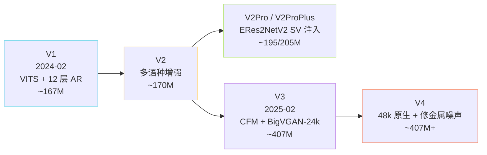
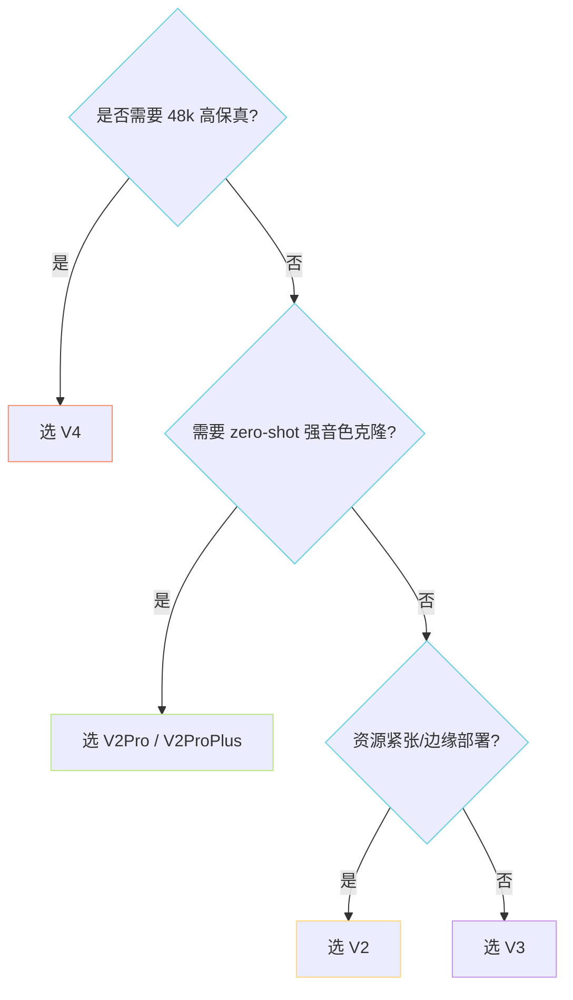

> 📎 **前置知识**：[[私人与共享/GPT-SoVITS 系列全栈总纲/6. SoVITS 解码器（声学生成阶段）|6. SoVITS 解码器（声学生成阶段）]]；理解 VITS、CFM、BigVGAN；了解从 24kHz 到 48kHz 的声学差异。

## 0. 定位

> 「从 167M 到 407M，从 32kHz 到 48kHz，从 VITS 到 CFM。」本节梳理 v1 → v2 → v2Pro/Plus → v3 → v4 的设计变迁、参数演化与选型逻辑。

## 1. 版本时间线

## 2. 全版本对比矩阵

|维度|V1|V2|V2Pro/Plus|V3|V4|
|---|---|---|---|---|---|
|发布|2024-02|2024-08|2025 中|2025-02|2025 中后|
|AR 层数|12|12|12|24|24|
|AR d_model|512|512|512|768|768|
|AR ctx|1024|1024|1024|2048|2048|
|Decoder|VITS|VITS|VITS + SV 双注入|CFM + BigVGAN|CFM + BigVGAN|
|采样率|32k|32k|32k|24k|**48k 原生**|
|SV embedding|❌|❌|ERes2NetV2 192-d|❌|❌|
|参数量|~167M|~170M|~195M / ~205M|~407M|~407M+|
|训练时长|~2,000h|~5,000h|~5,000h+SV|~7,000h|~7,000h+|
|配置文件|`s2.json`|`s2.json`|`s2Pro.json`|`s2v3.json`|`s2v4.json`|
|音质短板|32k 上限|同 V1|略 over-smooth|偶有金属音|—|

## 3. 选型决策树

## 4. 工程判断

> 🔧 **v3/v4 不替代 v2**：v3/v4 训练成本高（≥7,000h）、推理稍慢（ODE 8-10 步 + 24 层 AR）、对长文本仍有少量金属感；v2 在 CPU/边缘设备上仍是最优解。

> 🤔 **V2Pro 才是被低估的版本**：在不上 CFM 的前提下，靠 ERes2NetV2 + 双注入大幅提升了 zero-shot 音色相似度，比 v3/v4 更实用、推理快 2 倍。

> 💡 **演化路径直觉**：v1→v2 是「广度扩展」（多语种 + 数据量），v2→v2Pro 是「音色克隆精度」，v2→v3 是「范式跃迁」（VITS→CFM），v3→v4 是「采样率工程修复」。

## 5. 子页面导航

[[10.1 V1（2024-02 首发）|10.1 V1（2024-02 首发）]]

[[10.2 V2（多语种与稳定性增强）|10.2 V2（多语种与稳定性增强）]]

[[10.3 V2Pro - V2ProPlus|10.3 V2Pro - V2ProPlus]]

[[10.4 V3（2025-02，407M，CFM 化）|10.4 V3（2025-02，407M，CFM 化）]]

## 参考文献

- 仓库 release notes / wiki

- BigVGAN-v2: [https://github.com/NVIDIA/BigVGAN](https://github.com/NVIDIA/BigVGAN)

[[10.5 V4（48k 原生 + 修复金属噪声）|10.5 V4（48k 原生 + 修复金属噪声）]]

- ERes2NetV2: [https://github.com/alibaba-damo-academy/3D-Speaker](https://github.com/alibaba-damo-academy/3D-Speaker)

[[10.6 横向选型决策树|10.6 横向选型决策树]]