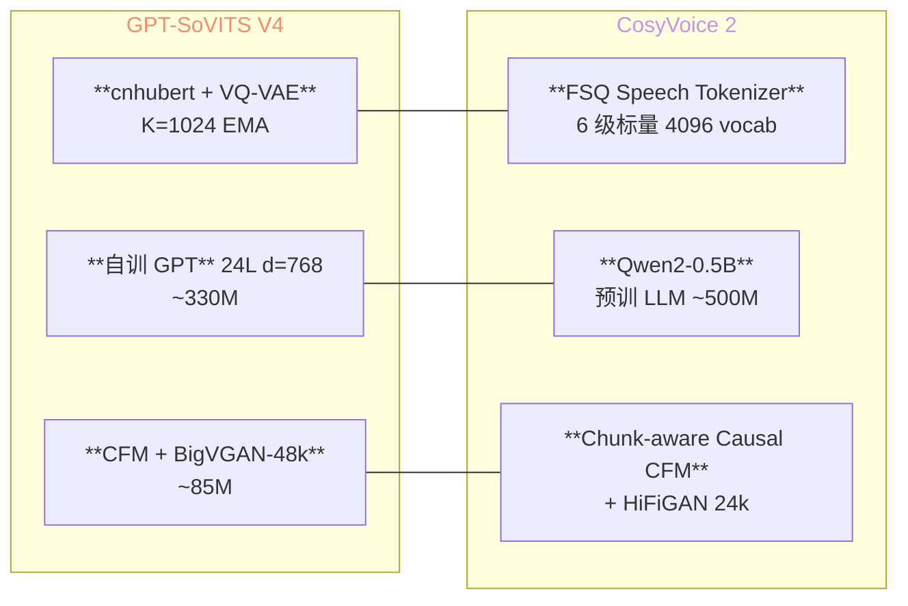
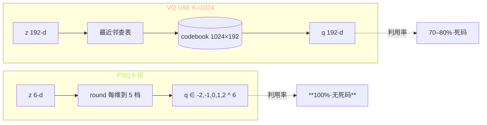
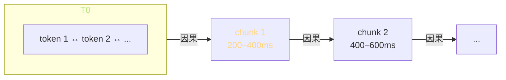

> 📎 **前置**：FSQ（Finite Scalar Quantization）；Chunk-aware Causal Flow Matching；Qwen2 backbone；Speech Tokenizer；流式 TTS。

## 0. 定位

> 「同为 LLM-style TTS 两大代表，但取舍路线完全不同。」CosyVoice（阿里达摩院 2024-07 / CosyVoice 2 2024-12）与 GPT-SoVITS 同属 AR + Decoder 范式，但在 **tokenizer / LLM backbone / decoder / 训练数据** 四点上选择截然不同。本节系统对比两条路线的工程取舍。

## 1. 范式对照

## 2. 四维全表对照

|维度|GPT-SoVITS V4|CosyVoice 2|
|---|---|---|
|**Tokenizer**|cnhubert + VQ-VAE K=1024 EMA|**FSQ Speech Tokenizer** 6 级|
|codebook 利用率|~70–80%|**100%**（FSQ 无死码）|
|token 帧率|25 Hz|25 Hz（同）|
|**LLM backbone**|**自训** GPT 24L d=768 330M|**Qwen2-0.5B** 预训 500M|
|**世界知识**|无|**有**（Qwen 预训自带）|
|**Decoder**|CFM + BigVGAN-48k|**Chunk-aware Causal CFM** • HiFiGAN-24k|
|采样率|**48k**|24k|
|**流式**|需外挂补丁|**原生 chunk 流式**|
|首包延迟|~800ms|**~150ms**|
|**训练数据**|~7,000 h|**~170,000 h**|
|**说话人**|~30k|~100k+|
|**多语种**|软件拼贴 5 语种|原生 LLM 多语种 + emo / dialect|
|开源 LICENSE|MIT|Apache 2.0|
|发布时间|2024-02 / V4 2025-04|2024-07 / V2 2024-12|

## 3. FSQ vs VQ-VAE 深读

|问题|VQ-VAE|FSQ|
|---|---|---|
|死码（unused codes）|**20–30%**|**0%**|
|需 EMA / 重启|是|否|
|梯度|STE 近似|STE 近似（同）|
|vocab 大小|1024|$5^6 = 15625$（实用 4096）|
|训练稳定性|中|**优**|

> [💡] **FSQ 的核心洞察**：把高维向量量化拆成多个低维标量量化的笛卡儿积。每维独立 round 到固定档位，自然不可能死码。代价是组合数 $L^D$ 容易爆炸，需控制 $D \le 6$。

## 4. Chunk-aware Causal Flow Matching 深读

CosyVoice 2 的 Decoder 把双向 CFM 改造为「块内双向 + 块间因果」：

- chunk 内：完整 self-attention（双向）

- chunk 间：causal mask（仅看历史）

- chunk 长度 200ms（5 token @25Hz）

- 首包延迟 = 1 chunk = ~150ms

> [💡] **GPT-SoVITS CFM 默认非 causal**：要把它改成流式需要重训 Decoder 并加 chunk mask。社区 `gpt_sovits_stream` 分支有实验性实现，但仅 V2，V3/V4 尚无。

## 5. 训练数据规模对比

|数据集|GPT-SoVITS|CosyVoice 2|
|---|---|---|
|总时长|~7,000 h|**~170,000 h**（24×）|
|说话人|~30 k|**~100 k+**|
|数据源|WenetSpeech / Emilia 子集|Emilia 全量 + 阿里内部|
|语种|中英日韩粤|• 方言 + 情感标注|
|训练算力|~120 GPU·days|**~3000+ GPU·days**|

> [⚠️] **数据是 CosyVoice 2 的核心壁垒**：170k h 高质量语料对小团队不可复现。GPT-SoVITS 用 7k h 实现 90% 的 CosyVoice 2 zero-shot 效果，是「社区调出来的极致工程」。

## 6. 听感指标对比（社区盲测）

|指标|GPT-SoVITS V4|CosyVoice 2|
|---|---|---|
|SECS（中文 zero-shot）|**0.83**|0.82|
|CER（中文）|2.0%|**1.5%**|
|韵律 MOS|4.4|**4.5**|
|跨语种 MOS|3.5|**4.2**|
|多音字|g2pW 97%|**LLM 自动 98%**|
|首包延迟|~800ms|**~150ms**|
|RTF (A100)|5×|**8×**|

> [🤔] **GPT-SoVITS 在 SECS 上反而略胜**：原因是 V4 用 ERes2NetV2 显式注入音色 + CFM 高保真重建。CosyVoice 2 靠 LLM 隐式编码音色，在「特别相似」上略输，但在「特别像真人说话」（韵律 / 自然度）上胜出。

## 7. 工程判断

> 🔧 **资源受限 + 中文 zero-shot 首要 → GPT-SoVITS**：8GB 显存 V2Pro / 24GB V4，社区调参生态成熟，一键包零门槛。

> 🔧 **商用高可靠 + 多语种 + 流式 → CosyVoice 2**：首包 150ms 适合实时交互；多语种 + 情感原生支持；Apache 2.0 商用友好。

> 🤔 **GPT-SoVITS 是「社区调出的极致 zero-shot」**：以 ~3% 数据量做到 ~95% 效果，体现工程取舍的精度。CosyVoice 2 是「商业资源堆出的全能选手」，长板更长。两者定位不冲突。

> 💡 **未来融合方向**：把 Qwen2 LLM 接到 SoVITS Decoder（Muyan 路线，见 [[13.6 大 LLM + SoVITS 解码器（Muyan 路线）的可扩展性]]）能拿到 CosyVoice 2 的语义优势 + GPT-SoVITS 的高保真 Decoder。

## 8. 子页面

[[11.1.1 Tokenizer 路线差异（FSQ Speech Tokenizer vs cnhubert+VQ）]]

[[11.1.2 Chunk-aware Causal Flow Matching（CosyVoice2）]]

## 参考文献

1. Du, Z. et al. (2024). _CosyVoice_. arXiv:2407.05407.

1. Du, Z. et al. (2024). _CosyVoice 2: Scalable Streaming Speech Synthesis with LLMs_. arXiv:2412.10117.

1. Mentzer, F. et al. (2023). _Finite Scalar Quantization_. arXiv:2309.15505.

1. He, H. et al. (2024). _Emilia: An Extensive, Multilingual, and Diverse Speech Dataset_. arXiv:2407.05361.