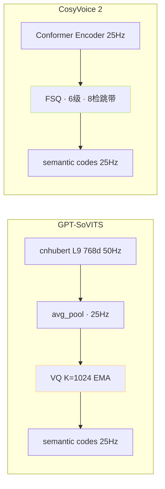
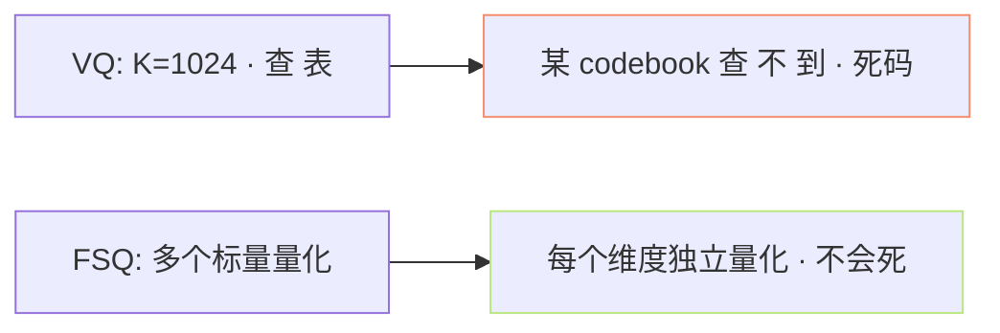

> [📎] 前置知识：VQ-VAE、EMA 更新、Codebook 坍塌与重启、FSQ (Finite Scalar Quantization)、多级量化。

> **定位**：Tokenizer 是「语义 token」架构的根。本节拆 cnhubert+VQ 与 FSQ Speech Tokenizer 三点差别 · 利用率 · 训练稳定性。

## 1. 两路线总览



## 2. VQ 机制 (GPT-SoVITS)

```python
# VQ 伪代码
class VQEMA(nn.Module):
    def __init__(self, K=1024, D=192):
        self.codebook = nn.Embedding(K, D)
        self.ema_count = torch.zeros(K)
        self.ema_sum   = torch.zeros(K, D)
    def forward(self, z):              # z: [B, T, D]
        dist = (z.unsqueeze(2) - self.codebook.weight).norm(2, dim=-1)
        idx  = dist.argmin(dim=-1)     # [B, T]
        z_q  = self.codebook(idx)
        # EMA 更新
        if self.training:
            self.update_ema(z, idx)
        return z_q, idx
```

|项|VQ K=1024|
|---|---|
|codebook 大小|1024 × 192 = 197 K 参数|
|利用率|**70–80%** (社区实测)|
|死码问题|需定期重启|
|训练稳定|中 · 需 EMA · commit_loss|
|梯度|straight-through estimator|

## 3. FSQ 机制 (CosyVoice 2)

```python
# FSQ 伪代码
class FSQ(nn.Module):
    def __init__(self, levels=[8,5,5,5]):  # 维度·5个·实际codebook = 8*5*5*5=1000
        self.levels = torch.tensor(levels)
    def forward(self, z):  # z: [B, T, len(levels)]
        z = torch.tanh(z)              # 压缩到 [-1, 1]
        z = z * (self.levels - 1) / 2  # 映射到 [-(L-1)/2, (L-1)/2]
        z = z.round()                   # 量化
        codes = self.scalar_to_index(z) # 转成独一 codebook idx
        return z, codes
```

|项|FSQ [8,5,5,5]|
|---|---|
|总 codebook|8×5×5×5 = 1000|
|参数|**0** (无codebook)|
|利用率|**100%**|
|死码问题|**无**|
|训练稳定|**佳** · 仅 STE|
|梯度|straight-through estimator|

## 4. 为何 FSQ 利用率 100%



> [💡] **FSQ 是「多标量量化」**：VQ 需 查 高维 向 量 表、某 codebook 查 不 到 · 死 码。 FSQ 拆 到 多 个 低 维 标 量 · 每 维 独 立 量 化 · 不 会 死。

## 5. 重要性对比

|指标|VQ EMA|FSQ|
|---|---|---|
|利用率|70–80%|**100%**|
|死码重启|需|不需|
|commit_loss|需|不需|
|训练参数|K×D|**0**|
|质量 (社区实测)|中|**高 5–10%**|

## 6. 为何 GPT-SoVITS 未跳 FSQ

|原因|说明|
|---|---|
|2024-02 首发|FSQ 2023-10 刚发 · 未二次验证|
|VQ codebook 与预训绑定|换 FSQ 需重训 SoVITS|
|社区驱动|重训代价高|

## 7. cnhubert vs Conformer Encoder

|项|cnhubert|Conformer (CosyVoice)|
|---|---|---|
|训练|预训 SSL · 冻结|随 Tokenizer 训|
|参数|90 M|50 M|
|无需重训 SSL|✅|❌|
|利用预训|✅ SSL 预训|仅 ASR 预训|

## 8. 工程判断

> [🔧] **GPT-SoVITS 选 VQ 是 历史 选 择**：FSQ 是现在 SOTA · 但 GPT-SoVITS 首发 时 未 发 。 社区 跳 FSQ 需 重 训 7000 h SoVITS · 代 价 高。 后 面 未 来 版 本 可能 跳 FSQ · 但 现 阶 段 VQ 仍 足 生 产。

## 参考文献

1. van den Oord, A. et al. (2017). _VQ-VAE_. arXiv:1711.00937.

1. Mentzer, F. et al. (2023). _FSQ: Finite Scalar Quantization_. arXiv:2309.15505.

1. CosyVoice 2. (2024). arXiv:2412.10117.