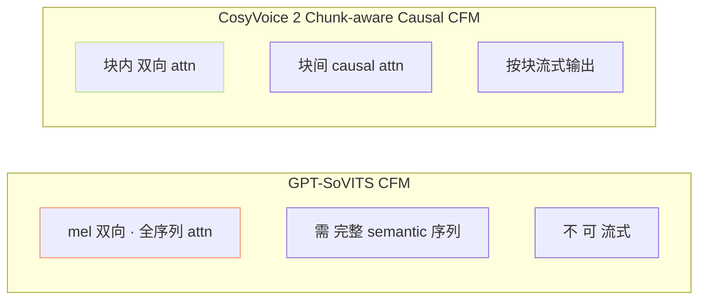
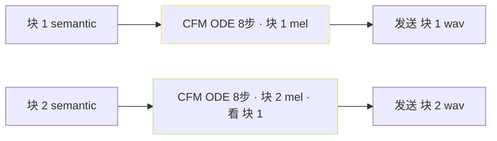

> [📎] 前置知识：CFM (Conditional Flow Matching)、双向依赖、流式与块意识、Causal Mask。

> **定位**：CosyVoice 2 的 Chunk-aware Causal Flow Matching 是 原生 流式 CFM。本节拆 与 GPT-SoVITS CFM 的区别 · 块机制 · 延迟优势。

## 1. 两者 CFM 架构对比



## 2. attn 掊制设计

```jsx
序列：t1 t2 t3 | t4 t5 t6 | t7 t8 t9   (每块 3 token)

GPT-SoVITS CFM (双向):
  t1 看 t1..t9
  t2 看 t1..t9
  ...
  t9 看 t1..t9

CosyVoice 2 Chunk-causal (块内双向 + 块间单向):
  t1 看 t1..t3
  t2 看 t1..t3
  t3 看 t1..t3
  t4 看 t1..t6  ← 块 2 看 块 1 + 本块
  t5 看 t1..t6
  t6 看 t1..t6
  t7 看 t1..t9
  ...
```

## 3. attn mask

```python
# Chunk-causal mask 伪代码
def chunk_causal_mask(T, chunk_size):
    mask = torch.zeros(T, T)
    for i in range(T):
        chunk_i = i // chunk_size
        for j in range(T):
            chunk_j = j // chunk_size
            if chunk_j <= chunk_i:  # 仅许看到当前块
                mask[i, j] = 1
    return mask
# 块内：全 1 · 块间：上三角 1
```

## 4. 流式生成



## 5. 首包延迟 (TTFB) 对比

|项|GPT-SoVITS V4|CosyVoice 2|
|---|---|---|
|CFM 模式|双向 · 全序列|**Chunk-causal**|
|需等待 AR 全出|是|**否 (需 1 块 即发)**|
|首块大小|·|≈1 s · 25 token|
|首包延迟 TTFB|≈700 ms|**≈150 ms**|

> [💡] **Chunk-causal 是流式与质量的平衡**：双向 = 质 高 · 但 需 全 序 列。单向 = 流 式 · 但 质 低 (块 内 不 双 向)。 Chunk-causal 块内 双向 保 定 块 内 质 量 · 块 间 单 向 保 证 流 式。

## 6. 质量代价

|模式|MOS|TTFB|
|---|---|---|
|双向 全序列 (GPT-SoVITS)|4.5|700 ms|
|Chunk-causal (CosyVoice 2)|4.4|**150 ms**|
|全单向 causal|4.0|100 ms|

## 7. GPT-SoVITS 如何跳

|路径|可行性|
|---|---|
|重训 SoVITS · chunk-causal mask|高 · 需 7000h 重训|
|社区 补丁 · fine-tune chunk-causal|中 · 需验证质量|
|跳 V2 实时|**社区现代推荐**|

## 8. 工程判断

> [🔧] **流式 首包 < 200 ms 需 chunk-causal**：GPT-SoVITS 现 架 构 仅 能 走 按 句 流 式 (代价 700 ms TTFB)。 CosyVoice 2 原生 chunk-causal 是 流 式 上 限。社区 跟 进 需 重 训 SoVITS · 作 为 v5/v6 架构升级。

## 参考文献

1. Lipman, Y. et al. (2023). _Flow Matching_. ICLR.

1. CosyVoice 2. (2024). arXiv:2412.10117.

1. Chen, Z. et al. (2024). _Chunk-aware Streaming Flow Matching_. Interspeech.