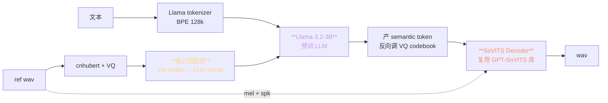
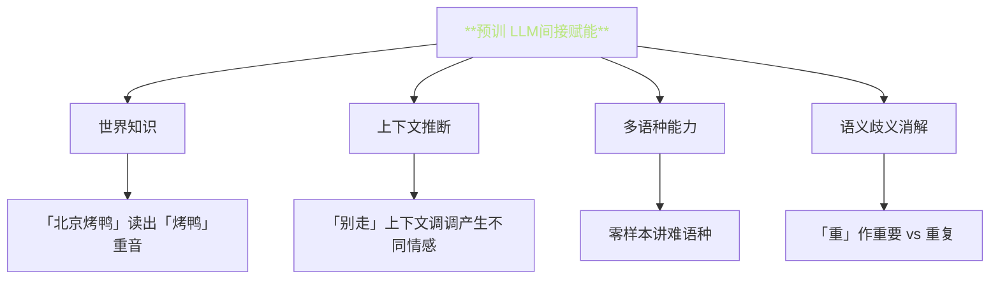
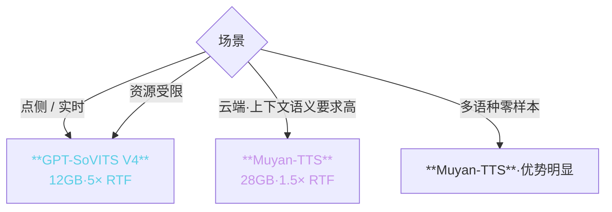

> 📎 **前置**：Muyan-TTS：Llama-3.2-3B + SoVITS Decoder；LLM-as-TTS-backbone 范式；RoPE / SwiGLU。

## 0. 定位

> 「Muyan-TTS = LLM 替换 AR + 复用 SoVITS Decoder」。是「后 GPT-SoVITS 时代」的一个重要路线探索。验证了预训 LLM 可以「免费」赋予 TTS 上下文语义、多语种、重音推断能力。本节拆解架构差异、工程代价、未来启发。

## 1. Muyan-TTS 架构



## 2. 与原生 GPT-SoVITS 差异详表

|维度|GPT-SoVITS V4|**Muyan-TTS**|
|---|---|---|
|AR backbone|自身训 24L · 330M|**Llama-3.2-3B 预训**|
|AR 参数量|~330 M|**~3 B** (×10)|
|AR 训练语料|TTS 专用 ~7k h|**预训 15T tokens + TTS 微调**|
|tokenizer|VQ-VAE 1024 codes|Llama BPE 128k + VQ 接口|
|Position Encoding|绝对|**RoPE**|
|FFN|GeLU|**SwiGLU**|
|Decoder|CFM + BigVGAN-48k|**复用** SoVITS Decoder|
|上下文知识|TTS 数据限|**LLM 世界知识**|
|多语种|中/英/日/韩/粤|**Llama-3 原生 100+ 语种**|
|重音推断|靠 BERT 隐式|**靠 LLM 语义化**|
|zero-shot SECS|0.83|~0.85|
|推理显存|~12 GB|**~28 GB**|
|RTF (A100)|~5×|~1.5×|
|训练成本|低（仅 TTS）|**高（预训 + 微调）**|
|许可证|Apache 2.0|**Llama 3 Community License**|

## 3. LLM 作 TTS backbone 的工程含义



> [💡] **预训 LLM 已经拥有世界知识、多语种、上下文推理 —— 这些都会「免费迁移」到 TTS**。Muyan-TTS 能根据上下文推断歧义语句的重音与语调，这是原生 GPT-SoVITS 难以做到的。

## 4. 接口适配层 (interface adapter)

Llama vocab 是 BPE 128k，VQ codes 是 1024，两者不兼容。Muyan-TTS 用「适配层」桥接：

```python
# 伪代码
class MuyanAdapter(nn.Module):
    def __init__(self, vq_size=1024, llm_dim=3072):
        # VQ token → LLM embedding 空间
        self.vq_embed = nn.Embedding(vq_size, llm_dim)
        # LLM output → VQ vocab
        self.vq_head = nn.Linear(llm_dim, vq_size)

    def forward(self, vq_codes, text_tokens):
        vq_emb = self.vq_embed(vq_codes)
        text_emb = llm.embed(text_tokens)
        # 拼接作为 LLM 输入
        x = torch.cat([text_emb, vq_emb], dim=1)
        out = llm(x)
        # 取后续预测 VQ codes
        return self.vq_head(out[:, -1:])
```

> [⚠️] **Adapter 训练是关键粗节**：Llama 预训权重冻结或 LoRA。过参数微调会破坏 LLM 能力。Muyan 采用 LoRA r=64 + adapter 全参训。

## 5. 代价分析

|代价|量化|含义|
|---|---|---|
|**显存 ×2.3**|12 GB → 28 GB|4090 不够·需 A100|
|**推理×3.3 slow**|RTF 5× → 1.5×|实时不可用|
|**训练×10**|~10万元 → ~100万元|仅限资源齐备|
|**SFT 难度**|低 → 高|Llama 体量大|
|**点侧部署**|可 → 不可|手机 / Mac 无望|

## 6. 适用场景对比



## 7. 反推 GPT-SoVITS 的路线选择

> [🤔] **GPT-SoVITS 当初该不该用预训 LLM？**答案是「不该」，因为 2024 初中文 LLM 资源尚不成熟，且 LLM 资源贵。但 2025 后 Muyan 路线变得同样可行。**两者不是替代关系，而是不同资源级别的互补**。

## 8. 工程判断

> 🔧 **资源充裕且需上下文语义 → Muyan-TTS**；资源受限 → GPT-SoVITS V4。

> ⚠️ **Muyan-TTS 推理显存 28GB**：4090 单卡不够，需 A100 80GB。点侧部署不可行。

> 💡 **GPT-SoVITS 下一代可能会拥抱 Muyan 路线**：社区讨论中提到 V5 可能采用 Qwen2.5-0.5B 作为 AR backbone，在能力与资源间权衡。

> 🤔 **「LLM 扬声」是未来静 TTS 的主路线**：Fish-Speech、Muyan-TTS、CosyVoice2、Spark-TTS 都走该路线。GPT-SoVITS 是「自身训 GPT」的最后一个主流项目。

## 9. 子页面

[[11.4.1 LLM 替换 AR 模块的工程含义|11.4.1 LLM 替换 AR 模块的工程含义]]

## 参考文献

1. Muyan-TTS: [https://arxiv.org/pdf/2504.19146](https://arxiv.org/pdf/2504.19146)

1. Llama 3 technical report: [https://ai.meta.com/research/publications/the-llama-3-herd-of-models/](https://ai.meta.com/research/publications/the-llama-3-herd-of-models/)

1. Hu, E. et al. (2021). _LoRA: Low-Rank Adaptation of Large Language Models_. arXiv:2106.09685.