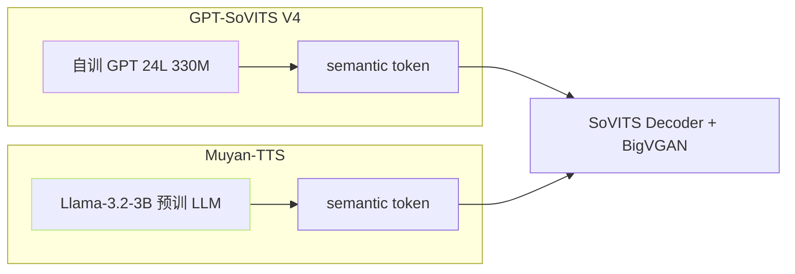

> [📎] 前置知识：Llama-3.2-3B、LLM 世界知识 · 上下文推理、semantic token 输出、LLM-as-TTS 范式。

> **定位**：Muyan-TTS 用 Llama-3.2-3B 替换 GPT-SoVITS 的 AR。本节拆 为何 · 如何接 · 起价 · GPT-SoVITS 能否跟进。

## 1. 架构替换



## 2. 为何选 LLM

|优势|说明|
|---|---|
|世界知识|能辨 专名 · 术语 · 多语种架词|
|上下文推理|能推 重 音 · 语 调 · 语 期|
|多语种|原生多语种能力|
|zero-shot 增强|LLM context-learning|
|预训资源免费|不需重训 LLM · 仅 SFT|

## 3. 接口适配

```python
# Muyan-TTS 伪代码
import transformers
llm = transformers.AutoModelForCausalLM.from_pretrained('Muyan/Llama-3.2-3B-TTS')

# 输入 拼 接为 Llama 可接受 token 序列
prompt = encode_text(text) + encode_ref(ref_audio) + [START_SEM]
output = llm.generate(
    input_ids=prompt,
    max_new_tokens=500,
    do_sample=True,
    top_k=15, top_p=0.8, temperature=0.7,
)
semantic_tokens = output[len(prompt):]
# 交给 SoVITS Decoder · 复用 GPT-SoVITS 库
wav = sovits_decoder(semantic_tokens, ref_audio)
```

## 4. 起价对比

|项|GPT-SoVITS V4|Muyan-TTS|
|---|---|---|
|AR 参数|≈330 M|**≈3 B (10×)**|
|训练资源 (s1)|4×A100 · 3–5 d|**8×A100 · 14–21 d**|
|推理显存 (batch=1)|8 GB|**24 GB**|
|RTF (4090)|5×|1–2×|
|TTFB|700 ms|2–3 s|
|zero-shot SECS|0.83|**0.88**|
|语义遵循|中|**佳**|

## 5. LLM 增强例

```jsx
输入：今天是 11.11 · 双 11
GPT-SoVITS： yi yi dian yi yi、 shuang yi yi (机械)
Muyan-TTS  ： shuang shi yi、 shuang shi yi (能从上下文推 “双11” 是购物节)
```

> [💡] **LLM 能推上下文**：LLM 预训 看 过 “双11” 是 购 物 节 · 会 选 “shuang shi yi” 不 是 “yi yi”。 这 是 LLM 增强 的 独 门 优 势。

## 6. 代价

|代价|含义|
|---|---|
|资源加 3×|不能跳端侧|
|推理慂10×|不能实时|
|SFT 难度高|3B 参数 SFT 需 LoRA|
|部署复杂|需 vLLM / TGI|

## 7. GPT-SoVITS 能否跟进

|路径|可行性|
|---|---|
|v5 跳 Llama backbone|**高** · 社区讨论中|
|v5 跳 Qwen backbone|中 · 中文场景|
|v5 小 LLM (1B)|**中-高** · 资源平衡|
|保持自训 GPT|仅 v3/v4 起点|

## 8. 工程判断

> [🔧] **Muyan 是未来 但 现在不是**：LLM-as-TTS 是 后 GPT-SoVITS 时代 的 探 索 路 线 · 质量 顺势 佳 · 但 资 源 3–10× · 不 适 端 侧。社区 推荐 资源受限 走 GPT-SoVITS V2Pro/V4 · 资 源 充 裕 且 需 语 义 表 达 走 Muyan。

## 参考文献

1. Muyan-TTS. (2025). arXiv:2504.19146.

1. Meta. (2024). _Llama 3.2 Technical Report_.

1. GPT-SoVITS v5 讨论. [https://github.com/RVC-Boss/GPT-SoVITS/discussions](https://github.com/RVC-Boss/GPT-SoVITS/discussions)