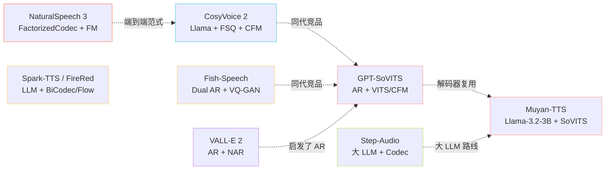

> 📎 **前置知识**：基本掌握 GPT-SoVITS 全栈；了解 CosyVoice、Fish-Speech、Spark/FireRed、Muyan、Step-Audio、VALL-E 2、NaturalSpeech 3 等同期 TTS 的高层范式。

## 0. 定位

> 「在 2024–2025 这一年里，GPT-SoVITS 和谁站在一起、谁不一样？」本节做横向坐标，让你在选型/写综述/做技术汇报时一图秒答。

## 1. 全景坐标

## 2. 同期 TTS 横向对比

|模型|AR 主干|解码器|Codec/SSL|训练数据|开源|中文质量|
|---|---|---|---|---|---|---|
|**GPT-SoVITS v4**|自研 24 层 d=768|CFM+BigVGAN 48k|cnhubert + VQ K=1024|~7,000h|✅ 全开|⭐⭐⭐⭐⭐|
|CosyVoice 2|Llama-style|CFM 24k|FSQ Codec|~170,000h|✅|⭐⭐⭐⭐|
|Fish-Speech|双 AR|VQ-GAN|dual-codebook|~100,000h|✅|⭐⭐⭐⭐|
|Spark-TTS|Qwen-7B|BiCodec|semantic + detail|~100,000h|✅|⭐⭐⭐⭐|
|FireRedTTS|Llama|Flow-Matching|Codec 25Hz|~250,000h|部分|⭐⭐⭐⭐|
|**Muyan-TTS**|Llama-3.2-3B|**SoVITS Decoder**|cnhubert + VQ|100k+ h|✅|⭐⭐⭐|
|Step-Audio|大 LLM (130B?)|Codec|1.3M tokens|私有|闭源|⭐⭐⭐⭐|
|VALL-E 2|AR + NAR|EnCodec 重建|RVQ 75Hz|~50,000h|闭源|⭐⭐|
|NaturalSpeech 3|❌（非 AR）|Factorized FM|Factorized Codec|60,000h|闭源|⭐⭐⭐|

## 3. 范式分类

|范式|代表|优势|劣势|
|---|---|---|---|
|**AR Token + 神经声码器**（GPT-SoVITS / CosyVoice / Fish）|GPT-SoVITS、Fish-Speech|低数据需求、zero-shot 强|长文本稳定性挑战|
|**大 LLM + 声学 Decoder**|Muyan、Spark、FireRed、Step-Audio|指令遵循、可扩展|推理成本高|
|**端到端 Flow / Diffusion**|NaturalSpeech 3、E2 TTS|训练简洁、并行解码|需 ≥50,000h|
|**AR + NAR 两段**|VALL-E 2|工程经典|复杂度高|

## 4. 工程判断

> 🔧 **GPT-SoVITS 的护城河**：低门槛（zero/few-shot）+ 中文 SOTA + 完全开源 + 一键包。即使学术 SOTA 易被超越，工程易用性仍是顶级。

> 🤔 **未来路线**：Muyan-TTS 证明了「大 LLM + SoVITS Decoder」可行。GPT-SoVITS 下一步可能走 Llama/Qwen + CFM Decoder 路线，把 AR 阶段升级为通用 LLM。

> 💡 **横向选型口诀**：要中文 → GPT-SoVITS；要海量数据 + 指令遵循 → CosyVoice 2 / Spark；要研究端到端 → NaturalSpeech 3 / E2。

## 5. 子页面导航

[[11.1 vs CosyVoice - CosyVoice2]]

[[11.2 vs Fish-Speech]]

## 参考文献

- CosyVoice 2: [https://arxiv.org/html/2412.10117v1](https://arxiv.org/html/2412.10117v1)

- Muyan-TTS: [https://arxiv.org/pdf/2504.19146](https://arxiv.org/pdf/2504.19146)

- Fish-Speech: [https://github.com/fishaudio/fish-speech](https://github.com/fishaudio/fish-speech)

- Spark-TTS: [https://github.com/SparkAudio/Spark-TTS](https://github.com/SparkAudio/Spark-TTS)

- FireRedTTS: [https://fireredtts.github.io](https://fireredtts.github.io)

[[11.3 vs FireRedTTS - Spark-TTS]]

- NaturalSpeech 3: [https://arxiv.org/abs/2403.03100](https://arxiv.org/abs/2403.03100)

[[11.4 vs Muyan-TTS（Llama-3.2-3B + SoVITS Decoder）]]

[[11.5 vs Step-Audio - VALL-E 2 - NaturalSpeech 3]]

[[11.6 GPT-SoVITS 在 ms-swift 生态中的角色]]