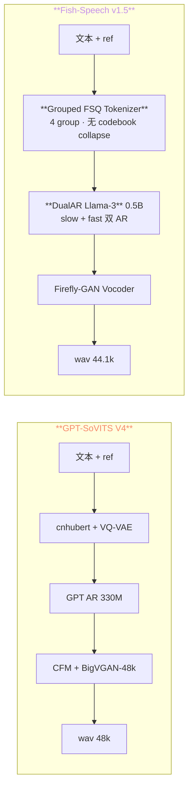
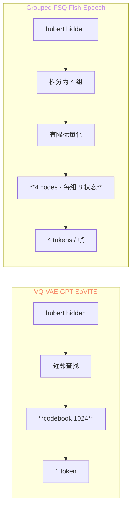
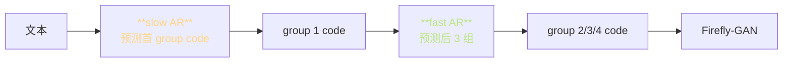

> 📎 **前置**：Fish-Speech v1.5 架构；Grouped FSQ Tokenizer；Llama-3 backbone；Firefly-GAN；Mega-TTS 路线。

## 0. 定位

> 「Fish-Speech（fishaudio）是 GPT-SoVITS 的「商业强化双胞胎」」：同样「LLM + 声码器」架构，但 tokenizer 、LLM backbone、训数据、部署优化都更精细。但许可证是 CC-BY-NC-SA，限制商用。

## 1. 架构对比

## 2. 全维度差异表

|维度|GPT-SoVITS V4|**Fish-Speech v1.5**|
|---|---|---|
|Tokenizer|cnhubert + VQ-VAE (1 codebook 1024)|**Grouped FSQ** ≈4 group·无 collapse|
|LLM Backbone|自身训 330M GPT|**Llama-3 0.5B 预训**|
|AR 架构|单 AR|**DualAR**：slow + fast|
|Vocoder|VITS / CFM + BigVGAN-48k|**Firefly-GAN**（44.1k）|
|训练数据|~7k h|**~720k h**|
|多语种|中英日韩粤 5|**8+ 语种**|
|zero-shot SECS|0.83|~0.86|
|推理显存|~12 GB (V4)|~10 GB|
|RTF (A100)|~5× (V4)|~10×|
|授权|**Apache 2.0** · 商用 OK|**CC-BY-NC-SA 4.0** · 非商用|
|训练成本|低|**高** (Llama-3 从头训贵)|
|SFT 难度|低（预训可下载）|高（Llama 体量大）|
|社区|中文社区主|国际化|

## 3. Grouped FSQ 与 VQ-VAE 的区别

|特性|VQ-VAE|**FSQ**|
|---|---|---|
|Codebook 限制|1024 个向量|**无限**（纯计算）|
|collapse 风险|**高**（50%+ code 不用）|**无** (FSQ 理论保证全用)|
|EMA 更新|需|**不需**|
|但表达力|1024 个状态/帧|$8^4 = 4096$ 状态/帧|
|训练稳定性|中|**高**|

> [💡] **FSQ 是 2023 后 VQ 的 successor**：由 DeepMind 提出（[FSQ paper](https://arxiv.org/abs/2309.15505)）。Fish-Speech 是首个采用 FSQ 的主流 TTS。GPT-SoVITS 社区也讨论过迁移。

## 4. DualAR（slow + fast AR）机制

- slow AR：预测 group 1，负责语义走向

- fast AR：并行预测 group 2/3/4，负责细节

- 动机：避免 4× sequence length·保持 KV Cache可控

> [⚠️] **DualAR 是 Fish-Speech 的核心技巧**：Grouped FSQ 意味着序列长度 4×，直接单 AR 会使 KV Cache 劣炸。DualAR 拆成「主骨架」+「细节补充」双层。

## 5. 训数据规模对比 (10× 差距)

|项|GPT-SoVITS|Fish-Speech|
|---|---|---|
|总时长|~7k h|**~720k h**|
|说话人数|~10k|~100k+|
|语种|5|8+|
|估计训练成本|~10万元|~500万元|

## 6. 听感与实验对比

|指标|GPT-SoVITS V4|**Fish-Speech v1.5**|
|---|---|---|
|SECS zero-shot|0.83|**0.86**|
|MOS (中文)|4.4|**4.5**|
|MOS (英文)|4.1|**4.4**|
|MOS (多语种平均)|4.0|**4.4**|
|情感表达|取决于 ref|**主动控制**|

## 7. 工程判断

> 🔧 **个人 / 开源项目 → GPT-SoVITS（Apache 2.0）**。许可证是决定性因素。

> 🔧 **个人玩「多语种顶级质量」 → Fish-Speech（但商用需授权）**。英语 / 多语种期望明显高于 GPT-SoVITS。

> 🤔 **Fish-Speech 证明了「预训 LLM + speech tokenizer」是可行路径**。Muyan-TTS 走的亦是同样思路（[[11.4 vs Muyan-TTS（Llama-3.2-3B + SoVITS Decoder）|11.4 vs Muyan-TTS（Llama-3.2-3B + SoVITS Decoder）]]）。GPT-SoVITS 的下一代可能需忠亨预训 LLM。

> 💡 **FSQ + DualAR 是未来 GPT-SoVITS 的参考**：社区讨论过迁移 FSQ。VQ collapse 问题在 V5/V6 可能会被解决。

## 8. 参考文献

1. Fish-Speech: [https://github.com/fishaudio/fish-speech](https://github.com/fishaudio/fish-speech)

1. Fish-Speech v1.5 technical report

1. Mentzer, F. et al. (2023). _Finite Scalar Quantization_. arXiv:2309.15505.