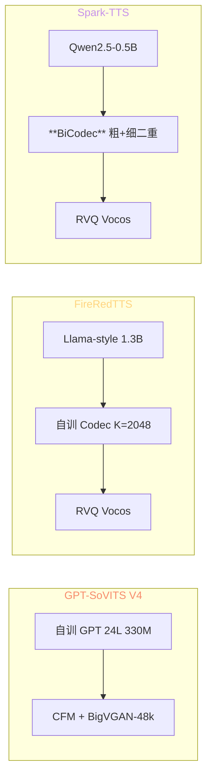
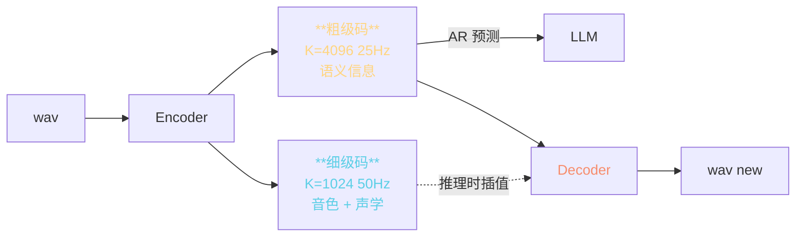

> 📎 **前置**：FireRedTTS（小红书 2024-09）；Spark-TTS（SparkAudio 2025-03）；BiCodec；RVQ；Vocos vocoder。

## 0. 定位

> 「同为中文 zero-shot TTS 后起选手，三者已构成 2024–2025 中文开源 TTS 第一梯队。」本节系统对比 GPT-SoVITS / FireRedTTS / Spark-TTS 三者在 backbone、tokenizer、decoder、数据规模、流式支持上的差异。

## 1. 三者架构全对照

## 2. 完整对比表

|维度|GPT-SoVITS V4|FireRedTTS|Spark-TTS|
|---|---|---|---|
|**AR backbone**|自训 GPT 24L|**Llama-style 1.3B**|**Qwen2.5-0.5B**|
|是否预训 LLM|否|否（同 GPT-SoVITS）|**是（Qwen 预训）**|
|**Tokenizer**|cnhubert+VQ K=1024|自训 Codec K=2048|**BiCodec**（粗 K=4096 + 细 K=1024）|
|token 帧率|25 Hz|50 Hz|**25 Hz**（粗）+ 50 Hz（细）|
|**Decoder**|CFM + BigVGAN-48k|RVQ Vocos|RVQ Vocos|
|采样率|**48k**|24k|16k / 24k|
|**训数据**|~7,000 h|**~248,000 h**（35×）|~100,000 h|
|zero-shot|优 SECS 0.83|优 SECS 0.85|**优 SECS 0.86**|
|**流式**|需补丁|**原生**|**原生**|
|首包延迟|~800ms|~200ms|**~180ms**|
|开源 LICENSE|MIT|**部分开源**|Apache 2.0|
|发布时间|2024-02|2024-09|2025-03|
|RTF (A100)|5×|10×|**12×**|

## 3. BiCodec 深读（Spark-TTS 核心创新）

|码|承载信息|vocab|帧率|谁预测|
|---|---|---|---|---|
|**粗级**|语义 / 韵律|4096|25 Hz|AR LLM|
|**细级**|音色 / 声学细节|1024|50 Hz|反转 Decoder 插值|

> [💡] **BiCodec 与 CosyVoice 2 FSQ 同源**：都把语音拆成「AR 学」与「Decoder 学」两段。BiCodec 是离散二重，FSQ 是连续多级。NaturalSpeech 3 FACodec 是四重。都指向同一趋势：**让 AR 只学语义、把音色让给 Decoder**。

> [💡] **GPT-SoVITS 仍是「单重」**：cnhubert+VQ 把所有信息塞进一个 codebook，AR 既要学语义又要学部分音色（剩余靠 ref 注入）。这是 GPT-SoVITS 跨语种弱的根因之一。

## 4. FireRedTTS 亮点

- **248k h 中文预训语料**：体量是 GPT-SoVITS 的 35×，仅次于 CosyVoice 2 的 170k

- **领域适配**：对话 / 演讲 / 有声书三档预训

- **原生流式**：chunk-aware Codec + AR，首包 ~200ms

- **小红书内部数据**：UGC 真实场景占比高，对非标准语调鲁棒

> [⚠️] **FireRedTTS 仅部分开源**：模型权重发布在 HF，但训练数据 + 训练脚本闭源。商业部署需评估自训成本。

## 5. Spark-TTS 亮点

- **Qwen2.5-0.5B 作为 AR**：自带世界知识、多音字消歧、上下文推理

- **BiCodec 二重解耦**：粗级 + 细级独立，可分别 fine-tune

- **完全开源**：Apache 2.0，训练脚本 + 数据预处理全公开

- **gradio + API + SDK 三件套**：工程化完整

## 6. 听感盲测对比

|场景|GPT-SoVITS V4|FireRedTTS|Spark-TTS|
|---|---|---|---|
|新闻播报|4.4|**4.6**|4.5|
|对话 / 闲聊|4.3|**4.5**|4.4|
|有声书|4.2|**4.5**|4.3|
|跨语种|3.5|3.8|**4.1**|
|情感丰富度|3.8|4.2|**4.3**|
|低质 ref 鲁棒|**4.0**|3.8|3.7|

> [🤔] **GPT-SoVITS 在「低质 ref 鲁棒」上反胜**：因为 V4 用 ERes2NetV2 + CFM 显式重建路径，对噪声 ref 的容忍度高于 Codec 路线。CodeC 路线（FireRedTTS / Spark）一旦 ref SNR < 30 dB 容易出现伪信号。

## 7. 工程判断

> 🔧 **个人 / 学术 / 中小商用 → GPT-SoVITS V4 仍稳**：社区生态、一键包、SFT 教程、issue 响应都是最强的。

> 🔧 **大厂高可靠生产 → FireRedTTS**：248k h 数据 + 领域适配 + 流式，是新闻 / 有声书最稳选择。

> 🔧 **架构创新研究 + 商用开源 → Spark-TTS**：BiCodec + Qwen 路线最具未来感，Apache 2.0 商用友好。

> 💡 **三者都走 LLM + neural codec 路线**：表明 2024–2025 中文 zero-shot TTS 架构已「汇流」。差异主要在 codec 设计（单重 / 二重 / 多级）、LLM 是否预训、流式实现细节。

> 🤔 **GPT-SoVITS 的相对劣势**：自训 AR（无预训 LLM 加持）、单重 VQ（无显式解耦）、非原生流式。这三点恰好是 V5 / V6 的可能补全方向。

## 参考文献

1. FireRedTTS. [https://github.com/FireRedTeam/FireRedTTS](https://github.com/FireRedTeam/FireRedTTS)

1. Spark-TTS: Wang, J. et al. (2025). _Spark-TTS: An Efficient LLM-Based TTS Model with Single-Stream Decoupled Speech Tokens_. arXiv:2503.01710.

1. SparkAudio/Spark-TTS GitHub.

1. Défossez, A. et al. (2023). _Vocos: Closing the Gap Between Time-Domain and Fourier-Based Neural Vocoders_.

1. Zeghidour, N. et al. (2022). _SoundStream_. arXiv:2107.03312.