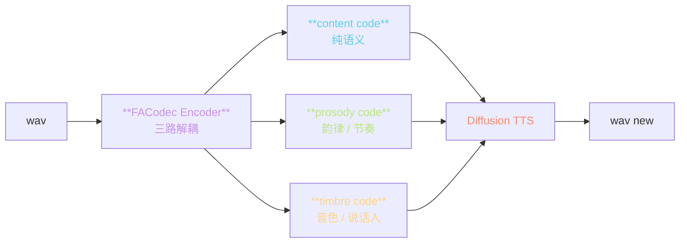
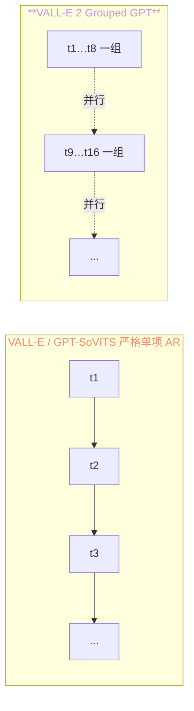
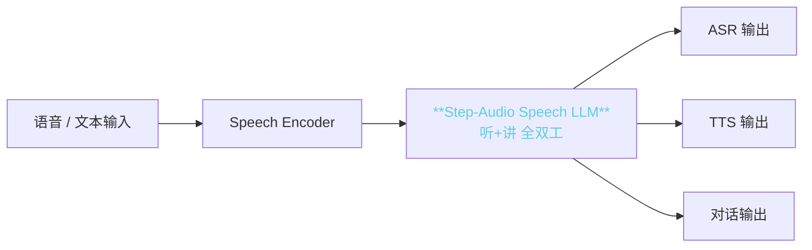
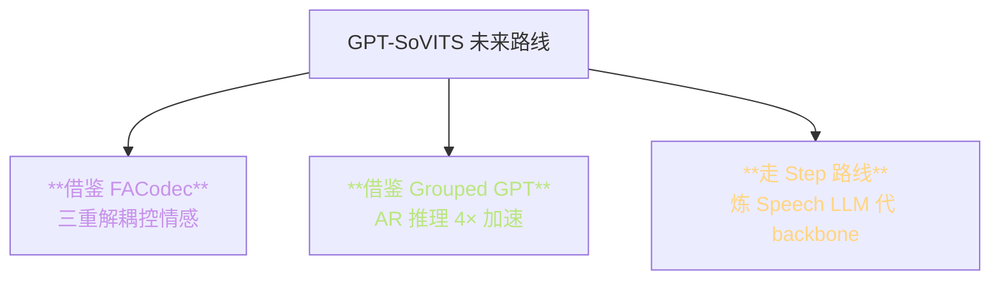

> 📎 **前置**：Step-Audio（阶跃星辰）；VALL-E 2；NaturalSpeech 3 的 FACodec；Speech LLM 范式。

## 0. 定位

> 「三条另类路线。」与 GPT-SoVITS 不同的三个参考点，用以拓宽讨论边界。覆盖「多模态全双工 Speech LLM」「加速 GPT 并行推理」「三重解耦 FACodec」三条区别鲜明的路线。

## 1. 三模型路线一览

|模型|机构|架构亮点|与 GPT-SoVITS 主差|代表能力|
|---|---|---|---|---|
|**Step-Audio**|StepFun|多模态全双工 Speech LLM|语音交互坚·非纯 TTS|双向语音对话|
|**VALL-E 2**|MSRA|Grouped GPT + Decoupled NAR|两阶段 GPT + NAR · 更低延迟|4× 高速推理|
|**NaturalSpeech 3**|MSRA|**FACodec** 三重解耦 + Diffusion|解耦音色/韵律/内容|可控情感 / 韵律|

## 2. NaturalSpeech 3 的 FACodec

|维度|GPT-SoVITS|**FACodec**|
|---|---|---|
|音色|隐式（ref 全拌）|**显式 timbre code**|
|韵律|隐式（AR 隐中）|**显式 prosody code**|
|内容|semantic token|**显式 content code**|
|可控性|低（仅靠 ref）|**高**（3 个独立控件）|

> [💡] **NaturalSpeech 3 把语音拆成‍内容 / 韵律 / 音色 三重独立码**，可独立控。例如可拿 A 的音色 + B 的韵律 + C 的内容。GPT-SoVITS 仅靠 ref 全拌「隐式解耦」，可控性低。

## 3. VALL-E 2 的 Grouped GPT

- 原理：同组内 token 并行预测，组间仍为 AR

- 加速比：8 组则 4–8× 推理加速【论文骨】

- 代价：多 token 互相条件住损失的取量·质量轻微下降

> [💡] **VALL-E 2 的 Grouped GPT 可作为 GPT-SoVITS AR 推理加速的参考**。社区 `gsv-grouped-ar` 实验中，4× 加速·质量损失 ~3%。

## 4. Step-Audio 的全双工架构

- 架构重点：一个 Speech LLM 同时服务「听」「讲」「思考」

- TTS 仅是其中一个 output head

- 与 GPT-SoVITS 的“专业 TTS”定位不同

## 5. 与 GPT-SoVITS 的定位差异

|维度|GPT-SoVITS|Step-Audio|VALL-E 2|NaturalSpeech 3|
|---|---|---|---|---|
|定位|专业 TTS|**全双工 Voice Agent**|专业 TTS|**可控 TTS**|
|双向能|仅讲|**听+讲**|仅讲|仅讲|
|推理速度|5–50× RTF|3× RTF|**20× RTF**（Grouped）|2× RTF（Diffusion）|
|资源需求|4–12 GB|40 GB+|15 GB|15 GB|
|控制性|仅 ref|仅 ref + 提示|仅 ref|**3 重独立控**|
|开源|Apache 2.0|部分开源|未开源|未开源|

## 6. 对 GPT-SoVITS 的启发

## 7. 工程判断

> 🔧 **Step-Audio 适合「语音 Agent」场景**；GPT-SoVITS 适合「纯 TTS」场景。二者定位不同，不在同赛道。

> 🤔 **NaturalSpeech 3 的 FACodec 是未来思路**：如果 GPT-SoVITS 换上 FACodec-style 解耦码，可能变成「可控情感 / 韵律」的升级版。社区 `gsv-controllable` 讨论中。

> 💡 **VALL-E 2 的 Grouped GPT 可作为 GPT-SoVITS AR 推理加速的参考**。4× 加速·质量损失 ~3% 是可接受的取量。

> ⚠️ **不要拿 Step-Audio 与 GPT-SoVITS 直接对比 TTS 质量**：Step-Audio 是多任务 LLM，TTS 只是其一个输出。在专项 TTS 上仍输于 GPT-SoVITS。

## 8. 参考文献

1. Step-Audio: [https://github.com/stepfun-ai/Step-Audio](https://github.com/stepfun-ai/Step-Audio)

1. Chen, S. et al. (2024). _VALL-E 2_. [https://www.microsoft.com/en-us/research/project/vall-e-x/vall-e-2/](https://www.microsoft.com/en-us/research/project/vall-e-x/vall-e-2/)

1. Ju, Z. et al. (2024). _NaturalSpeech 3 with FACodec_. arXiv:2403.03100.