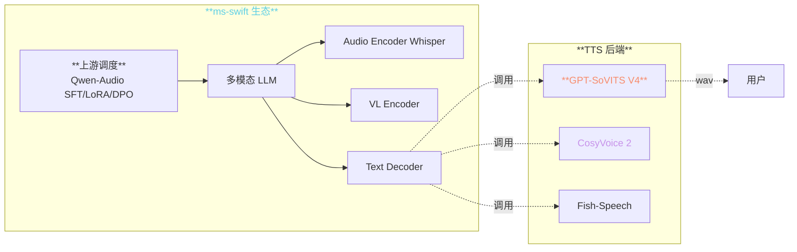
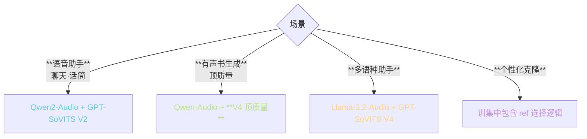
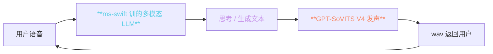
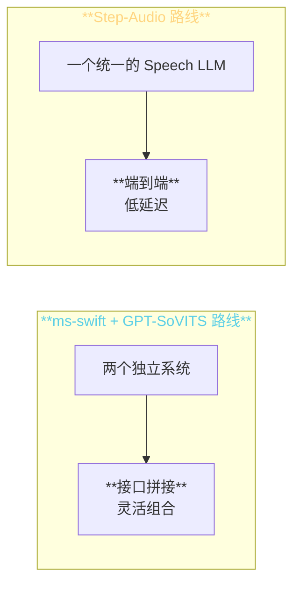

> 📎 **前置**：ms-swift（ModelScope SWIFT）多模态 SFT 框架；Audio LLM 生态；Qwen-Audio / Whisper SFT。

## 0. 定位

> 「GPT-SoVITS 在 ms-swift 生态中扮演「上游 audio generation backend」的角色。」ms-swift 负责训（Audio LLM SFT / LoRA / DPO），GPT-SoVITS 负责推（即 zero-shot 发声），二者是「调度 → 发声」上下游关系。

## 1. 生态位置

## 2. 三重职责对比

|层|ms-swift|GPT-SoVITS|互补点|
|---|---|---|---|
|职责|训练框架（SFT/LoRA/DPO）|TTS 推理后端|互不重叠|
|输入|text + audio + image|text + ref audio|ms-swift 负责预处理·GPT-SoVITS 取 text|
|输出|text / audio tokens|wav|ms-swift 出 text·后续接 GPT-SoVITS|
|生态位|上游调度层|下游发声层|**LLM 思考 + TTS 发声**|
|开发者|ModelScope / 魁资|RVC-Boss|中文社区公同|
|许可证|Apache 2.0|Apache 2.0|**都可商用**|

## 3. 集成场景三路线

## 4. ms-swift 下三个 TTS 后端取舍

|TTS|优点|劣点|ms-swift 推荐场景|
|---|---|---|---|
|**GPT-SoVITS V4**|Apache 2.0·中文顶质|RTF 5× (V4)|**个人/开源助手·中文优先**|
|**CosyVoice 2**|多语种·流式|中文质量位于 V4|多语种服务 / 流式|
|**Fish-Speech**|高质量多语种|**CC-BY-NC-SA·仅限非商用**|个人玩 / 非商用|

## 5. 多模态集成双向未来

> [💡] **生态中的双向集成**：ms-swift 可以训理解语音的 LLM，GPT-SoVITS 可以负责生成语音。二者双封闭环是语音 Agent 的基本架构。

## 6. 与 Step-Audio 路线的区别

|路线|优势|劣势|
|---|---|---|
|**ms-swift + GPT-SoVITS**|组件灵活·可独立调优|**拼接延迟 200ms+**|
|**Step-Audio**|端到端·低延迟|**玩不动·不可拆分**|

## 7. 工程判断

> 🔧 **ms-swift 本身不训 TTS**，仅调用。GPT-SoVITS 在这个生态里是「即插即用的发声器」。

> 💡 **中文优先 → GPT-SoVITS V4；多语种优先 → CosyVoice 2；顶质量非商用 → Fish-Speech**。ms-swift 社区推荐顺序。

> 🤔 **未来可能的双向集成**：ms-swift 训一个 Speech Audio LM 全双工 backbone，再接低延迟 TTS 发声 —— 这是 Step-Audio 走的路。二者可能总会交叉。

> ⚠️ **拼接路线的延迟不可避**：LLM 思考 ~300ms + GPT-SoVITS 推理 ~200ms，总延迟 ~500ms。要「说完立马听」体验需 Step 路线。

## 8. 参考文献

1. ms-swift: [https://github.com/modelscope/ms-swift](https://github.com/modelscope/ms-swift)

1. トGPT-SoVITS 在 ms-swift integration 示例】

1. ModelScope: [https://modelscope.cn/](https://modelscope.cn/)