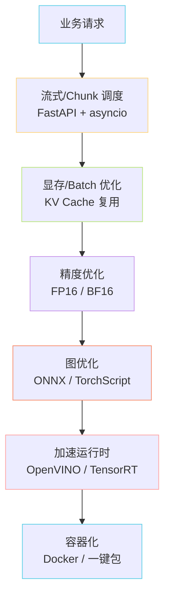
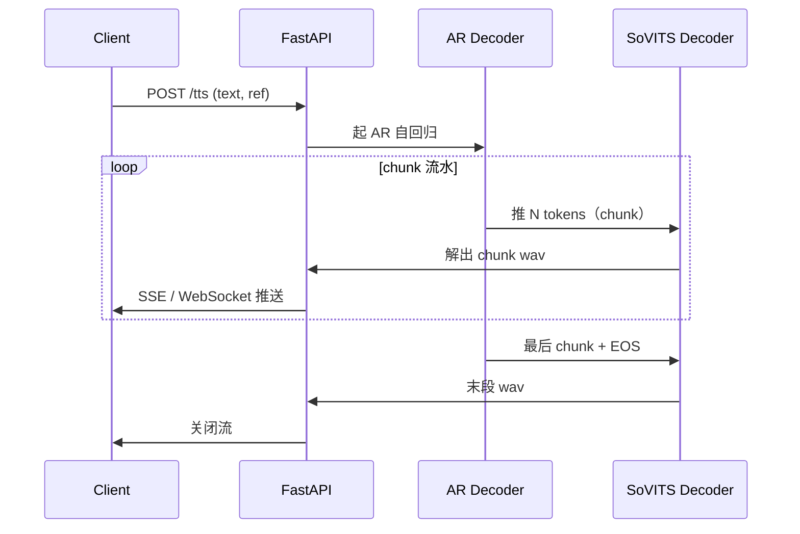

> 📎 **前置知识**：PyTorch 2.x；CUDA 基本概念；ONNX / OpenVINO / TensorRT 至少认识其一；了解流式 chunk 推理。

## 0. 定位

> 「把模型从 jupyter 搬到线上服务，让首包延迟 <500ms、并发吞吐过百。」本节梳理 BF16、ONNX、OpenVINO、TensorRT、流式、显存优化、容器化六大工程战场。

## 1. 优化栈分层

## 2. 各加速方案对比

|方案|适用硬件|首包延迟|实施难度|兼容性|
|---|---|---|---|---|
|FP32（baseline）|任意|~1.5s|★|100%|
|FP16 / BF16|A100 / 4090 / H100|~800ms|★★|CUDA|
|ONNX + ORT-CUDA|跨平台|~700ms|★★★|需全 OP 支持|
|OpenVINO|Intel CPU / iGPU|CPU 提速 3×|★★★|Intel only|
|TensorRT|NVIDIA GPU 生产|~300ms|★★★★|仅 NV|
|流式 chunk|全部|**首包 ~200ms**|★★★|取决于模型|

## 3. 显存与 Batch 估算

AR KV Cache 显存近似公式：

$M_{KV} \approx 2 \cdot L \cdot H \cdot d_h \cdot T \cdot b$

其中 $L$ 为层数、$H$ 为头数、$d_h$ 为每头维度、$T$ 为序列长度、$b$ 为 dtype 字节数。

- V3/V4: $L=24$, $H=12$, $d_h=64$, $T \le 2048$ → bf16 下单序列 ~150MB

- v3/v4 单实例 V100 16GB 可跑 batch=4，A100 40GB 可跑 batch=16

- 长文本预切分（cut1~cut5）+ 流水线并行可让单卡吞吐翻倍

## 4. 流式推理实现

- chunk 粒度：~50 tokens（约 2 秒音频）平衡首包延迟与拼接代价

- AR 与 Decoder **同进程异步**：避免 IPC 开销

- 客户端用 SSE / WebSocket / HTTP chunked 三选一

## 5. 工程判断

> 🔧 **生产首选 TensorRT + 流式**：v3 的 ODE 8 步 + AR 自回归用 TRT FP16 可压到 200ms 首包。BigVGAN 的 anti-alias group conv 在 TRT 下加速比最高（~3×）。

> ⚠️ **ONNX 导出 KV Cache 是坑**：AR 的 KV Cache 是动态形状，导出时需自定义 `dynamic_axes`；BigVGAN 的 anti-alias 需保留 group conv 不要 fuse；CFM 的 ODE 循环需手动展开成固定步数图。

> 💡 **一键包 vs Docker**：一键包面向爱好者（Windows `.exe`），Docker 面向生产（Linux GPU + NVIDIA Container Toolkit）。两者并存，不是替代关系。

> 🤔 **bf16 vs fp16**：A100/4090/H100 上推荐 bf16（动态范围更大，不易溢出）；V100/T4 等老卡只支持 fp16，需配合 loss scaling 防 NaN。

## 6. 子页面导航

## 参考文献

- TensorRT: [https://developer.nvidia.com/tensorrt](https://developer.nvidia.com/tensorrt)

- OpenVINO: [https://docs.openvino.ai](https://docs.openvino.ai)

- ONNX Runtime: [https://onnxruntime.ai](https://onnxruntime.ai)

- NVIDIA Container Toolkit: [https://github.com/NVIDIA/nvidia-container-toolkit](https://github.com/NVIDIA/nvidia-container-toolkit)

- BigVGAN（声码器加速参考）: [https://github.com/NVIDIA/BigVGAN](https://github.com/NVIDIA/BigVGAN)