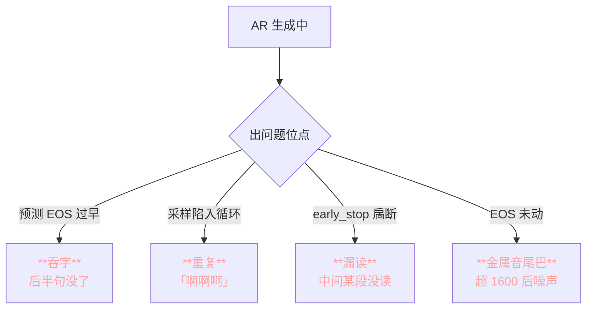
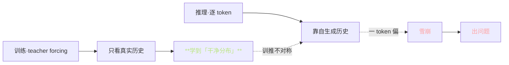
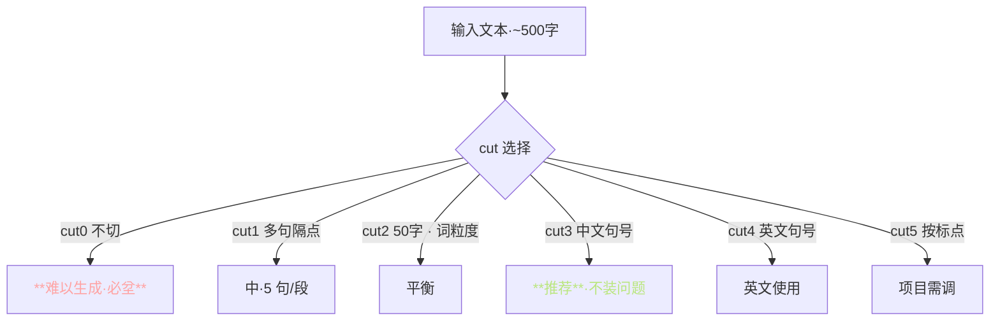
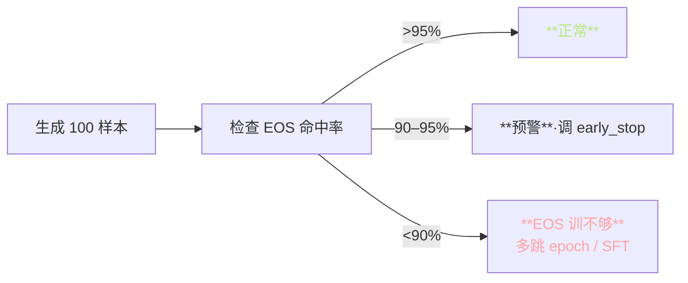

> 📎 **前置**：AR exposure bias；KV Cache 显存累积；early_stop；sampling；[[8.2 文本切分（cut 策略）|8.2 文本切分（cut 策略）]]；teacher forcing 限制。

## 0. 定位

> 「长文本不稳是第一大痛点。」吞字 / 重复 / 漏读 / 金属音尾巴 四大现象的根因与缓解。本质是 exposure bias 与 ctx 限制的携手问题，不能只靠采样调参根治。

## 1. 四种崩坏模式

|现象|根本原因|听感表现|领发场景|
|---|---|---|---|
|**吞字**|AR 预测 EOS 过早 / 采样偊跑|后半句丢失|长句·复杂结构|
|**重复**|rep_penalty 不够 / 采样陷循环|「啊啊啊」「合作合作合作」|句尾多发|
|**漏读**|early_stop 提前截断 / cut 错|中间丢字|长句中间|
|**金属尾巴**|EOS 未动·超上限后乱出|句后噪声·机械响|EOS 训不够|

## 2. exposure bias 是根本原因

$$P_\text{train}(s_t \mid s_{<t}^\text{real}, c) \neq P_\text{infer}(s_t \mid \hat{s}_{<t}, c)$$

**错误累积概率**：设单步独立错率 $p$，连续 T 步出错概率：

$$P_\text{err}(T) = 1 - (1-p)^T$$

|p|T=100|T=500|T=1000|T=1600|
|---|---|---|---|---|
|0.001|9.5%|39%|63%|**80%**|
|0.005|39%|**92%**|99%|~100%|
|0.01|63%|99%|~100%|~100%|

> [⚠️] **单步错率 0.5% · 500 token · 出错概率 ≈92%**。这是为什么 cut 是唯一根治手段：把 T 缩到 100，出错概率降到 39%。

## 3. cut 策略是第一优先

|cut|含义|适用|错率限|
|---|---|---|---|
|cut0|不切|短句 <20 字|高|
|cut1|按 5 句/段|中|中|
|cut2|按 50 字|多|低|
|**cut3**|**按中文句号**|**默认推**|**最低**|
|cut4|按英文句号|英项目|低|
|cut5|按标点|多语种|低|

> [💡] **cut3 是默认·项目里 95% 场景都应该开」**。不切别试 1000 token 上限，那是在给 exposure bias 送军充火药。

## 4. 调参经验表

|参数|默认|长文本|原理|
|---|---|---|---|
|how_to_cut|cut0|**cut3**|减少 T|
|top_k|15|**10**|减少采样随机性|
|top_p|0.8|0.85|保留足够选项|
|temperature|0.7|**0.6**|锐化分布|
|repetition_penalty|1.35|**1.5**|压重复|
|early_stop_num|1600|**2000**|防被提前截|

## 5. 特殊场景专项调优

|领域|现象|主调|
|---|---|---|
|医疗术语|专业词发音错|**人工加拼音标注**|
|法律文本|长句·独立条款|人工加句号·cut3|
|广告零售|金额 / 型号错|**人工转入 SSML 语魔**|
|有声书|500字以上|cut3 + 句间 0.3s 静默|
|动漫配音|情感多变|多 ref · 多调采样|

## 6. EOS 训练不够的诊断

## 7. 根治方案·未来路线

|方案|原理|状态|
|---|---|---|
|**Scheduled Sampling**|训随机用预测代真实|未集成|
|**SeqGAN / RL**|RL 对齐推理分布|未集成|
|**Forced Alignment Loss**|加 phoneme · token 对齐损|未集成|
|**Grouped GPT**|VALL-E 2 多 token 并行|可期|
|**DPO / RLHF**|选优采样路径|可期|
|**人工标点**|加重点句号|**现在即可**|

## 8. 工程判断

> 🔧 **设定 cut3 是第一优先，其他都是补助**。看到长文本不稳不要先调 temperature，先调 cut。

> ⚠️ **temperature 调太低（<0.5）会出现机械感 · 语调一致**。不要为了稳犹犹调。

> 💡 **在医疗 / 法律 / 广告场景，人工加标点是性价比最高的稳定性优化**；能包走 80% 问题。SSML 语魔补上可走 95%。

> 🤔 **根治需 Scheduled Sampling 或 RL 微调**。仅靠采样重错修复是「创可贴」不是「手术」。VALL-E 2 的 Grouped GPT 是另一条可期路径。

## 9. 子页面

[[13.1.1 cut 策略与文本切片|13.1.1 cut 策略与文本切片]]

[[13.1.2 Repetition Penalty - Temperature 调优经验|13.1.2 Repetition Penalty - Temperature 调优经验]]

## 参考文献

1. 仓库 issue 区 #234, #567 长文本吞字讨论串

1. Ranzato, M. et al. (2016). _Sequence Level Training_. ICLR. (exposure bias)

1. Bengio, S. et al. (2015). _Scheduled Sampling_. NeurIPS.

1. Holtzman, A. et al. (2019). _Curious Case of Neural Text Degeneration_. ICLR.