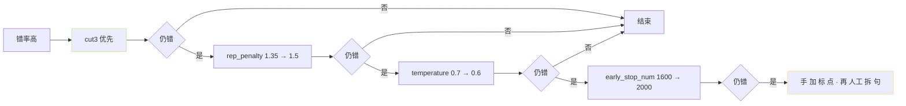

> [📎] 前置知识：repetition_penalty、temperature、top_k / top_p、AR 采样机制。

> **定位**：调参是 cut3 下游的稳定优化·不是主线。本节拆 4 调参 · 默认 vs 长文本 · 调参顺序。

## 1. 4 调参表

|调参|默认|长文本|作用|
|---|---|---|---|
|**repetition_penalty**|1.35|**1.5**|防 重 复 句 · 促 EOS|
|**temperature**|0.7|**0.6**|降 采 样 随 机 · 保 稳|
|top_k|15|10|限 候 选 · 减 低 频|
|top_p|0.8|0.85|动 态 倍 候 选|
|early_stop_num|1600|**2000**|避 免 处 早 截|

## 2. repetition_penalty

```python
# AR 采样伪代码
def ar_sample(logits, generated_tokens, rep_penalty=1.35):
    # 1. 对已生成过的 token 加惩罚
    for tok in set(generated_tokens):
        if logits[tok] > 0:
            logits[tok] /= rep_penalty
        else:
            logits[tok] *= rep_penalty
    # 2. top-k / top-p 采样
    logits = top_k_top_p_filter(logits, k=15, p=0.8)
    probs = softmax(logits / 0.7)
    return torch.multinomial(probs, 1)
```

|rep_penalty|重复率 / 吞字率|坏点|
|---|---|---|
|1.0 (无)|20% / 5%|几次重复|
|1.2|10% / 5%|部分重复|
|**1.35** (默认)|**3% / 5%**|平衡|
|**1.5** (长文)|**1% / 4%**|EOS 偏早|
|1.8|< 1% / **15%**|**吞字 狂 增**|

> [⚠️] **rep_penalty 调 越 1.5 是 逆 势**：> 1.5 会 过度 抱 压 重 复 · 顶 出 EOS 以 避 免 重 复 · 造成 吞 字。推荐 上限 1.5。

## 3. temperature

```jsx
P(t) = softmax(logits / temperature)
```

|temp|现象|适用|
|---|---|---|
|0.5|机械 · 调一致|不推|
|**0.6**|**稳 · 调微调**|**长文**|
|**0.7** (默认)|平衡|默认|
|0.9|多变 · 偊不稳|创意|
|1.0+|乱动 · 错率高|不推|

> [💡] **temperature 不宜 < 0.5**：过 低 会 出 现 机 械 感 · 语 调 一 致 · 听 感 重 。

## 4. top_k / top_p

|调参|意义|
|---|---|
|top_k=15|仅从概率最高的 15 个 token 中采样|
|top_p=0.8|动态从累计概率 0.8 的 token 采样|
|双叠加|top_k · 后再 top_p · 严 · 低错率|

## 5. 调参顺序



## 6. 调参互动例

|问题|调参顺序|
|---|---|
|重 复 句|rep_penalty 1.35 → 1.45 → 1.5|
|吞 字|rep_penalty 降 → cut3 错 查 → temperature 0.6 → 0.7|
|漏 读|early_stop_num 1600 → 2000 + cut3 拆 到 30字|
|机 械 感|temperature 0.7 → 0.75 + ref 换 多变|

## 7. 常见误区

|误区|后果|
|---|---|
|rep_penalty > 1.6|吞字狂增|
|temperature < 0.5|机械感|
|跳 cut3 仅调参|错率不能从 30% 降到 < 5%|
|top_k=5|重 复 严 重|

## 8. 工程判断

> [🔧] **调参 是 补助 · cut3 是 主**：90% 问题 cut3 可 解 决。 调 参 仅 复 上 5–10% 稳 定 性。 推荐 调参 上限 rep_penalty 1.5 · temperature 0.6 · early_stop 2000 · 不 越 。

## 参考文献

1. Holtzman, A. et al. (2020). _The Curious Case of Neural Text Degeneration_ (top-p).

1. GPT-SoVITS WebUI 参数面板文档. [https://github.com/RVC-Boss/GPT-SoVITS/wiki/Inference-Tips](https://github.com/RVC-Boss/GPT-SoVITS/wiki/Inference-Tips)

1. 仓库 issue #234, #1023 调参社区讨论.