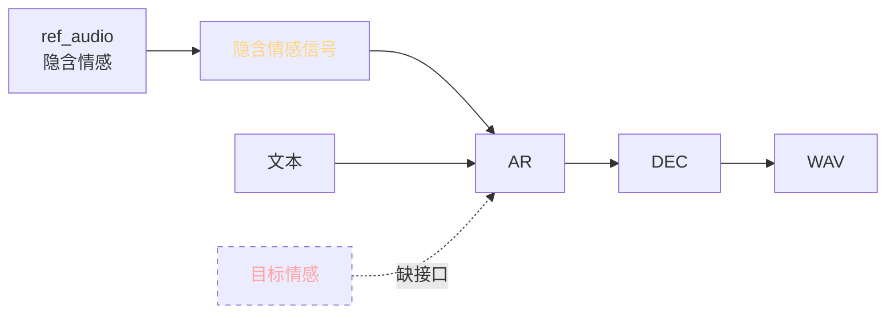
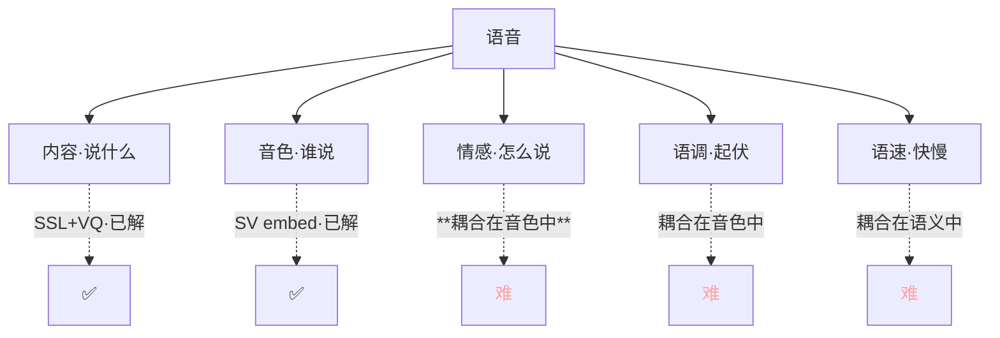
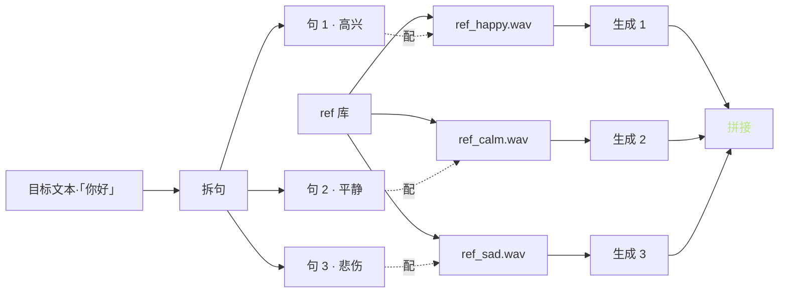
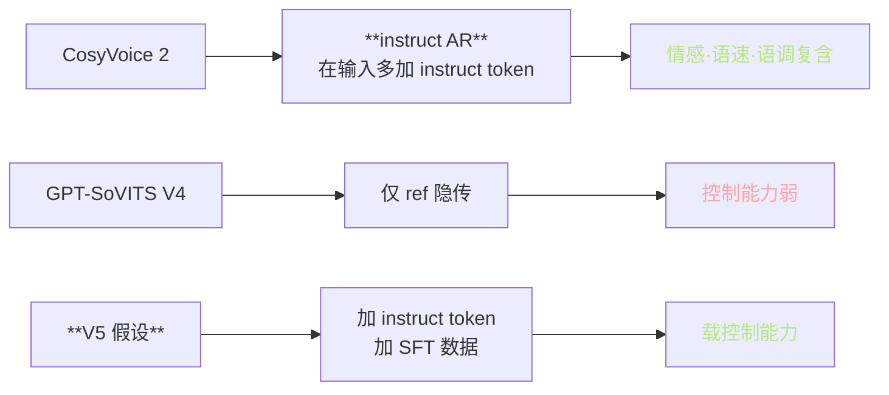

> 📎 **前置**：emotion embedding；emotion2vec；NaturalSpeech 3 FACodec；CosyVoice 2 instruct；社区分支。

## 0. 定位

> 「情感 / 语调控制是隐式的。」GPT-SoVITS 仅靠 ref_audio 传递情感，无独立的「情感控」接口。这是与 CosyVoice 2 / Step-Audio 主要差距之一。

## 1. 现状：只能靠 ref

|控制能力|GPT-SoVITS|CosyVoice 2|Step-Audio|NaturalSpeech 3|
|---|---|---|---|---|
|**音色**|✅ ref|✅ ref|✅ ref|✅ ref|
|**情感**|⚠️ 仅 ref 隐传|✅ instruct|✅ instruct|✅ 独码|
|**语调**|⚠️ 仅 ref 隐传|✅ instruct|✅ 多伥双工|✅ 独码|
|**语速**|❌ 无|✅ instruct|✅|✅|
|**音量**|❌ 无|⚠️|⚠️|⚠️|

## 2. 难点：为什么难拆？

> [🤔] **情感与语调高度耦合在音色中，拆不干净**。NaturalSpeech 3 提出 FACodec，将语音拆为「内容 + 情感 + 语调 + 音色 + 音质」五路独码。GPT-SoVITS 未采纳该路线。

## 3. 社区分支探索

|方案|思路|状态|跟进复项|
|---|---|---|---|
|**Emotion ref 多选**|不同情感 ref 多次调用|社区实践可用|**项目默认**|
|**Emotion embedding**|加独立 256-d 情感向量·注入 AR|实验分支|PR #234|
|**Prompt prefix**|文本前缀「高兴地说：」|部分有效·依赖训数据|社区调研|
|**FACodec-style**|拆解为情感 / 语调独立码|未项目集成|未期|
|**emotion2vec**|预训情感表示推理|可集成|github|
|**Instruct AR**|加 instruct token·CosyVoice 2 路线|**V5 可期**|roadmap|

## 4. Emotion ref 多选（当前加事实践）

|情感|ref 选择要点|SECS 与主 ref|
|---|---|---|
|高兴|起伏大·上扬调|>0.7 OK|
|平静|中部调·多作序言|>0.7 OK|
|悲伤|低振·慢语速|>0.6 可|
|生气|**难**·重音·金属|~0.5 不稳|
|中性|默认 ref|~0.8 高|

> [⚠️] **多 ref 拼接会出现句间音色跳变**。需在句间加 0.3–0.5s 静默·以及在 cross-fade 上作平滑。

## 5. Emotion embedding 注入简化公式

$$\text{emb}_\text{AR} = E_\text{phone}[p_i] + W_b \cdot h_\text{BERT} + W_e \cdot e_\text{emotion}$$

其中 $e_\text{emotion}$ 是一个 256-d 独立表征，可从预训 emotion classifier（如 emotion2vec）提取。

|emotion2vec|含义|仓库|
|---|---|---|
|输入|wav 16k|ddlBoJack/emotion2vec|
|输出|768-d emotion vec|·|
|训集|1万h 多情感|中/英|
|推理耗时|~50 ms / 句|·|

> [💡] **社区实验表明：emotion embedding 可让情感补偿但音色保持**，微调后能控 60–70%；边界仍是发音变形过起。

## 6. 各方案对比表

|方案|代价|控制精度|音色保持|推荐|
|---|---|---|---|---|
|**Emotion ref 多选**|需多 ref 库|中高|**高**|**生产默认**|
|Emotion embedding|需微调 + emotion2vec|中|中|社区实验|
|Prompt prefix|需 SFT 数据含描述|低|高|调研|
|FACodec-style|**重构 codec**|**高**|高|未期|
|Instruct AR|重训 AR + instruct 数据|高|高|**V5 路线**|

## 7. 与 CosyVoice 2 instruct 对比

> [🤔] **未来思路：FACodec / NaturalSpeech 3 的「情感×语调×音色」独立码**，或 CosyVoice 2 的 instruct AR 路线。GPT-SoVITS 采纳则可增加一个情感控量。V5 推测走该路。

## 8. 工程判断

> 🔧 **生产仅可靠·默认可用的是「情感 ref 多选」**：不同情感备 N 条 ref。在项目里应先建「情感 ref 库」。

> ⚠️ **emotion embedding 分支未官方集成**；微调后能控 60–70%，边界仍是发音变形过起。勿上生产。

> 💡 **未来思路：FACodec / NaturalSpeech 3 的「情感×语调×音色」独立码**。GPT-SoVITS 采纳则可增加一个情感控量。

> 🤔 **V5 路线推测：instruct AR + 多任务 SFT · 靠齐 CosyVoice 2 控制能力**。但代价是需 100k+ 条 instruct 数据，社区集资难度高。

## 9. 子页面

[[13.3.1 Emotion Embedding 注入实验（社区分支）|13.3.1 Emotion Embedding 注入实验（社区分支）]]

## 参考文献

1. NaturalSpeech 3: [https://arxiv.org/abs/2403.03100](https://arxiv.org/abs/2403.03100)

1. emotion2vec: [https://github.com/ddlBoJack/emotion2vec](https://github.com/ddlBoJack/emotion2vec)

1. CosyVoice 2: arXiv:2412.10117

1. GPT-SoVITS 仓库 PR #234 emotion ref multi-select