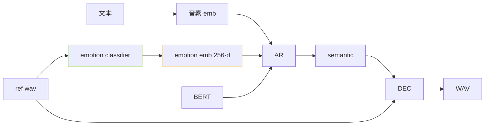

> [📎] 前置知识：emotion classifier 预训、embedding 注入、社区分支 · 未官方集成。

> **定位**：Emotion Embedding 是社区探索分支 · 拆 ref 中 隐含 情感 为 独立 控量。本节拆 思路 · 实现 · 限制。

## 1. 思路



## 2. 公式

$\text{emb}_{\text{AR}}[i] = E_{\text{phone}}[p_i] + W_b \cdot h_{\text{BERT}}[i] + W_e \cdot e_{\text{emotion}}$

- $e_{\text{emotion}} \in \mathbb{R}^{256}$：emotion classifier 输出

- $W_e \in \mathbb{R}^{256 \times d_{\text{model}}}$：投影 · 初始为 0

- $W_e$ 初始 为 0 保 证 SFT 初 始 到 预 训 状 态

## 3. emotion classifier 选型

|模型|参数|输出类别|
|---|---|---|
|**emotion2vec**|92 M|9 类 (中性 · 高兴 · 怨恨 ...)|
|SenseVoice|180 M|7 类|
|HuBERT + linear|90 M|自训 4 类|

```python
import torch
from funasr import AutoModel
emotion_model = AutoModel(model='emotion2vec_plus_large')
result = emotion_model.generate('ref.wav', extract_embedding=True)
emotion_emb = result[0]['embedding']  # [256]
```

## 4. 社区实现 (PR #234)

```python
# AR forward 装修
class T2SModelWithEmotion(T2SModel):
    def __init__(self, base_t2s, d_emo=256):
        super().__init__(base_t2s.cfg)
        self.load_state_dict(base_t2s.state_dict(), strict=False)
        self.W_e = nn.Linear(d_emo, self.d_model, bias=False)
        nn.init.zeros_(self.W_e.weight)  # 初始为 0
    def forward(self, phone, bert, semantic_prev, emotion_emb):
        h = self.phone_emb(phone) + self.W_b(bert)
        h = h + self.W_e(emotion_emb).unsqueeze(1)  # broadcast 到句长
        return super().forward_with_emb(h, semantic_prev)
```

## 5. SFT 代价

|项|原生|• Emotion|
|---|---|---|
|训练数据|任意|需 emotion 标注 (自动推)|
|SFT step|500|**1000–2000**|
|SFT 显存|8 GB|10 GB|
|LoRA 可用|✅|**✅ 需 W_e 也需训**|

## 6. 推理控制

```python
# 推理时
# A. 从 ref 抽 emotion (默认)
emo = emotion_model('ref.wav')
# B. 手动 指定 emotion (双中 ref + emotion)
emo_target = emotion_model('happy_sample.wav')  # 从另一 sample 抽
emo_target = 0.3 * emo + 0.7 * emo_target       # 插值
wav = sovits_infer(text, ref_wav, emotion_emb=emo_target)
```

## 7. 体现与限制

|能干|质|
|---|---|
|中性 → 高兴|60–70% 可辨 · 音色保|
|中性 → 怨恨|40–50% · 语期 偏 重|
|中性 → 悲伤|50–60% · 语速 偏 慊|
|跨 语 种|**弱** · emotion2vec 中 文 训|

> [⚠️] **emotion emb 升高 发音偏差**：$\|W_e \cdot e\|_2$ 越 0.5 会 出 现 发 音 变 形。 社区 推 骨 控 0.3–0.7 插 值。

## 8. 与 FACodec 对比

|项|Emotion Emb 注入|FACodec 三重解耦|
|---|---|---|
|控量|1 维 (情感)|3 维 (内容 · 韵律 · 音色)|
|代价|低 · SFT|高 · 重训 codec|
|状态|社区分支|NS3 原生|
|GPT-SoVITS 采纳|**v5 可能**|**v6+** (重架构)|

## 9. 工程判断

> [🔧] **生 产 使 用 emotion ref 多 选 不 是 embedding**：多 ref 是 生 产 可 靠 默 认 。Emotion Embedding 是 社 区 探 索 · 未 官 方 集 成 · 控 60–70% · 跨 语 种 弱。推 荐 试 验 场 景 试 分 支 · 生 产 场 景 走 多 ref。

## 参考文献

1. emotion2vec: [https://github.com/ddlBoJack/emotion2vec](https://github.com/ddlBoJack/emotion2vec)

1. NaturalSpeech 3 FACodec. arXiv:2403.03100.

1. GPT-SoVITS PR #234 emotion ref multi-select.