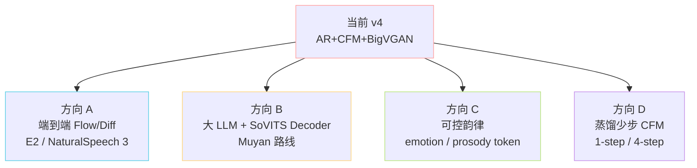

> 📎 **前置知识**：通读 GPT-SoVITS 全栈；了解 AR 的吞字/重复机制、CFM 金属音根因、跨语种音色泄漏问题、E2E TTS（NaturalSpeech 3 / E2 TTS）路线。

## 0. 定位

> 「模型也有它的影子。」本节直面 GPT-SoVITS 当前的硬伤与生态级未来：从长文本稳定性到大 LLM 路线，把工程师视角下的「待办列表」摆出来。

## 1. 痛点地图

## 2. 当前已知缺陷

|缺陷|根因|缓解措施|彻底修复方向|
|---|---|---|---|
|长句吞字|AR 重复惩罚误杀正常 token|文本预切分 cut1~cut5 + rep=1.35|改用 forced alignment 监督|
|偶发重复|温度过高 / rep 不足|T=0.7, rep=1.35|训练时加 anti-repetition loss|
|v3 金属音|CFM 步数少 + BigVGAN-24k 高频失真|升 V4 / 提高 `cfg=2.0`|V4 已修（48k 原生）|
|韵律平淡|BERT 隐层信息有限|多参考 prompt + 情感标签|加 prosody token / emotion VAE|
|跨语种音色漂|phoneme 表不同导致音色泄漏|同语种参考音频|统一 IPA + 跨语种 SSL|
|情感不可控|无显式情感条件|选带情感的参考音频|训练加情感标签（如 CosyVoice 2）|
|推理慢（v3/v4）|24 层 AR + ODE 8 步 + BigVGAN|TensorRT + chunk 流式|蒸馏 student（少步 CFM）|

## 3. 未来研究方向

|方向|代表工作|数据/算力门槛|难点|
|---|---|---|---|
|A 端到端 Flow/Diffusion|NaturalSpeech 3、E2 TTS|≥50,000h|收敛慢、调参敏感|
|B 大 LLM + SoVITS|Muyan-TTS、Spark-TTS、FireRedTTS|LLM 推理资源|首包延迟|
|C 可控韵律|CosyVoice 2、Step-Audio|情感标注|标注质量与一致性|
|D 蒸馏少步 CFM|Consistency Model、Distill++|训练时间|高保真度保持|

## 4. 工程判断

> 🔧 **当下生产建议**：v4 + cut3 + 短句参考音频（5–10s）+ BF16 + TensorRT，已可商用。短期不必追新。

> 🤔 **方向 B 的可行性最高**：Muyan-TTS（[arXiv 2504.19146](https://arxiv.org/pdf/2504.19146)）已证明「Llama-3.2-3B + SoVITS Decoder」可行。GPT-SoVITS 下一代最自然的路径是把 AR 换成通用 LLM，把 SoVITS Decoder 当作「通用声学后端」复用。

> ⚠️ **方向 A 的陷阱**：E2E 看似优雅，但 zero-shot 音色克隆能力对训练数据规模极敏感。学术上 NaturalSpeech 3 表现好，但开源复现需 50,000h+ 高质量数据，社区难以复刻。

> 💡 **生态判断**：GPT-SoVITS 的真正价值不在「论文 SOTA」，而在「在中文 + 一键包 + 1 分钟 SFT」这套组合拳上。即使被技术超越，工程生态护城河仍在。

## 5. 子页面导航

[[13.1 长文本稳定性（吞字 - 重复 - 漏读）|13.1 长文本稳定性（吞字 - 重复 - 漏读）]]

[[13.2 v3 - v4 人工感 - 金属音|13.2 v3 - v4 人工感 - 金属音]]

## 参考文献

- Muyan-TTS: [https://arxiv.org/pdf/2504.19146](https://arxiv.org/pdf/2504.19146)

- NaturalSpeech 3: [https://arxiv.org/abs/2403.03100](https://arxiv.org/abs/2403.03100)

- E2 TTS: [https://arxiv.org/abs/2406.18009](https://arxiv.org/abs/2406.18009)

- CosyVoice 2: [https://arxiv.org/html/2412.10117v1](https://arxiv.org/html/2412.10117v1)

[[13.3 情感与韵律可控性|13.3 情感与韵律可控性]]

- Consistency Model (蒸馏少步): [https://arxiv.org/abs/2303.01469](https://arxiv.org/abs/2303.01469)

[[13.4 跨语种音色泄漏与口音|13.4 跨语种音色泄漏与口音]]

[[13.5 与端到端 Flow - Diffusion TTS 的未来融合|13.5 与端到端 Flow - Diffusion TTS 的未来融合]]

[[13.6 大 LLM + SoVITS 解码器（Muyan 路线）的可扩展性|13.6 大 LLM + SoVITS 解码器（Muyan 路线）的可扩展性]]